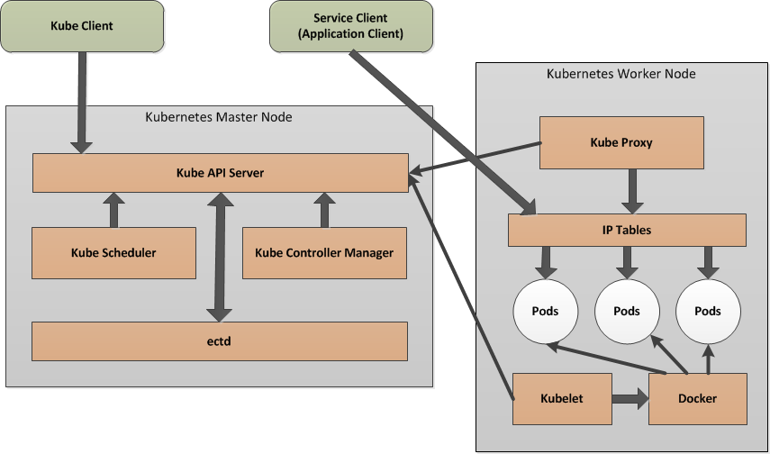

# OSFI (Open Source Flexible Infrastructure)

OSFI is Optum’s next generation container hosting and cloud service solution.  It is a secure, self-service platform built on open standards, with a multi-datacenter footprint, container aware storage solutions, and tenant isolation. 

OSFI platform is built on 
* Open standards promoting the use of commodity servers, commodity storage and networking 
* Open source software – OpenShift Origin, Mesos + Frameworks, Kubernetes, and containerization technology.

Key Benefits: 
* Containerization will enable more portability of workloads across public/private clouds
* Lower costs due to no vendor lock-in and high competition on commodity hardware
* Open source technology is expectation for hiring top engineering and ops talent 
* Promotes DevOps enablers such as Infrastructure as Code and CI/CD

# Kubernetes – The core of OSFI

Kubernetes is a portable, extensible open-source platform for managing containerized workloads and services, that facilitates both declarative configuration and automation. It has a large, rapidly growing ecosystem. Kubernetes services, support, and tools are widely available.

Some of the key features are:

* Lean, lightweight, simple, accessible
* Built-in Security and Mullti-tenancy
* Auto-scaling, auto-restart, auto-replication and service discovery features
* GPU support through device plugins to scale up training and inference deployment
* Metrics and Event APIs for monitoring
* Wide variety of storage options, including on-premises SANs, distributed file systems and public clouds
* Based on extensive experience at Google

# Kubernetes Architecture

Kubernetes on bare metal is a cluster of machines to host the daemons that make up the Kubernetes control plane and workers. This cluster automatically runs containerized applications and services based on Docker runtimes. A Kubernetes cluster provides a single Kubernetes API entry point, a cluster-wide resource naming scheme, a placement engine and scheduler for pods, a service network routing domain and an authentication and authorization model. The below diagram shows high level architecture view:

  

## Master Node

Master components provide the cluster’s control plane. Master components make global decisions about the cluster (for example, scheduling), and detecting and responding to cluster events (starting up a new pod when a replication controller’s ‘replicas’ field is unsatisfied). 

### Kube API server

The API server is the entry points for all the REST commands used to control the cluster. It is the front-end for the Kubernetes control plane.

### etcd storage

etcd is a simple, distributed, consistent key-value store. It’s mainly used for shared configuration and service discovery.
It provides a REST API for CRUD operations as well as an interface to register watchers on specific nodes, which enables a reliable way to notify the rest of the cluster about configuration changes.

### Kube scheduler

Component on the master that watches newly created pods that have no node assigned, and selects a node for them to run on.

### Kube controller-manager

Optionally you can run different kinds of controllers inside the master node. controller-manager is a daemon embedding those.
A controller uses apiserver to watch the shared state of the cluster and makes corrective changes to the current state to change it to the desired one.
An example of such a controller is the Replication controller, which takes care of the number of pods in the system. The replication factor is configured by the user, and it's the controller’s responsibility to recreate a failed pod or remove an extra-scheduled one.

## Worker node

The pods are run here, so the worker node contains all the necessary services to manage the networking between the containers, communicate with the master node, and assign resources to the containers scheduled.

### Docker

Docker runs on each of the worker nodes, and runs the configured pods. It takes care of downloading the images and starting the containers.

### kubelet

kubelet gets the configuration of a pod from the apiserver and ensures that the described containers are up and running. This is the worker service that’s responsible for communicating with the master node. The kubelet doesn’t manage containers which were not created by Kubernetes.

### kube-proxy

kube-proxy acts as a network proxy and a load balancer for a service on a single worker node. It takes care of the network routing for TCP and UDP packets.

Read [Kubernetes Architecture documentation](https://kubernetes.io/docs/concepts/overview/components) for more details.

# High Availability

The daemons running on a master node control all operations of a Kubernetes cluster. Therefore, in a production environment, their operation has to be protected with high-availability clustering. The kubelet service that runs on each worker node, and monitors the pods, is a convenient option to monitor these services on the master node as well. Each of master node services will be automatically restarted by kubelet if it fails. 

The Kubernetes architecture is designed to implement clustered redundancy for each of the daemons as follows:

The etcd daemon can be clustered with a leader-based distributed protocol that replicates the daemon's contents across an odd number of hosts (i.e., three, five or more). The etcd protocol gracefully handles the failure of any individual host, or the loss of network communication, to provide continued access.

The API server daemon can be replicated as needed, since it does not maintain its own state (its state is managed by the etcd daemon). The replicated instances of the API server are usually accessed through an external load balancer (highly available load balancer to avoid single point failure for the cluster). 

  

# OSFI Kubernetes - Reference Architecture

The OSFI Kuberntes is a Container infrastructure as a service (CIaaS) that handles cluster management and container orchestration. It integrates with most of the devops tools and enterprise platforms available in our organization. It is designed with the following guidelines:

* API driven infrastructure for  automation and DevOps
* Implement unified Container Security and IAM
* Embrace the use of containers for hosting applications in production
* Single platform experience for micro-services, Big Data, AI, Machine Learning and Deep Learning
* Flex compute and pay per use model
* Adequate performance and availability monitoring tools
* Improved end user experiences with single management UI for Infrastructure Provisioning, Billing, Developer Tools, Service managements

  

OSFI Portal is designed to enable self-service provisioning and service management. The UI has option to register tenancy details which will be used for chargeback for platform usage.

Platform monitoring and application monitoring tools are also developed in OSFI platform. Cluster monitoring tools are available only for cluster operators where as application monitoring tools are available for each tenants.

Read [onboarding instructions](/operations/tenantOnboarding/Onboarding-instructions.md) for further details on on-boarding to the platform

# Multi-tenancy

Namespaces provide logical separation and application multitenancy within a cluster; it is a mechanism to facilitate management by isolating resources. Namespaces partition cluster resource usage and authorization, effectively creating multiple virtual clusters inside of a single Kubernetes cluster.

Each application team can provision one or more namespaces through the management UI. This enables each application operates in an isolated environment. The [on-boarding guide](/operations/tenantOnboarding/Onboarding-instructions.md) further provide instructions to get on-boarded to the platform.

The self provisioning process creates:

1. Namespace with guaranteed quota 
2. an admin Service Account with 'admin' role for the namespace
3. RBAC through two secure groups - admin group and developer group
4. Network Namespace (Cisco ACI EPG) for namespace to provide Policy based Network Isolation and security

The service account owner can further customize the namespace access controls by creating more service accounts, roles and role bindings. The [authorization guide](/security/Authorization.md) explains the roles, cluster roles and role binding available for tenant administrators to control access at namespace level.

The following diagram shows the concept. The network policy based isolation is customizable and there will be self service tools available for tenants to maintain contracts and policies

  

# Security

Kubernetes architecture builds distributed access control into its operation by design. All calls to Kubernetes APIs can be authenticated with client certificates, bearer tokens, an authenticating proxy or HTTP basic access authentication. The roll based access controls (RBAC) authorize the users, auditing feature audit API calls and admission controller enables container runtime security. The network policy feature in Kubernetes, allows cluster/tenant administrators to configure how groups of pods are allowed to communicate with each other and other network endpoints. With the proper configuration and maintenance processes in place, a Kubernetes cluster can therefore be kept fully secure. 

The major areas of considerations:

## Securing Control Plane

The Control Plane manages the cluster’s state and schedules containers. A privileged attack against a control plane node or pod can have serious consequences. We are restricting direct access to control plane nodes only to the cluster administrators. Administrators have to make sure that the OS running on Kubernetes cluster servers is kept up to date with the latest security patches. 

The direct access of Control plane and worker nodes are restricted for regular users. Only admin users are allowed to SSH into the hosts. Multi-factor authentication is also enabled through password vault for admin users

## Securing Cluster Networking

Networking is at the heart of the Kubernetes architecture, and protecting network communications is one of the most important requirements for maintaining the security of a Kubernetes cluster. All communication between Kubernetes components can use Transport Layer Security (TLS), which requires administrators to create server certificates to set up a working cluster. Master nodes require a certificate to act as an HTTPS server, and worker nodes need certificates to identify themselves as clients of the master. For end to end TLS communication, we are using Optum signed certificate. 

The Cisco ACI and Kubernetes integration was designed to offer a highly flexible approach to network policy. To enable tenancy isolation, we will be creating Cisco ACI EPGs and contacts with self service contract management option for Kubernetes users. Kubernetes provides an abstraction called NetworkPolicy, which enables tenant administrators to configure how groups of pods are allowed to communicate with each other and other network endpoints. Network policies effectively act as firewalls between pods, controlling details such as which namespaces are allowed to communicate with each other and which port numbers can be used by pods. With Cisco ACI EPG contracts and Network policies, tenants can design fully segregated applications and manage access through configurable policies.

For more details: 

## Container Security

Containers are not inherently unsecure, but administrators must take some specific steps to address container security issues around vulnerabilities, visibility, compromise and compliance. This risk of a container security breach may be acceptable if all the pods running on a host share the same level of trust. However, when security isolation between containers is required, such as in a multitenant environment, it will be necessary to deploy additional host level and OS-level mechanisms that help to securely isolate container. 

Pod Security Policies define a set of conditions that a pod must run with in order to be accepted into the system. This is administrated as an admission controller. They allow cluster administrators to control many security settings such as running pods as privilege users, host ports, host networking, volume types etc. This policy has been predefined for all users of the cluster and can only be modified with an exception.

For more details: [Pod Security Policy](security/ContainerSecurity.md)

## Managing Identity and Access Management

When security has to be implemented in a distributed computing system like Kubernetes, the most basic protection is to control what actions users or applications can perform in the cluster based on their identity. Kubernetes deals with this requirement by performing all authentication and authorization within its API server component. 

Authentication Controls are explained [here](/security/Authentication.md)

Authorization Controls are explained [here](/security/Authorization.md)

## Managing Secrets

One of the challenges with operating container platforms is providing secure access credentials to applications without losing control over their usage. Kubernetes provides a resource abstraction called Secrets to store sensitive information, such as passwords, without including plain-text versions in the resource definition file for a pod. Kubernetes Secrets can be mounted to pods that need them, and then accessed within the pod as files. These files contain the secret credential values as content.

The secret access is controlled with a custom cluster role created called 'developer' So by default only cluster administrators has access to secrets. The developers still can deploy pods accessing the secrets manage by tenant administrators. Vault integration for Secrets also will be available based on the availability of enterprise solution for Vault by IAM team

# Load Balancing and Ingress Controls for Services

Optimizing the flow of traffic to application services running in pods is an important part of enabling the scalability in a Kubernetes deployment. The Kubernetes network architecture enables load balancing to be implemented in a variety of ways.

1. ClusterIP for Internal access 

This type of service has no external access (i.e., it is reachable only from inside the cluster through its virtual IP address). The kube-proxy daemon routes requests to a pod to deliver the service. 

Please refer [Internal Service Discovery](/services/InternalServiceDiscovery.md) for more details

2.  NodePort for External access 

With this type of service, a single number in the range of 30,000 through 32,767 is selected, and that port number is opened on every node of the host cluster. When a port receives a service request, it is routed to one of the pods in the cluster, as chosen by the load-balancing function in kube-proxy. External Load Balancer (LTM) can be provisioned to enable load balancing to expose services externally. Alternatively Cisco ACI provide load balancer IP along with node port, which can be configured as an externally accessible DNS name for the services/applications.

Please refer [External Service Discovery](/services/ExternalServiceExposure.md) for more details

# Storage

A key feature OSFI platform should have is that developers should be able to store data in Kubernetes clusters without having to worry about how persistent storage is working under the hood. Kubernetes offers a wide variety of options to set up persistent storage. The Kubernetes storage architecture is designed for clear separation of responsibilities between development and operations administrators. Developers request a certain amount of storage for pods, and Kubernetes fulfills the request using resources provisioned by cluster administrators. For stateless workloads, a pod's storage is ephemeral, and it is recycled when the pod is deleted. Persistent storage that must remain in place independently of pod life cycles can be allocated in one of two ways:

1. Static

Cluster administrators pre-provision storage resources and expose them as abstractions called Persistent Volumes (PVs). Developers explicitly specify the identity of the PV that will attach to pods. 
    
2. Dynamic 
Cluster administrators create pools of storage as storage classes which can be further classified and labeled (i.e., "slow" for GlusterFS runs on attached hard drives [HDDs], and "fast" for ISCSI 3PAR). Developers then specify which class of storage they want to attach to their pods, and it is dynamically allocated on demand.

To read more about Persistent Volume and Persistent Volume Claim please refer [Kubernetes Storage](/storage/ReadME.md) documentation.

# Reference:

[Kubernetes Documentation](https://kubernetes.io/docs/concepts/)

[Assessing Infrastructure Requirements for Deploying Kubernetes](https://www.gartner.com/document/3872492?ref=solrAll&refval=205424128&qid=06950030c17d1035b268286c01769da3) from Gartner

[Achieving Kubernetes Operational Readiness to Run Containers in Production](https://www.gartner.com/document/3877943?ref=lib) from Gartner
