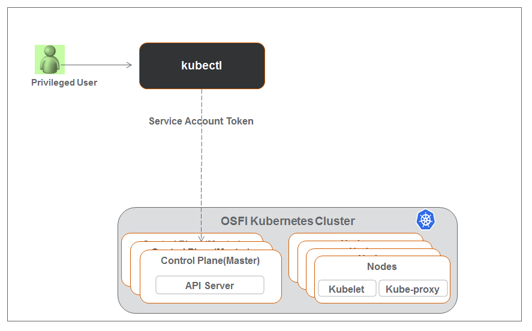
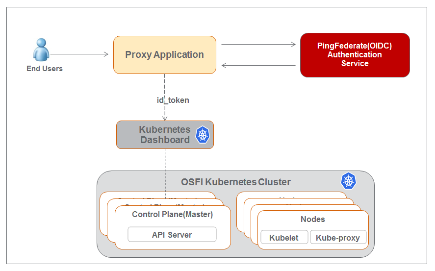
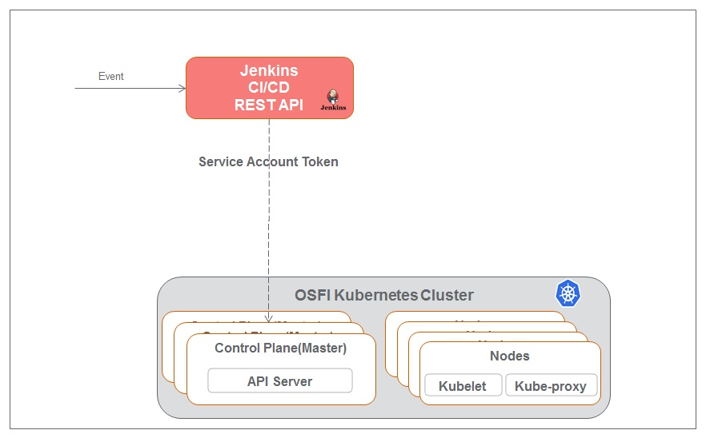

# Kubernetes Authentication 
OSFI Kubernetes container orchestration platform brings tremendous values like devops,faster development, built in fault tolerance, 
scale the containers based on workload and etc to orignization. Kubernetes adopted by all major clouds providers,many orginzation 
and fully embraced by developer/open source community. This brings increased responsonsibility on orgnization to address any threat or vulnerability those are still open to be exploited by malicous user/activities. As an orchestration platform, Kubernetes can affect many runtime security functions, including authentication,authorization,logging,resource isolation and network segmentation.

OSFI Kubernetes is an enterprise offering to our bussiness, application and operation teams, needs to address the all functions 
of security to avoid any threat, vulnerability or compromise.
Authentication and authorization are at the core of Kubernetes security. Securing API Sever is the top of list to secure Kubernetes
environment. Kubernetes API Server is the interface for all users (administrators, users or application) to communicate to 
Kubernetes environments. Both user and service accounts can comminicate Kubernetes API Server to initiate any operation.

The Kubernetes platform has built-in authentication and authorization controls, as well as admission controls, which intercept 
and regulate request to the Kubernetes API after Authentication and Authorization. Admission controls include built-in 
constructs as well as webhook enabled methods that can be used to invoke external logic.

Here are list of Authentication options available in Kubernetes
* Static Token File
* X509 Client Certs
* Bootstrap Tokens
* Static Password File
* Service Account Tokens
* OpenID Connect (OIDC) Tokens
* Webhook Token Authentication

PingIdentity (OIDC provider) is a standard offering in enterprise to provide identity and access management for an application. This offering is being utilized in OSFI Kubernetes platform. The following Authentication options are being used in OSFI Kubernetes platform
* OpenID Connect (OIDC) Tokens
* Service Account Tokens
* X509 Client Certs (comming soon)

### Key terms used in Kubernetes
* A Kubernetes clusters have two categories of users: service accounts managed by Kubernetes, and normal users.

* Normal User: Normal users are assumed to be managed by an outside, independent service. Kubernetes does not have objects which represent normal user accounts. Regular users cannot be added to a cluster through an API call.

* Group: Group is similar to Normal user. Group is associated with set of common users. The groups along with users are used in RBAC configuration.

* Service accounts: Service accounts are users managed by the Kubernetes API. Service Accounts are created automatically by the API server or manually through API calls. Unlike a normal user, Service Accounts are managed and bound to a specific namespaces and associated with credentials known as Secrets. The authentication and authorization processes for service accounts are radically different than those for the human users.

* JWT: The signed JWT can be used as a bearer token to authenticate as the given Service Account or user. 

### Type of Interaction with Kubernetes Platform
User, administator or application can interactive with kubernetes with one of the following options
* CLI (kubeclt)
* Kubernetes Dashboard
* REST API

Here are details of pictorial presentation of each option

### CLI (kubelet)
* This option is used by tenant owner or previledged user within tenancy
* This type of user will use Kubernetes managed Service Account token
* Tenant owner can add more Servie Account to their tenancy and control the access for each account
* The user will configure their kubectl CLI using Service account token

  

### Kubernetes Dashboard
* Normal user will login to proxy application to authenticate using PingFederate (OIDC Provider)
* After successful authentication PingFederate return access and id_token to Proxy Application
* Proxy Application will add id token in Authorization header before passing to Dashboard.
* User can select/use their Authorized namespace to interact with Kubernetes

  

### Kubernetes REST API
* This option is used by tenant owner or previledged user within tenancy to deploy the application through CI/CD pipeline
* This type of user will use Kubernetes managed Service Account token
* Tenant owner can add more Servie Account to their tenancy and control the access for each account
* The user will configure their CI/CD pipeline using Service account token

  

* X509 Client Certs (comming soon) 

## Reference Link
* https://kubernetes.io/docs/admin/authentication/
* https://kubernetes.io/docs/reference/access-authn-authz/
* https://kubernetes.io/docs/reference/access-authn-authz/rbac/#rolebinding-and-clusterrolebinding
https://kubernetes.io/docs/reference/access-authn-authz/authentication/
