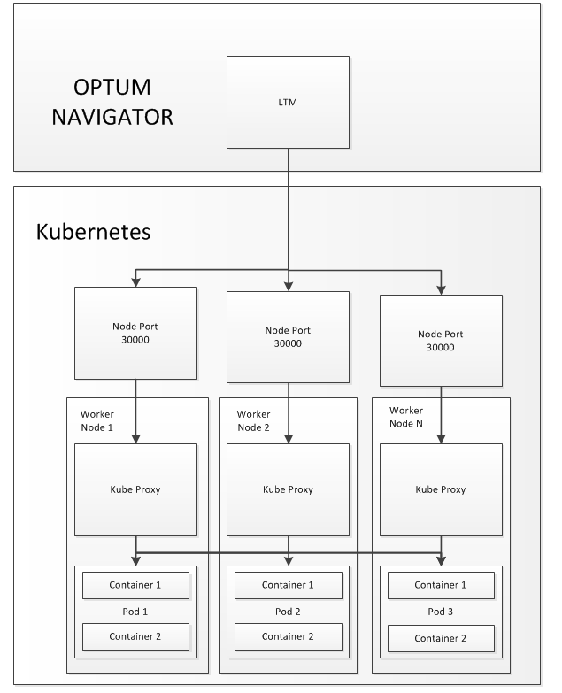
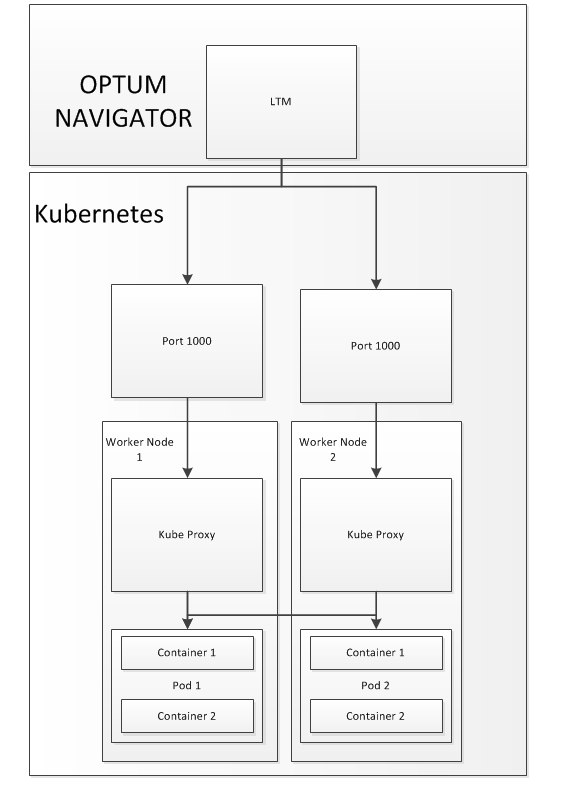
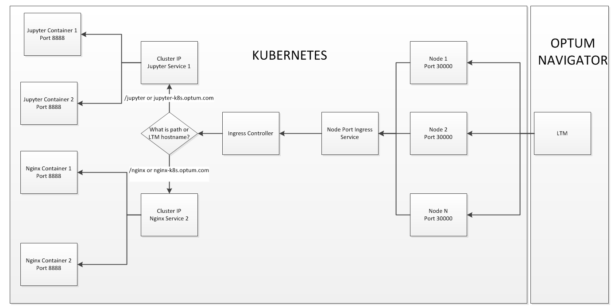
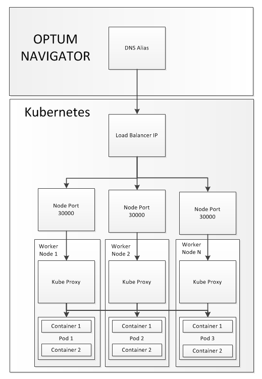

# Service Exposure 
Within Kuberentes there are various different ways to expose a service externally. The current recommended model for external exposure is Node Port.

## Node Port
Kubernetes out of the box provides a Node Port Service Type. This service allows you to expose a port on every node within the Kubernetes cluster where your application would be accessible. A sample yaml can be found [here](https://github.optum.com/kubernetes/OSFI-Kubernetes/blob/master/yamls/services/nodePort_template.yaml) and is also seen below:

```yaml
apiVersion: v1
kind: Service
metadata:
   name: <service_name>
   namespace: <namespace>
   labels:
     app: <service name>
spec:
   type: NodePort
   ports:
     - port: <container Port>
       name: <port name>
       protocol: <protocol type TCP OR UDP>
   selector:
     app: <value of your app label>
```

Once the service is up and running you can pull the port where your service is accessible:

`kubectl get service -n <namespace> | grep <service name> | awk {'print $5'}`

You should see a port or ports in the 30000+ range these are the ports that were exposed. For example if you were trying to expose 80 and 443 you would see 80:32118/TCP,443:31440/TCP. This means that port 80 is accessible on 32118 and port 443 is accessible on 31440. 

Once you have the port(s) you can create a Load Balancer LTM in front of all the nodes or a a handful of nodes within the cluster pointing at the port that was assigned. In other words the service is availabe on every node in the cluster or 1 to N so you can configure the load balancer to point at any number that you desire. The Load Balancer with the LTM option can be created on [Optum Navigator](https://nsdashprd.optum.com/navigator/load_balancer_automation.do). Do not select GTM as we currently are not multi data center. Please note that if you stop and restart the service this port will change and your VIP would need to be updated.

 <p align="center">
  
</p>


Additionally you can hard code the node port by changing the ports section to include Node Port with a port over 30000:


```yaml
apiVersion: v1
kind: Service
metadata:
   name: <service_name>
   namespace: <namespace>
   labels:
     app: <service name>
spec:
   type: NodePort
   ports:
     - port: <container Port>
       name: <port name>
       protocol: <protocol type TCP OR UDP>
       nodePort: <desired Node Port>
   selector:
     app: <value of your app label>
```
The issue with hardcoding is that you have to find a port that isn't in use by another tenant.


## External IP 

A 2nd way to expose your service is to use the Cluster IP service type with an external IP flag. This method is not recommended as it is difficult to manage as you may pick a port already in use. Additionally you have to manually put in every ip you want to expose the service on. An example yaml can be seen below where we define to ips and the flow can be seen:

```yaml
kind: Service
apiVersion: v1
metadata:
  labels:
    app: my-service
  name: my-service
spec:
  ports:
    - port: 1000
      name: <port name>
      protocol: <protocol type TCP OR UDP>
      targetPort: <container port>
  selector:
    app: <value of your app label>
  externalIPs:
  - <IP of Host in cluster>
  - <IP of Host in cluster>
```

 <p align="center">
  
</p>

## Ingress Controller - Coming Soon 8/1

An ingress controler allows you to start up one external service that will route to one to many internal services running within the cluster. It would be configured in an administrative namespace and would point back to a tenant namespace. 

Tenants would then simply create an ingress rule that would direct the traffic to the correct service depending on the host header or path.

To get an ingress controller an intake request would need to be filled out which can be found here(Link will be available upon release)

 <p align="center">
  
</p>

An example ingress rule can be seen below:

Host header rule:

```yaml
apiVersion: extensions/v1beta1
kind: Ingress
metadata:
  name: jupyter-ingress
  namespace: development
  annotations:
    nginx.ingress.kubernetes.io/rewrite-target: "/"
spec:
 rules: 
  - host: 'jupyter-k8s.optum.com' 
    http:
     paths:
     - backend:
         serviceName: jupyter 
         servicePort: 8898
 ```
 
 With the above rule we need to create a LTM called jupyter-k8s.optum.com that points at the ingress controller created for us. The details of where your ingress controller is running should be provided once your ticket is completed. Create your LTM on [Optum Navigator](https://nsdashprd.optum.com/navigator/load_balancer_automation.do) Then when you go to jupyter-k8s.optum.com you will be redirected to port 8898 in the container that the service is pointing at. Please note that the servicePort provided here is the port your service is running on within the container not the port you expose using ClusterIP.
 
 
Path example:
```yaml
apiVersion: extensions/v1beta1
kind: Ingress
metadata:
  name: jupyter-ingress
  namespace: development
  annotations:
   nginx.ingress.kubernetes.io/rewrite-target: /
spec:
 rules: 
  - http:
     paths:
     - path: /jupyter
       backend:
         serviceName: jupyter
         servicePort: 8898
     - path: /nginx
       backend:
         serviceName: my-nginx
         servicePort: 80
```

The above example will route traffic to your clusterIP service my-nginx when you connect to http://<node ip>:<ingress controller port>/nginx. Additionally it will route traffic to your clusterIP service jupyter when you connect to  http://<node ip>:<ingress controller port>/jupyter. 

You will notice that there is an annotation in our ingress controller telling us to rewrite the target to slash. This is so we don't hit the path /nginx within the container but rather just /.

## Load Balancer - Coming Soon TBD

The load balancer is provided by Cisco ACI which is planned to be the SDN in the GA release barring any setbacks. The load balancer service type creates an external IP where your container can be reached. A user can then simply create a DNS alias in Optum Navigator for there assigned IP to access there application.


```yaml
kind: Service
apiVersion: v1
metadata:
  labels:
    app: my-service
  name: my-service
spec:
  type: LoadBalancer
  ports:
    - port: 1000
      name: <port name>
      protocol: <protocol type TCP OR UDP>
      targetPort: <container port>
  selector:
    app: <value of your app label>
```


Behind the scenes the load balancer exposes the service on a node port and then creates an external ip that points at these ports. The user can simply then go to the load balancer ip on port 80 to access there service or create a dns alias pointing at this ip on [Optum Navigator](https://nsdashprd.optum.com/navigator/dns.do).


 <p align="center">
  
</p>


