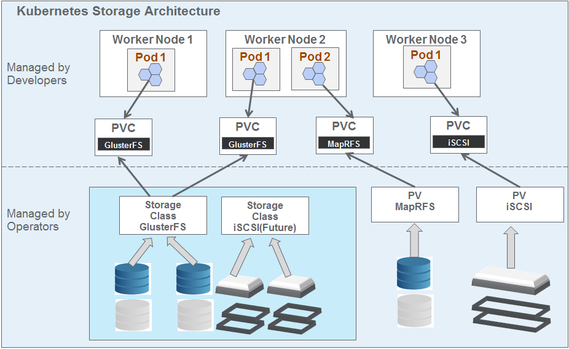

# Storage
## Introduction
All application/micro services/containers run on the container platform are not stateless, some of these services need storage to persist the state/data.
Now a days architectures become more application-oriented and storage doesn’t necessarily live on the same machine as 
the application or its services.
Storage is the top challenge for most of the organizations that deploy Kubernetes only on-premises servers.
This may be because these organizations manage their own storage infrastructure, possibly even handled by a separate IT team.

To run stateful workloads such as databases or storing logs or application/service requiring distributed storage, a software-defined storage layer should be available to the Kubernetes cluster. This software-defined storage layer will be exposed to the containers as persistent volumes. Gluster FS, Ceph FS Network File Systems(NFS), iSCSI, block storage and etc are the possible distributed storage software options.

## Volume
To solve the storage problem, Kubernetes provides a Volume abstraction to manage storage. Kubernetes Volume is a de-facto way of managing storage for container(s).The PersistentVolume subsystem provides an API for users and administrators that abstracts details of how storage is provided from how it is consumed.

PersistentVolume (PV): A piece of storage in the cluster that has been provisioned by an administrator. It is a resource in the cluster just like a node is a cluster resource. PersistentVolume resources are used to manage durable storage in a cluster. It is the low level representation of a storage volume. It represents the exclusive usage of a Persistent Volume by a particular Pod.

PersistentVolumeClaim (PVC): A request for storage by a cluster user. It is similar to a pod.The way pods consume node resources and PVCs consume PV resources.

StorageClass: A StorageClass provides a way for administrators to describe the “classes” of storage they offer. Different classes might map to quality-of-service levels, or to backup policies, or to arbitrary policies determined by the cluster administrators. 

Volume Driver: Driver is low level code used to communicate with the backend storage provider.

FlexVolume Driver: FlexVolume is an out-of-tree plugin interface, it makes it easy to write your own drivers and add support for their volumes in Kubernetes. It intended to allow storage vendors to provide storage to containers managed by Kubernetes.

## Provisioning
There are two ways PersistentVolumes may be provisioned: statically or dynamically.

### Static
A cluster administrator creates a number of PVs. They carry the details of the real storage which is available for use by cluster users. The cluster user can created PVC to claim the PV and consume in the Pod.

### Dynamic
The cluster user can dynamically request PersistenceVolume through PVC request. The cluster administrator does not need to provision a volume upfront. Kubernetes uses StorageClass to dynamically provision a Persistence Volume based on Persistence Volume Claim request.

## Recliam Policy
When a user is done with their volume, they can delete the PVC objects from the API which allows reclamation of the resource. The reclaim policy for a PersistentVolume tells the cluster what to do with the volume after it has been released of its claim. Currently, volumes can either be Retained, Recycled or Deleted.

### Recycled
It must supported by the underlying volume plugin, the Recycle reclaim policy performs a basic scrub (rm -rf /thevolume/*) on the volume and makes it available again for a new claim. Warning:The Recycle reclaim policy is deprecated. Instead, the recommended approach is to use dynamic provisioning.

### Deleted
For volume plugins that support the Delete reclaim policy, deletion removes both the PersistentVolume object from Kubernetes, as well as the associated storage asset in the external infrastructure.Volumes that were dynamically provisioned inherit the reclaim policy of their StorageClass, which defaults to Delete.

### Retained
The Retain reclaim policy allows for manual reclamation of the resource. When the PersistentVolumeClaim is deleted, the PersistentVolume still exists and the volume is considered “released”. But it is not yet available for another claim because the previous claimant’s data remains on the volume. An administrator can manually reclaim the volume with the following steps.

## Access Modes
A PersistentVolume can be mounted on a host in any way supported by the resource provider. Each storage providers will have different capabilities as mentioned below and each PV’s access modes are set to the specific modes supported by that particular volume. 

 ### ReadWriteOnce(RWO):
 The volume can be mounted as read-write by a single node. 
 
 ### ReadOnlyMany(ROX):
 The volume can be mounted read-only by many nodes.
 
 ### ReadWriteMany(RWX): 
 The volume can be mounted as read-write by many nodes

The abbreviations can be used in CLI.

## Kubernetes Storage Architecture 
The Kubernetes storage Architecture is designed to have clear seperation of responsibilities between developer and operators administrator. The available options described below, iSCSI and MapRFS are available as static volume and GlusterFS is available as dynamic volume. 

  

### Available Options
### iSCSI: 
iSCSI 3Par is a  fast flash storage SAN deployment. For iSCSI only static volume provisioning is available. The OSFI Kubernetes user needs to request cluster administrator to create static PersistenceVolume. Click [here](https://github.optum.com/FENetworkStorage/3par_k8s_generic_iscsi) to access detailed information.

### GlusterFS: 
GlusterFS is a scalable network filesystem suitable for data-intensive tasks. GlusterFS is configured to provision Persistence Volume Dynamically. OSFI Kubernetes user can directly request PV through PVC request.Click [here](https://github.optum.com/FENetworkStorage/gluster_kubernetes) to access detailed information.

### MapRFS: 
This option is only available for existing BDPaaS users and existing volumes in BDPaaS. The OSFI Kubernetes user needs to request cluster administrator to create static PersistenceVolume in Kubernertes. Click [here](https://github.optum.com/kubernetes/OSFI-Kubernetes/tree/master/storage/mapr) to access detailed information.

## Reference Links
* https://kubernetes.io/docs/concepts/storage/persistent-volumes/
* https://kubernetes.io/docs/concepts/storage/volumes/
* https://github.optum.com/FENetworkStorage/3par_k8s_generic_iscsi
* https://github.optum.com/FENetworkStorage/gluster_kubernetes
* https://github.optum.com/kubernetes/OSFI-Kubernetes/tree/master/storage/mapr

