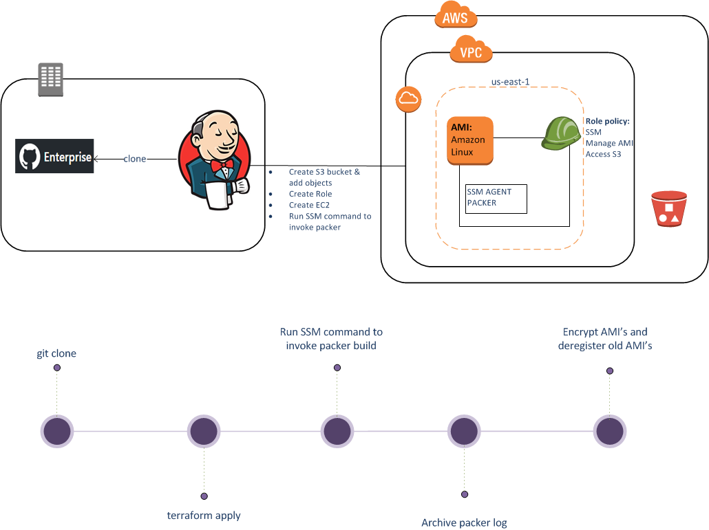

# aws_ami

### Overview

This module helps you to customize the Amazon Machine Images [[AMI]](http://docs.aws.amazon.com/AWSEC2/latest/UserGuide/AMIs.html) for different services like [aws_kubernetes](https://github.optum.com/PE-IAC-AWS/aws_kubernetes), [aws_eks](https://github.optum.com/CommercialCloud-EAC/aws_eks) and [aws_egress_proxy](https://github.optum.com/CommercialCloud-EAC/aws_egress_proxy) supported in CommercialCloud-EAC. The primary goal of the project is to provide hardened images containing latest patches with different agents like SSM,OSSEC,AWSLOG,Inspector etc. We use [Packer](https://packer.io/) to build and distribute images to different regions and accounts. 

#### Note:
* This is not a module that should be called from a different Terraform module. Instead it is a deployment of a specialized image factory. If you would like to use this deployment the recommended approach is to clone or fork it into your own repository, then modify it according to your image needs
* Instructions to use images built using this module is provided in the respective modules [aws_kubernetes](https://github.optum.com/PE-IAC-AWS/aws_kubernetes), [aws_eks](https://github.optum.com/CommercialCloud-EAC/aws_eks) and  [aws_egress_proxy](https://github.optum.com/CommercialCloud-EAC/aws_egress_proxy)
* Encrypting root volume is highly recommended. We use `jenkins_ami_builder.groovy` to encrypt images created by Packer. We do not encrypt when images are built as Packer can't share/distribute AMI with encrypted boot volume

### Workflow 

Jenkins administrates the overall AMI build process. It uses Terraform, Packer & AWS CLI. No SSH access is needed.

Terraform launches an EC2 instance with Packer and SSM installed using "user data" script. Terraform also creates an S3 bucket with archived Packer definition files as an object. Both S3 and EC2 are created with necessary IAM roles and policy. 

Once EC2 instance is successfully launched, AWS CLI invokes SSM to run a Packer build command. When Packer build is run, it builds an AMI by launching an EC2 instance from a source AMI and runs provisioner script to create the target AMI. If requested, the builder also shares the images with different accounts across regions. This is done by setting the parameter "ami_users" in the JSON descriptor file (example, ubuntu_var.json). The value is a list of AWS accounts. A list of regions can be specified in the "ami_regions" parameter to distribute the AMI across regions.

Jenkins Pipeline is further extended to encrypt the images on every account and regions where images are distributed. The AWS CLI command "copy-image" is invoked to create and encrypted copy of the image across accounts and regions specified in ami_users and ami_regions. The unencrypted images are destroyed instantly.  

With a different input parameter, the same Jenkins pipeline can be used to destroy the resources it created. 

### Instructions 
* Update `jenkins_ami_builder.groovy` to change information such as `credentialsId`
* Update the variable files `ubuntu_var.json`,`debian_var.json`, `amazon_linux2_eks_var.json` and `amazon_linux2_egress_proxy_var` based on the requirements. If not anything, you will be changing `ami_users` and `snapshot_users`
* Update `run_packer` based on your requirements 
* Update the `state.tf_bak` file with S3 bucket & DynamoDB table and rename the file to `state.tf`.Please refer the module [here](https://github.optum.com/PE-IAC-AWS/aws_bootstrap/) to create S3 bucket and Dynamodb table required to manage Terraform state.

### Managed Images

This chart displays the managed images this module can produce:

|Managed Image                          | Source AMI Used               | Publisher |
|--------------                         |-----------------------------  |-----------|
|`encrypted-ubuntu-xenial-16.04-amd64-server-ssm-ossec-awslogs-inspector-<date>` | UbuntuServer 16.04-LTS  | Canonical |
|`encrypted-amazon-eks-node-ssm-ossec-awslogs-inspector-<date>` | Amazon eks optimized Linux2              | AWS |
|`encrypted-amzn2-ami-hvm-2.0-squid-ssm-ossec-awslogs-inspector-<date>`   | Amazon eks Linux2              | AWS |
|`encrypted-k8s-1.8-debian-jessie-amd64-hvm-ebs-ssm-ossec-awslogs-<date>` | Kubernetes 1.8 Base Image      | Debian jessie|

### Variable Reference 

#### Terraform Variables

|Options                 |Description                                                                                     |
|------------------------|------------------------------------------------------------------------------------------------|
|**aws_profile**         |AWS credential profile. Example, saml                                                           |
|**aws_account**         |AWS account name                                                                                |
|**aws_region**          |The name of the region, such as us-east-1, in which to launch the EC2 instance to create the AMI|
|**tag_name_identifier** |Tag name identifier for the aws_base                                                            |

#### Packer Variables

These variables are used in the JSON files in order to provide packer information about the image being set up.

|Options                    |Description                 |
|---------------------------|----------------------------|
|**aws_region**             |The name of the region, such as us-east-1, in which to launch the EC2 instance to create the AMI|
|**ami_name**               |The name of the resulting AMI that will appear when managing AMIs in the AWS console or via APIs. This must be unique|
|**ami_description**        |The description to set for the resulting AMI(s). By default this description is empty|
|**ssh_username**           |SSH user name needed to authenticate source instance |
|**source_ami_filter_name** |Name filters used to select a source AMI |
|**source_ami_owner_name**  |This scopes the source AMI to certain Amazon account IDs|
|**ami_regions**            |A list of regions to copy the AMI to|
|**ami_users**              |A list of account IDs that have access to launch the resulting AMI|
|**snapshot_users**         |A list of account IDs that have access to create volumes from the snapshot(s). Needed to encrypt the AMI |
|**os_type**                |Type of OS to build |
|**ami_build_type**         |Provisioner script action input. `add_agents` run the upgrade and adds agent. We can add different action to change the behavior | 

## EIS Security Endorsement 

This module helps to enforce the following EIS mandates:

| Req ID | Requirement | How module addresses requirement |
|-------------|-----------|-----------|
|**3.2** | *Role-Base Access Control (RBAC)*: Groups of information services, users, and information systems shall be isolated logically and virtually to prevent information leakage and unauthorized access. | The AMI module generates an S3 store and a EC2 instance and assigns it default IAM permissions to perform required actions to provision AMI. The user of the module can also setup a list of account IDs that are given access to launch the provisioned AMI.|
|**5.3** | *Internal information Systems*: Functionality ensuring confidentiality, integrity and availability of internal information systems shall exist preventing exploitation technical security weaknesses. | Description for 3.2, 5.4, 5.5, 5.6, 6.2, 7.4, 9.1, and 11.1 also addresses 5.3 requirements.|
|**5.4** | *Patch Management*: Native functionality providing patching of information system flaws shall exist to protect against known security vulnerabilities and exploits-the-wild. | The module installs the latest updates for the image's operating system during the initial AMI build. An AWS SSM agent is also installed and enabled for the images which allows for the usage of AWS Systems Manager Patch Manager to automate patching and security updates for managed images as well as using AWS Systems Manager Configuration Compliance to scan images for patch compliance.|
|**5.5** | *Vulnerability Scanning Logs*: Native functionality shall exist enabling capture of attack surface management (ASM) results  to UHG/Optum's EIS-approved repository. | OSSEC is installed on the images which can check for file integrity and detect rookits.|
|**5.6** | *Malicious and Mobile Code Protection*: Native functionality preventing execution of malicious code shall exist preventing compromise of information systems by manual or automated attacks. | OSSEC is installed on the images which can which performs file integrity monitoring, log monitoring, rootcheck, and process monitoring. An Amazon Inspector agent is also setup on ubuntu images to allow for more security assessments on network, file system, and process activity and configuration data information.|
|**6.1** | *Secure Configuration Baseline*: Functionality  shall exist providing baseline security configurations for CSP environments. Assets instantiated in the cloud must adhere to enterprise standards, hardening guideline and compliance mandates. | Description for 3.2, 5.4, 5.5, 5.6, 6.2, 7.4, 9.1, and 11.1 also addresses 6.1 requirements.|
|**6.2** | *CMDB*: Functionality shall exist enabling monitoring and remediation of configuration baselines of CSP environments. | An AWS SSM agent is installed and enabled for the images which allows for the usage of AWS Systems Manager Configuration Compliance to scan images for configuration consistency.|
|**7.1** | *Defense in Depth*: Native functionality shall be deployed in a tiered architecture model to protect ingress and egress perimeter routes against blended threats. functionality shall be deployed in a tiered architecture model to protect ingress and egress perimeter routes against blended threats. | Description for 3.2, 5.4, 5.5, 5.6, 6.2, 7.4, 9.1, and 11.1 also addresses 7.1 requirements.|
|**7.4** | *IDS/IPS Stack*: Native functionality enabling detection and alerting of intrusions or alerting and preventing intrusions. | OSSEC is installed on the images which can perform security alerting and take active responses.|
|**8.3** | *Tehcnology Stack hardware and software*: Native cloud functionality must be enabled to capture security events from the software, platform and infrastructure levels. | Description for 5.6 also addresses 8.3 requirements.|
|**9.1** | *Threat Monitoring*: Native functionality shall exist supporting monitoring of onprem logs by the Cyber Defense team for investigative purposes. | Description for 5.6 also addresses 9.1 requirements. In addition, an AWS SSM agent is installed and enabled for the images which allows for the usage of AWS Systems Manager Built-In Insights and CloudWatch dashboards to view information about the images.|
|**9.2** | *Security Incident Response*: Native functionality shall exist supporting monitoring of onprem logs by the Cyber Defense team for investigative purposes. | Description for 9.1 also addresses 9.2 requirements.|
|**11.1** | *Authentication & Authorization*: A collection of native and traditional solutions shall be selected to manage access of human/non-human accounts, services, clients and host while enforcing the principle-of-least privilege along with prevention of unauthorized access to information systems. | Root login is automatically disabled on images.|
|**11.4** | *Role-Base Access Control (RBAC)*: Groups of information services, users, and information systems shall be isolated logically and virtually to prevent information leakage and unauthorized access. | Description for 3.2 also addresses 11.4 requirements.|
|**13.2** | *Operating Systems*: Cloud native and traditional software shall be configured protect operating system software against accidental or malicious events. | Description for 5.4, 5.6, 11.1 also addresses 13.2 requirements.|
|**13.6** | *Patching*: To reduce the risks resulting from application coding flaws, vendor provided patches shall be applied. | Description for 5.4 also addresses 13.6 requirements.|

Note: This module also utilizes the Commercial Cloud S3 Module. You can check the module's [repository](https://github.optum.com/CommercialCloud-EAC/aws_s3) to view its EIS Security Endorsement information.

