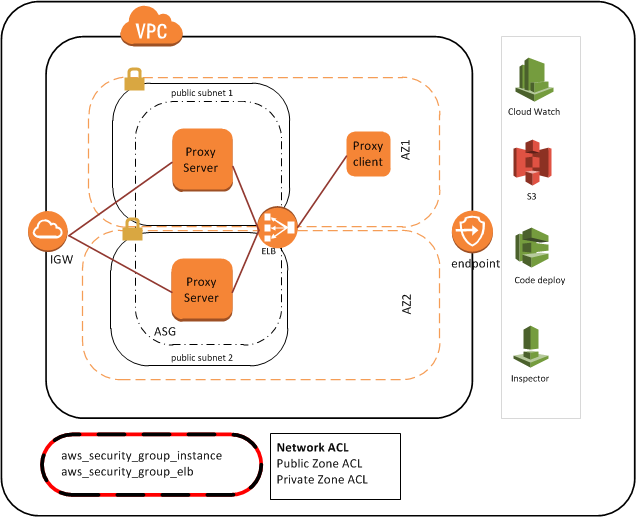

# aws_egress_proxy
### Overview
One of the critical network security measure is to effectively control outbound (egress) VPC network traffic in order to distinguish between legitimate and illegitimate requests. If internal servers are compromised, they can pose a threat to a larger network of resources especially when attempting to steal sensitive data. Egress module helps to manage egress traffic as part of a holistic network security strategy.

#### What is the difference between NAT Gateways & Egress Proxy ? 

NAT Gateway allows private instances to connect to Internet by replacing internal servers private IP addresses with public IP addresses on the way out of the network, and retranslating response IP addresses on the way back in. While NAT gateway enables the outbound Internet access but doesn't control it and to make things more complicated, security groups cannot be directly associated with a NAT gateway. 
Proxy Fleet is bit more complicated. Proxy servers usually act as a relay between internal resources and the Internet, and to filter, accelerate and log network activities leaving the private network. However ,applications using proxy must be made aware of the proxy server at OS or application level. Please note, Egress proxy is a forwarding proxy server and not a reverse proxy.


This module creates the following using Terraform: 

* Fleet of Squid proxy instances in all the public availability zones linked to Auto Scaling Group. EC2 instance has the IAM role to access selected S3 bucket ,Cloud watch logs & metrics
* An Auto Scaling launch configuration that will install the required services - Squid with default configurations, Log agent, Code Deploy & Inspector agent. Launch configuration also installs Cron job to collect the squid metrics and send them to Cloud Watch Metrics
* Creates an internal ELB with proxy_policy to distributes TCP requests across multiple Squid proxy instances. ELB is also attached to the Auto scaling group 
* A Security group is assigned to Proxy instances that has inbound only access from ELB and Security group assigned to ELB allows only access from private instances 
* Deployment group, application and IAM role for Code Deploy to revise the squid configurations. Code deployment is integrated with Auto scaling group as well to make sure all new instances starts with the latest configuration
* Optional Auto Scaling policies to increase or decrease the number of instances based on the Cloud Watch alarms depending on the total Squid traffic
* Cloud watch log group to capture the outbound access events 
* Creates an S3 bucket to host the artifacts for Code deploy and update the Squid URL after creating them 
 


#### Module Variables:
|Variables|Description              |Default|
|---------|-------------------------------|-----------|
|aws_region   |  AWS region to create resources| `us-east-2` |
|proxy_name  | Name for the Egress proxy | `squid-egress-proxy` |
|vpc_id | VPC to launch the egress proxy.  Required field.|``|
|subnets_for_proxy_placement |subnet ids from public availability zones.Must be public zone subnets from your VPC .Default is default subnets for the given region | `[""]`|
|instance_type |ec2 instance type used for proxy instance| `t2.medium` |
|ami_provider | AMI provider is either public or private. If image is not public, you must also provide ami_name_filter and ami_owner. Please note: **You can't encrypt root EBS volumes when public image is used**. You need to change this value to bring your own encrypted AMI. Read more about building your own encrypted root volume [here](https://github.optum.com/CommercialCloud-EAC/aws_ami) | `public` |
|ami_name_filter | The name filter to find the AMI.Ignored when ami_provider is public | ``|
|ami_owner       | The owner of the AMI. Ignored when ami_provider is public | `` |
|enable_asg_policy  |Enable custom Scale In/Scale Out policy based on network traffic [KB/sec] | `true`|
|max_number_instances  | Maximum number of instances to run with Scale out policy. This variable is ignored if `enable_asg_policy` is set to false.   | `10` |
|cloudwatch_log_group_name | Name of the CloudWatch log group| `egress-proxy-logs` |
|retention_days| Number of days to retain the cloud watch logs| `14` |
|s3_bucket_name_prefix |Name prefix for S3 bucket to output the Squid proxy information and also to store code deploy configurations.| `egress-squid-proxy-config` |
| s3_log_bucket_name | s3 bucket name for logging s3 access to main bucket | ``|
|namespace | The namespace parameter is appended to all resource names to create unquie resource names| `poc` |
|global_tags |Addtioanl global tags to be applied to created resources|`{"terraform" = "true"}`|


#### Module Outputs:
|Output | Description|
|----------------|---------------|
|egress_proxy_url|ELB internal URL with port |
|egress_proxy_security_group| Security group for ELB. Application using proxy must add inbound rule to this SG |
|egress_proxy_s3_bucket_with_proxy_info|S3 bucket name with proxy information|
|egress_proxy_codedeploy_deployment_app_name| code deploy application name for the configuration update |
|egress_proxy_codedeploy_deployment_group_name| code deploy deployment group name for the configuration update |

#### Important Note:
* Application/EC2 instances using egress proxy must be able to communicate with ELB and that requires inbound rule to the ELB SG 

* Application/EC2 instances must be made aware of proxy ELB endpoint. At OS level, It can be as simple as setting up environment variable `http_proxy` & `https_proxy` and updating them permanently in `/etc/envornment`. All Proxy-aware application should also be configured to use proxy endpoint. Please refer [aws_ami](https://github.optum.com/CommercialCloud-EAC/aws_ami) module to learn more about it

* Auto scaling policy provided here is experimental for the default instance type[t2.medium]. Performance is expected to vary when different types of instances are used. Current setup starts with `n` number of instance where `n` is the number of availability zone. Policy provided here adds an additional instance every time average network traffic is greater than 5000 KB/s for 5 consecutive minutes. This process continues till `max_number_instances` limit is reached. Similarly, Scale-In process will be triggered if average network traffic is lesser than 2000 KB/s for 15 consecutive minutes. Thorough performance testing is warranted!! 


#### Testing:

* Ensure that ruby and bundler have been installed, also the install the required gems and run the tests
```
> ruby --version
> bundle install
> rspec 
```

#### Examples:
There is an example provided in VPC [module](https://github.optum.com/CommercialCloud-EAC/aws_vpc/tree/master/examples/vpc_with_egress_proxy_and_flow_logs) to showcase the use of egress proxy.

#### Use of Code Deploy 
Once you have successfully create egress proxy, you should have running proxy farm with the default configurations defined [here](/code_deploy_config/squid/squid.conf_orig). If egress proxy configuration requires a changes,  CodeDeploy Application is created with a config "CodeDeployDefault.OneAtATime" to deploy one instance at a time with new configurations.

By default only below endpoints are allowed:

`.amazonaws.com`
`.newrelic.com`

Steps
-----
* Refer Code Deploy [AppSpec](/code_deploy_config/) to understand the deployment workflow
* [squid.conf_orig](/code_deploy_config/squid/) is the current config and [squid.conf_new](/code_deploy_config/squid/) is the “to be” install version of the config 
* Make sure all new rules are present in [squid.conf_new](/code_deploy_config/squid/)
* Package the contents of [code_deploy_config](/code_deploy_config/) in to single zip file and upload to S3 bucket(egress_proxy_s3_bucket_with_proxy_info)created earlier.Make sure there is no sub directories created during archiving the contents. Code Deploy `appspec` file must be at root 
* Invoke the CodeDeploy API using aws CLI to trigger the deployment 

```
 aws deploy create-deployment \
--application-name <egress_proxy_codedeploy_deployment_application_name> \
--deployment-group-name <egress_proxy_codedeploy_deployment_group_name> \
--description "sample deployment" \
--s3-location bucket=<egress_proxy_s3_bucket_with_proxy_info>,bundleType=zip,key=<ZipFileName>

```

####  Manage Terraform state:

The S3 bucket will store the Terraform [state file](https://www.terraform.io/docs/state/); the dynamodb will provide a [locking mechanism](https://www.terraform.io/docs/state/locking.html) for Terraform. The [Bootstrap](https://github.optum.com/CommercialCloud-EAC/aws_bootstrap/) module automatically creates the required S3 bucket and dynamodb table. Once you have the S3 bucket name and dynamodb table created ,update the `state.tf_bak` file, rename the file to `state.tf` and run the `terraform init`. 

#### Innersource Guidelines:

All contributions to the CommercialCloud repositories must follow the guidelines outlined in the following guides:
* [Commercial Cloud Terraform Developers Guide](https://github.optum.com/CommercialCloud-EAC/welcome/tree/master/DEVELOPER_GUIDE.md)
* [Contributing](https://github.optum.com/CommercialCloud-EAC/welcome/tree/master/CONTRIBUTING.md)
* [Contributor Code of Conduct](https://github.optum.com/CommercialCloud-EAC/welcome/tree/master/CODE_OF_CONDUCT.md)

## EIS Security Endorsement 

This module helps to enforce the following EIS mandates:

| Req ID | Requirement | How module addresses requirement |
|-------------|-----------|-----------|
|**2.3** | *Data in Transit*: Cloud native functionality protecting the confidentiality, authenticity and integrity of data in transit must be implemented. | By default, the Squid proxies only allows HTTP/S and certain [safe ports](https://github.optum.com/CommercialCloud-EAC/aws_egress_proxy/blob/master/code_deploy_config/squid/squid.conf_orig#L23-L32) to _*.amazonaws.com_ and _*.newrelic.com_ endpoints on the Local Network and the Local Host. |
|**3.1** | *Information System Boundaries*: A native collection of solutions shall be selected to provide information system boundaries for information services, users, and information systems to prevent information leakage and unauthorized access. | Module creates Security Groups with the minimum required egress/ingress rules and Squid proxy instances to manage egress traffic in the VPC. |
|**3.2** | *Role-Base Access Control(RBAC)*: Groups of information services, users, and information systems shall be isolated logically and virtually to prevent information leakage and unauthorized access.| Default IAM Roles and Policies are created for the EC2 Proxy and Code Deploy. |
|**3.3** | *Encrypted Channels*: Native functionality providing virtual boundaries shall be implement to support confidentiality and integrity of information in transit. | By default, the Squid proxies only allows HTTP/S and certain [safe ports](https://github.optum.com/CommercialCloud-EAC/aws_egress_proxy/blob/master/code_deploy_config/squid/squid.conf_orig#L23-L32) to _*.amazonaws.com_ and _*.newrelic.com_ endpoints on the Local Network and the Local Host. |
|**5.3** | *Internal Information Systems*: Functionality ensuring confidentiality, integrity and availability of internal information systems shall exist preventing exploitation technical security weaknesses. | Amazon Inspector Agents are installed to each EC2 instance created. |
|**7.1** | *Defense in Depth*: Native functionality shall be deployed in a tiered architecture model to protect ingress and egress perimeter routes against blended threats. | The Squid proxies created are used to help manage egress traffic in the VPC by denying all requests not specified in the Squid configuration. |
|**7.3** | *DLP Stack*: Native functionality preventing the loss of data at rest or in transit. | By default, the Squid proxies only allows HTTP/S and certain [safe ports](https://github.optum.com/CommercialCloud-EAC/aws_egress_proxy/blob/master/code_deploy_config/squid/squid.conf_orig#L23-L32) to _*.amazonaws.com_ and _*.newrelic.com_ endpoints on the Local Network and the Local Host. |
|**8.2** | *Platform and Software Levels*: Cloud native functionality must be enabled to capture security events. | CloudWatch Log Groups are used to capture the outbound access events. |