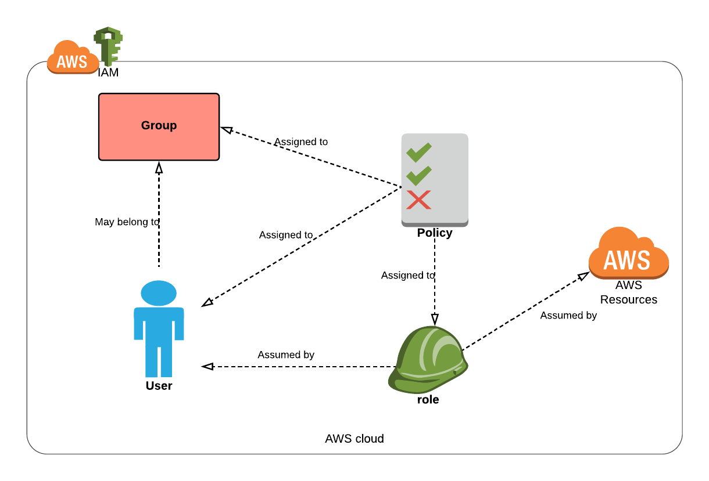

# aws_iam
### Overview
AWS IAM (Identity and Access Management) enables a security control access layer to AWS services and resources, [see this document](https://aws.amazon.com/iam/)

This repository describes the setup and implementation of AWS IAM `Identity-based` permissions using terraform. Identity-based permissions are attached to an IAM user, group or role.  For example, you can assign an user Bob, stating that the user has permission to use an S3 bucket. The diagram below illustrates the relationship between various IAM entities.



Benefits of IAM:
* Fine-grained access control to AWS resources
* Manage IAM policies, roles, groups and users
* All IAM API calls are automatically logged
* IAM is a 'global' service

Terraform
---------

#### How to use this module:

```
This module has no root configuration. A module with no root configuration cannot be used directly. 

Use the submodules for specific functionality as needed.
```

This module has been configured into the following features using module path:

|Module Path    |Description|
|---------|----|
|modules/iam-user  |Terraform code to manage IAM users |
|modules/iam-policy|Terraform code to manage IAM policies |
|modules/iam-role  |Terraform code to manage IAM roles |
|modules/iam-group |Terraform code to manage IAM groups |

**See the individual sub-module's README for more detailed, relevant information.**

#### Testing:

* Ensure that ruby and bundler have been installed, install the required gems and run the tests

```sh
~ $ ruby --version
~ $ bundle install
~ $ rspec
```

The tests should all pass.

#### Examples:

Examples are included in this repository, for more information see the `examples` directory as well as the integration test cases in the `tests` directory.

## EIS Requirements

This module helps with enforcing the following EIS security requirements:

|Req ID|Security Requirement|How this Module Addresses the Requirement
|--|--|--|
|3.1|Information System Boundaries: A native collection of solutions shall be selected to provide information system boundaries for information services, users, and information systems to prevent and detect information leakage and unauthorized access.|IAM module provides the ability to define AWS-native access policies and attach them to users and roles to prevent unauthorized access. It also provides policy-driven `IAM role` primitives to enforce access control to services, users, and other resources.|
|3.2|"Role-Base Access Control(RBAC): Groups of information services, users, and information systems shall be isolated logically and virtually to prevent information leakage and unauthorized access.|See requirement 3.1|
|4.1|Federated: Native functionality supporting federation of identities and access rights from UHG/Optum user directories shall exist to support Single Sign-on (SSO) of privileged  human and non-human users, services and computing devices preventing credential abuse.|IAM module provides for the creation of federated principals to enable Single Sign-On (SSO). It provides the ability to attach policies that define the access privileges for the roles assumed by the federated principals.|
|4.2|Direct Access: Native functionality shall exist supporting multi-factor authentication of human and non-human users, services and computing devices preventing credential abuse.|This module helps enforce multi-factor authentication by (a) integrating with corporate standard MFA and (b) providing enforcement policy template for MFA.|
|7.1|Defense in Depth: Native functionality shall be deployed in a tiered architecture model to protect ingress and egress perimeter routes against blended threats.|IAM policies could be used to help enforce traffic policies along with other tools.|
|11.1|Authentication & Authorization: A collection of native and traditional solutions shall be selected to manage access of human/non-human accounts, services, clients and host while enforcing the principle of least privilege along with  prevention of unauthorized access to information systems.|IAM module provides users, groups, roles, and policy primitives to help enforce fine-grained access control.|
|11.2|User Directory Authentication: Native and traditional user directories shall exist enabling authorized access and prevent unauthorized access to information systems.| Through its support for federation, single sign-on, and SAML role-mapping, this module supports this requirement.|
|11.4|Role-Base Access Control (RBAC): Groups of information services, users, and information systems shall be isolated logically and virtually to prevent information leakage and unauthorized access.| See requirement 11.1|
|11.6|Authorization: A collection of native and traditional solutions shall be selected to manage and grant access of subjects to objects while enforcing the principle-of-least privilege along with  prevention of unauthorized access to information systems.| See requirement 11.1|
|12.1|Data Protection: A collection of native and traditional solutions shall be selected to protect data to prevent data tampering and reduce the possibility of unauthorized access by unauthorized persons.| See requirement 11.1|
|12.2|Databases: Native features and third-party tools shall exist to control access to and information stored by databases.| See requirement 11.1|
|12.3|Document Repositories: Native and Commercial off the Shelf (COTS) shall exist enabling protection of documents/information stored at rest by information systems.| See requirement 11.1|
|12.4|Environments: Native and Commercial off the Shelf (COTS) shall exist enabling protection of environments through established boundaries and preventing opportunistic and unauthorized access.| See requirement 11.1|
