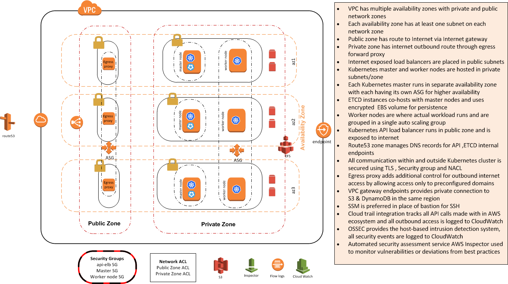

# PEKOPS - Product Engineering Kubernetes Operations
Project PEKOPS helps you deploy production-grade Kubernetes[v1.10.6] clusters on AWS. It creates a highly available cluster spanning  multiple availability zones using Terraform.Project PEKOPS consists of [terraform](https://www.terraform.io/) module for Kubernetes, launch configuration components 'nodeup' and 'protokube' (from kops) to install packages and a bootstrap script to manage the state for the Kubernetes cluster.

### Why PEKOPS ?
This solution is based on open source project [KOPS](https://github.com/kubernetes/kops). PEKOPS doesn't add anything that KOPS can't do.
This project is intended to creates production grade Kubernetes cluster all by running “terraform plan & apply”, by doing so enforce opinionated policies to compliant with corporate security guidelines and to follow industry best practices.
Some of the enforced polices including, but not limited to
* Encryption at rest and in transit
* Zero Egress using [Egress proxy](https://github.optum.com/CommercialCloud-EAC/aws_egress_proxy)
* Network isolation by defining public & private zones using [vpc](https://github.optum.com/CommercialCloud-EAC/aws_vpc)
* Support for VPC Endpoints using [vpc](https://github.optum.com/CommercialCloud-EAC/aws_vpc)
* Pre-baked images with different agents like OSSEC for host based intrusion detection, Inspector for vulnerability scan
* Disable SSH in favor of SSM
* Strict RBAC for API access
* Enable audit controls by default to record actions taken with in the cluster
* Defined compute resources reservation for stable operation within the cluster 
* Default storage class for creating PVC



### Inputs

| Name | Description | Type | Default |
|------|-------------|:----:|:-----:|
| aws_profile | AWS credential profile. AWS credentials are read from ~/.aws/credentials | string | `default` |
| ami_os_name | AMI operating system.`ubuntu` and `k8s-1.8-debian` are the only options.Refer "About AMI & OS" for more details | string | `ubuntu` |
| ami_owner | Owner name of the AMI.Refer "About AMI & OS" for more details | string | `757541135089` |
| ami_unique_identifier | To uniquely identify an ami. Refer "About AMI & OS" for more details | string | `*` |
| aws_azs | AWS availability zones within a single region where Kubernetes resources are created.Number of availability zones must be equal or higher than the number of Master nodes | list | `["us-east-1a", "us-east-1b", "us-east-1c"]` |
| vpc_id | VPC id for the Kubernetes cluster | string | - |
| vpc_private_subnet_ids | Private subnet ids from VPC to launch Kubernetes master and worker nodes. Currently subnets need to be tagged with "kubernetes.io/cluster/${var.k8s_cluster_name}" = "shared" and  "kubernetes.io/role/elb" = 1 to have Kubernetes created ELBs correctly include all the zones| list | - |
| vpc_public_subnet_ids | Public subnet ids from VPC to launch Kubernetes public facing load balancers. Currently subnets need to be tagged with "kubernetes.io/cluster/${var.k8s_cluster_name}" = "shared" and  "kubernetes.io/role/internal-elb" = 1 to have Kubernetes created ELBs correctly include all the zones | list | - |
| cluster_name | Name of the Kubernetes cluster. Name must be a qualified domain name with AWS Route53. ex: mycluster.examaple.com - example.com must be the domain in public Route53 Hosted zone | string | - |
| egress_proxy_endpoint | Egress proxy endpoint with port. Should be in the format http://dnsname:port. Egress proxy configuration should allow `.amazonaws.com`,`.cloudfront.net`,`.ubuntu.com`,`.snap.io`,`.debian.org`,`.docker.io`,`.docker.com`,`.dockerproject.org`,`.kope.io`,`.quay.io`,`.googleapis.com` and `.gcr.io`. Egress proxy ELB must have SG rule to allow inbound access from master & worker nodes | string | - |
| master_count | Number of master nodes to run. Each one of them run in a separate availability zone for HA | string | `3` |
| master_instance_type | EC2 instance type for master nodes | string | `t2.medium` |
| node_count_max |Maximum number of worker nodes to run in ASG. This depends on your workload | string | `3` |
| node_count_min |Minimum number of worker nodes to run in ASG. This depends on your workload | string | `3` |
| node_instance_type | EC2 instance type for worker nodes | string | `t2.medium` |
| ebs_optimized | If true, the launched EC2 instance will be EBS-optimized. Make sure instance support EBS optimization is set to true | `false` |
| pekops_trigger | A mapping of values which should trigger a rerun of the script.Changing this value effectively trigger pekops again ,this would mean creating a new cluster | string | `FIXED` |
| enable_nacl | Enable NACL for private subnets | string | `true` |
| private_network_acl_id | NACL id of the private subnets provided. Ignore if `enable_nacl` is false | string | - |
| route53_zoneid | Route53 public zone id to create Kubernetes DNS records. This zone must be where cluster domain is registered | string | - |
| s3_k8s_bucket_name | S3 bucket to persist cluster configurations | string | - |
| tag_name_identifier | Tag name identifier for all resources that supports tags | string | `pe` |
| global_tags | Additional global tags to be applied to created resources | map | `"terraform" = "true"` |
 

### Outputs

| Name | Description |
|------|-------------|
| k8s_cluster_name | Name of the cluster |
| k8s_master_asg_name | Autoscaling group names for master nodes |
| k8s_master_security_group_ids | Security group ids associated with master nodes |
| k8s_masters_role_arn | Master role ARN associated with master nodes |
| k8s_masters_role_name | Master role name associated with master nodes |
| k8s_node_security_group_ids | Security group ids associated with worker nodes |
| k8s_nodes_asg_name | Autoscaling group name for worker nodes |
| k8s_nodes_role_arn | Worker role ARN associated with worker nodes |
| k8s_nodes_role_name | Worker role name associated with worker nodes |

#### Steps for setting up your Cluster
Refer the [example](examples/) provided to quickly start with the project.

#### Cluster Monitoring using Heapster & Dashboard 
Heapster enables Container Cluster Monitoring and Performance Analysis for Kubernetes.This is needed to enable Horizontal pod autoscaler.

**To Install**:
```
kubectl create -f https://raw.githubusercontent.com/kubernetes/kops/master/addons/monitoring-standalone/v1.7.0.yaml
```

Dashboard provides the web-based UI for Kubernetes cluster to manage applications running in the cluster and troubleshoot them, as well as manage the cluster itself.

**To Install**:

```
kubectl create -f https://raw.githubusercontent.com/kubernetes/dashboard/v1.10.0/src/deploy/recommended/kubernetes-dashboard.yaml
```

**To Access**:
Follow below steps to access the dashboard:
```
kubectl proxy --port=9000

Once proxy server is started you should be able to access Dashboard from your browser:

http://localhost:9000/api/v1/namespaces/kube-system/services/https:kubernetes-dashboard:/proxy/

Select "Skip" in login page to use minimum privileges of Service Account used by Dashboard.

```
Role-Based Access Control [rbac](https://kubernetes.io/docs/admin/authorization/rbac/) drive authorization decisions, allowing admins to dynamically configure policies through the Kubernetes API. There are many Service Accounts created in Kubernetes by default. All with different access permissions. 
To find the token from any service account :
```
kubectl -n kube-system get secret|grep "service-account-token"
kubectl -n kube-system describe secret <secret_name>|grep "token"
```

Review below resources to do more with Kubernetes cluster:

[log management](https://github.optum.com/ct-instrumentation/logging)

[Ingress controller](https://github.optum.com/ct-instrumentation/k8s-ingress)

[Storage](https://github.optum.com/ct-instrumentation/storage)


#### Testing:

* Ensure that ruby and bundler have been installed, install the required gems and run the tests
```
> ruby --version
> bundle install
> rspec
```

####  About AMI & OS:
Ubuntu (16.04 or later) is the default OS for PEKOPS. AWS managed amzn linux2 image is an alternative option.
Amazon Machine Images[AMI](http://docs.aws.amazon.com/AWSEC2/latest/UserGuide/AMIs.html) used here are sourced from image published by accounts  099720109477 & 137112412989 for Ubuntu & amzn2 respectively. 
Base AMI's are further extended by adding various agents like [SSM](http://docs.aws.amazon.com/systems-manager/latest/userguide/what-is-systems-manager.html) to run commands as an alternative to SSH,[OSSEC](https://ossec.github.io/) & [AWSLOGS](http://docs.aws.amazon.com/AmazonCloudWatch/latest/logs/WhatIsCloudWatchLogs.html) to detect and alert host intrusions and [INSPECTOR](https://aws.amazon.com/inspector/) to assess the security and compliance of applications deployed on each host. These AMI's are also updated weekly for any latest patches available.
Note: AWS Inspector currently doesn't support Debian. 

Refer this [module](https://github.optum.com/CommercialCloud-EAC/aws_ami) to learn more about managing AMIs. AMI's are copied only to "us-east-1" & "us-east-2" and available only for selected accounts. Users are advised to add their accounts by sending a pull request to this [repo](https://github.optum.com/CommercialCloud-EAC/aws_ami).

#### About Egress Proxy:
The primary reason to replace NAT gateway with Egress proxy is to better control and audit the outbound Internet access, a critical DLP security requirement not possible with NAT gateways.
However, users must note egress proxy is not a "in-line" gateway rather a forward proxy. It requires application/OS to be aware of the proxy endpoint.The Kubernetes cluster created here is aware of Egress proxy but proxy configuration for application containers and pods must be managed by the users if only if application requires Internet access.By default containers doesn't have Internet access, it can only access recourses within VPC. Internet access can be enabled by setting up environment variable `http_proxy`,`https_proxy` & `no_proxy` in pod manifest.

#### AWS Inspector:
Amazon Inspector agent running on the AMI[Ubuntu only] assesses host for vulnerabilities. After performing an assessment, Amazon Inspector produces a detailed list of security findings prioritized by level of severity. These findings can be reviewed directly or as part of detailed assessment reports which are available via the Amazon Inspector console or API.
All EC2 Instances are tagged with `"key:aws_inspector", "value:true"` to create assessment target easily.
Refer this [module]( https://github.optum.com/CommercialCloud-EAC/aws_inspector) to integrate Inspector to your DevSecOps pipeline. 


#### Innersource Guidelines:

All contributions to the CommercialCloud repositories must follow the guidelines outlined in the following guides:
* [Commercial Cloud Terraform Developers Guide](https://github.optum.com/CommercialCloud-EAC/welcome/tree/master/DEVELOPER_GUIDE.md)
* [Contributing](https://github.optum.com/CommercialCloud-EAC/welcome/tree/master/CONTRIBUTING.md)
* [Contributor Code of Conduct](https://github.optum.com/CommercialCloud-EAC/welcome/tree/master/CODE_OF_CONDUCT.md)

## EIS Security Endorsement 

This module helps to enforce the following EIS mandates:

| Req ID | Requirement | How module addresses requirement |
|-------------|-----------|-----------|
|**2.1** | *Key Strength*: Cloud native functionality protecting the confidentiality, authenticity and integrity of data must be enabled to encrypt data at rest and in motion. | S3 and EBS mentioned in 2.4 both utilize 256-bit Advanced Encryption Standard (AES-256).|
|**2.4** | *Data at Rest*: Cloud native functionality protecting the confidentiality, authenticity and integrity of data at rest must be implemented. | At setup, the module will create an encrypted S3 bucket to store cluster configurations. A default storage class is also created and set to use encrypted AWS EBS.|
|**3.1** | *Information System Boundaries*: A native collection of solutions shall be selected  to provide information system boundaries for information services, users, and information systems to prevent information leakage and unauthorized access. | This module is uses a specified, secure VPC and Egress Proxy from the [VPC module](https://github.optum.com/CommercialCloud-EAC/aws_vpc) and [Egress Proxy module](https://github.optum.com/CommercialCloud-EAC/aws_egress_proxy). The VPC will be validated at setup as well. The module places autoscaling groups for Kubernetes master/worker nodes in the VPC's private subnet and a load balancer in the VPC's public subnet. Ingress and egress security group configurations are created and assigned to the load balancer and to the launch configurations of the master/worker autoscaling groups. Then it creates NACL rules for the provided VPC's private subnet's NACL.|
|**3.2** | *Role-Base Access Control (RBAC)*: Groups of information services, users, and information systems shall be isolated logically and virtually to prevent information leakage and unauthorized access. | Using the [IAM module](https://github.optum.com/CommercialCloud-EAC/aws_iam), this module creates IAM instance profiles containing roles with set policies for both Kubernetes master and worker nodes. Kubernetes also will have service accounts created to control access permissions to it's API.|
|**5.5** | *Vulnerability Scanning Logs*: Native functionality shall exist enabling capture of attack surface management (ASM) results  to UHG/Optum's EIS-approved repository. | Autoscaling groups are tagged to allow for AWS Inspector and Inspector agents are installed in images setup by the [AMI module](https://github.optum.com/CommercialCloud-EAC/aws_ami).|
|**6.1** | *Secure Configuration Baseline*: Functionality  shall exist providing baseline security configurations for CSP environments. Assets instantiated in the cloud must adhere to enterprise standards, hardening guideline and compliance mandates. | Description for 2.4, 3.1, 3.2, 5.5, 13.2 also addresses 6.1 requirements.|
|**7.1** | *Defense in Depth*: Native functionality shall be deployed in a tiered architecture model to protect ingress and egress perimeter routes against blended threats. | Description for 2.1, 2.4, 3.1, 3.2, 5.5, 13.2 also addresses 7.1 requirements.|
|**7.2** | *Isolation Stack*: Native functionality providing segregation, segmentation and isolation. | Description for 3.1 also addresses 7.2 requirements.|
|**7.3** | *DLP Stack*: Native functionality preventing the loss of data at rest or in transit. | Description for 2.1, 2.4, 3.1 also addresses 7.3 requirements.|
|**7.4** | *IDS/IPS Stack*: Native functionality enabling detection and alerting of intrusions or alerting and preventing intrusions. | Description for 3.1 also addresses 7.4 requirements.|
|**8.3** | *Tehcnology Stack hardware and software*: Native cloud functionality must be enabled to capture security events from the software, platform and infrastructure levels. | Description for 13.2 also addresses 8.3 requirements.|
|**11.4** | *Role-Base Access Control (RBAC)*: Groups of information services, users, and information systems shall be isolated logically and virtually to prevent information leakage and unauthorized access. | Description for 3.2 also addresses 11.4 requirements.|
|**13.2** | *Operating Systems*: Cloud native and traditional software shall be configured protect operating system software against accidental or malicious events. | AWS Kubernetes module utilizes images configured for security and monitoring by the the [AMI module](https://github.optum.com/CommercialCloud-EAC/aws_ami). The AMI will be validated at setup as well.|

Note: This module also utilizes the Commercial Cloud [VPC](https://github.optum.com/CommercialCloud-EAC/aws_vpc), [Egress Proxy](https://github.optum.com/CommercialCloud-EAC/aws_egress_proxy), [IAM](https://github.optum.com/CommercialCloud-EAC/aws_iam), and [AMI](https://github.optum.com/CommercialCloud-EAC/aws_ami) modules. You can check the each module's repository to view its EIS Security Endorsement information.
