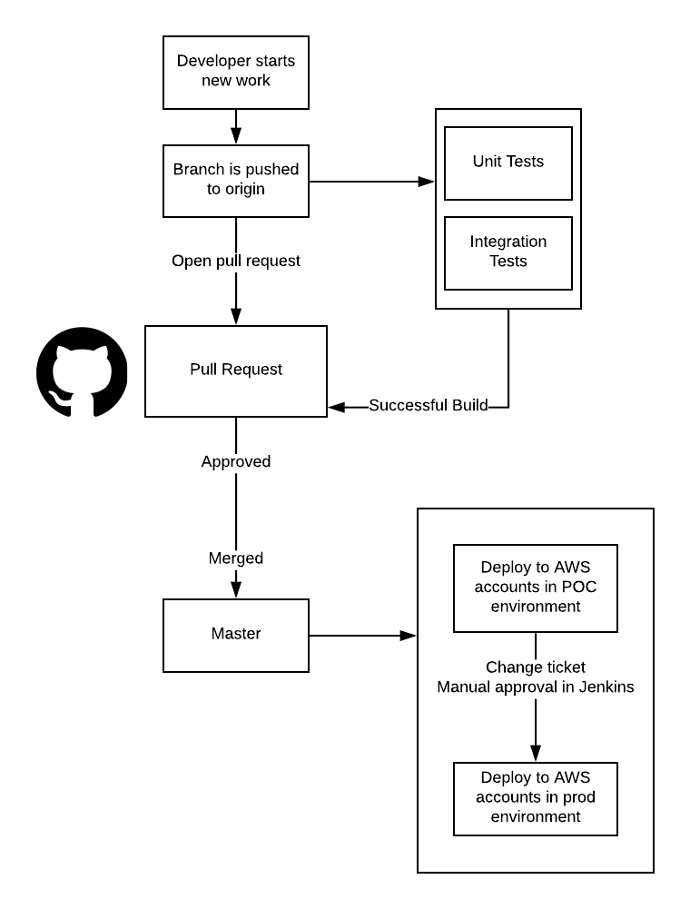
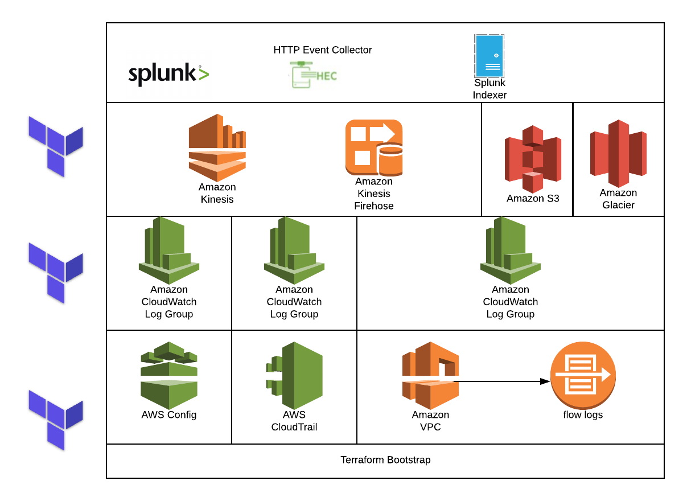
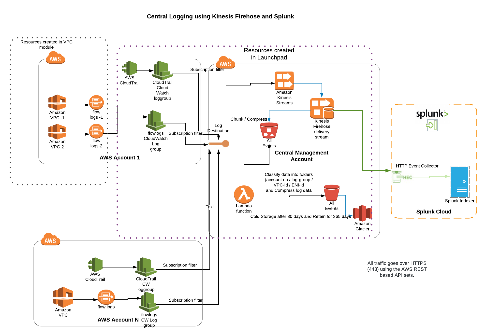

## Section 1: Product Summary

| Product Name  | Ask ID          | Technical Lead | PMO Lead       |
| ------------- | --------------- | -------------- | -------------- |
| AWS Launchpad | UHGWM110-017982 | Bill Browning  | Alex Johansson |

### Description

AWS Launchpad provides Enterprise Information Security a way to monitor the security of public cloud accounts. It works by configuring Kinesis data streams to point [CloudTrail](https://aws.amazon.com/cloudtrail/), [Config](https://aws.amazon.com/config/), and [CloudWatch](https://aws.amazon.com/cloudwatch/) logs to a Kinesis Firehose in the Central Management Account. From there, logs are sent to Splunk SaaS and received by a HTTP Event Collector. Next they are sent to the Splunk indexer and are ready for consumption and analysis by security personnel. 

AWS Config is used to apply audit polices to individual accounts, and will generate logs of any violations. These policy violations are visible in both the AWS Config Service in the console, and are forwarded to Spunk. See [Section 5: EIS Solution Intent]([section-5:-EIS-solution-intent]) and the [AWS Config module](https://github.optum.com/CommercialCloud-EAC/aws_config) for additional information on included policies. This is not intended to punish users for any identified security violations, but rather help remediate risks and validate that Optum Security Standards are being met. 

Launchpad also configures **EIS_AWS_Read** and **EIS_AWS_BreakGlass** roles in each account to provide Enterprise Information Security read and break glass access into accounts. Both of these roles in every account will be configured with AWS IAM Trust policies to allow members of the corresponding global groups to be able to assume that role *from* the security account in that environment (EA or POC). Both of these roles in every account will also be configured with AWS IAM Permission policies to allow read-only - with AWS IAM managed policy `ReadOnlyAccess`. And full access - with the AWS IAM managed policy `PowerUserAccess` - privileges to the members of the corresponding global groups in that environment (EA or POC). [Learn more about EIS access](EIS_Access.md).

In the case of an existing AWS Account that does not have __Enterprise__ level of __AWS Support__ enabled in their account, Launchpad will automatically create a __Support Case__ on behalf of their account through the respective AWS Master. For additional information about the differences of __AWS Support__, please visit this [link](https://aws.amazon.com/premiumsupport/compare-plans/).

No action is required on the user's end to run AWS Launchpad. This is done automatically by using the master account to assume the `OrganizationAccountAccessRole` that is under all of the underlying accounts. The `OrganizationAccountAccessRole` has `AdminstratorAccess` and its only Trusted Entity is the respective Master account. 

### Data Usage

AWS Launchpad captures and forwards CloudWatch, Config, and CloudTrail log data from individual accounts. This is used to monitor security compliance and identify potential risks. Logs are stored in an S3 bucket for 30 days and then sent to AWS Glacier for cold storage up to 365 days. They are also sent to Splunk SaaS for further analysis. No PHI/PII is captured or stored as part of launchpad.

### Workload Criteria

1. **Does not require connectivity back to Optum Data Centers** - Excluding CI/CD over HTTPS 443
2. **Critical requirement for un-adopted or emerging technology** - Launchpad supports emerging cloud technology by providing built-in logging and monitoring infrastructure to ensure security compliance and visibility. 

## Section 2: Code Management

##### Repositories

https://github.optum.com/CommercialCloud-EAC/aws_launchpad/

##### Code Promotion

##### CI/CD

https://jenkins.optum.com/commercialcloudeac/job/CommercialCloud-EAC/job/aws_launchpad/

## Section 3: Architecture Summary

## Section 4: Network Summary

## Section 5: EIS Solution Intent

> **NOTE:** The policies in the following list perform alerting to notify when a non-compliant situation occurs, as opposed to actively preventing the situation from occurring.  Active prevention may be possible using custom policies and will be implemented in a future release.

The [AWS Config](https://github.optum.com/CommercialCloud-EAC/aws_config) module defines the policies applied in AWS Launchpad.

| Req ID   | Requirement                                                  | Related AWS Config Policies                                  |
| -------- | ------------------------------------------------------------ | ------------------------------------------------------------ |
| **2.1**  | _Key Strength_: Cloud native functionality protecting the confidentiality, authenticity and integrity of data must be enabled to encrypt data at rest and in motion. | All encryptable AWS services use the [AES-256 encryption algorithm](https://docs.aws.amazon.com/kms/latest/developerguide/crypto-intro.html).   Policies in requirement 2.4 include checking the encryption of EBS volumes, RDS instances, and S3 storage. [Additional information on encrypting AWS services](https://docs.aws.amazon.com/kms/latest/developerguide/service-integration.html) |
| **2.3**  | *Data in Transit*: Cloud native functionality protecting the confidentiality, authenticity and integrity of data in transit must be implemented. | **ELB_ACM_CERTIFICATE_REQUIRED** checks whether the Elastic Load Balancer(s) uses SSL certificates provided by AWS Certificate Manager. **ACM_CERTIFICATE_EXPIRATION_CHECK** checks whether ACM Certificates in your account are marked for expiration within the specified number of days. **S3_BUCKET_SSL_REQUESTS_ONLY** checks whether S3 buckets have policies that require requests to use Secure Socket Layer (SSL).  **ELB_CUSTOM_SECURITY_POLICY_SSL_CHECK** checks whether your Classic Load Balancer SSL listeners are using a custom policy.  **ELB_PREDEFINED_SECURITY_POLICY_SSL_CHECK** checks whether your Classic Load Balancer SSL listeners are using a predefined policy. |
| **2.4**  | *Data at Rest*: Cloud native functionality protecting the confidentiality, authenticity and integrity of data at rest must be implemented. | **ENCRYPTED_VOLUMES** checks whether EBS volumes that are in an attached state are encrypted. **RDS_STORAGE_ENCRYPTED** checks whether storage encryption is enabled for your RDS DB instances. **S3_BUCKET_SERVER_SIDE_ENCRYPTION_ENABLED** checks whether the S3 bucket policy denies the put-object requests that are not encrypted using AES-256 or AWS KMS. **REDSHIFT_CLUSTER_CONFIGURATION_CHECK** checks whether Amazon Redshift clusters have the specified settings, including database encryption. |
| **3.1**  | *Information System Boundaries*: A native collection of solutions shall be selected to provide information system boundaries for information services, users, and information systems to prevent information leakage and unauthorized access. | **S3_BUCKET_PUBLIC_READ_PROHIBITED** checks that S3 buckets do not allow public read access. **S3_BUCKET_PUBLIC_WRITE_PROHIBITED** checks that your S3 buckets do not allow public write access.  **LAMBDA_FUNCTION_PUBLIC_ACCESS_PROHIBITED** checks whether the Lambda function policy prohibits public access. **FMS_WEBACL_RULEGROUP_ASSOCIATION_CHECK** checks whether the RuleGroupId and WafOverrideAction pairs are associated with the WebACL at highest priority.  **INSTANCES_IN_VP** checks whether your EC2 instances belong to a virtual private cloud (VPC). |
| **3.2**  | *Role-Base Access Control(RBAC)*: Groups of information services, users, and information systems shall be isolated logically and virtually to prevent information leakage and unauthorized access. | IAM controls in AWS are used to provide service and human accounts with the minimum necessary privileges to perform their function, in their respective AWS account(s). This is provided through SSO federation with on-prem AD. During account creation IAM roles are created and synced with on-prem to provide users with initial RBAC configuration. **IAM_POLICY_BLACKLISTED_CHECK** checks that none of your IAM users, groups, or roles (excluding exceptionList) have the specified policies attached. **IAM_PASSWORD_POLICY** checks whether the account password policy for IAM users meets the specified requirements. |
| **3.3**  | *Encrypted Channels*: Native functionality providing virtual boundaries shall be implement to support confidentiality and integrity of information in transit. | See policies in requirement 2.3                              |
| **4.1**  | *Federated*: Native functionality supporting federation of identities and access rights from UHG/Optum user directories shall exist to support Single Sign-on (SSO) of privileged  human and non-human users, services and computing devices preventing credential abuse. | Federation to AWS exists   See requirement 3.2     |
| **4.2**  | *Direct Access*: Native functionality shall exist supporting multi-factor authentication of human and non-human users, services and computing devices preventing credential abuse. | **ROOT_ACCOUNT_MFA_ENABLED** checks whether the root user of your AWS account requires multi-factor authentication for console sign-in. |
| **5.2**  | *Externally-facing Information Systems*: Functionality ensuring confidentiality, integrity and availability of externally-facing information systems shall exist preventing exploitation technical security weaknesses. | AWS Config policies check the configuration of EC2 instances for certain vulnerabilities.   **EC2_MANAGEDINSTANCE_APPLICATIONS_BLACKLISTED** checks that none of the specified applications are installed on the instance.  **EC2_MANAGEDINSTANCE_APPLICATIONS_REQUIRED** checks whether all of the specified applications are installed on the instance.  **EC2_MANAGEDINSTANCE_PLATFORM_CHECK** checks whether EC2 managed instances have the desired configurations. **EC2_MANAGEDINSTANCE_INVENTORY_BLACKLISTED** checks whether instances managed by Amazon EC2 Systems Manager are configured to collect blacklisted inventory types.  **EC2_INSTANCE_DETAILED_MONITORING_ENABLED** checks whether detailed monitoring is enabled for EC2 instances.  **S3_BUCKET_LOGGING_ENABLED** checks whether logging is enabled for your S3 buckets. checks whether S3 buckets have cross-region replication enabled. **CLOUDWATCH_ALARM_ACTION_CHECK** checks whether CloudWatch alarms have at least one alarm action, one INSUFFICIENT_DATA action, or one OK action enabled.  **CLOUDWATCH_ALARM_SETTINGS_CHECK** checks whether CloudWatch alarms with the given metric name have the specified settings.   **CLOUD_TRAIL_ENABLED** checks whether AWS CloudTrail is enabled in your AWS account.   **CLOUDWATCH_ALARM_RESOURCE_CHECK** checks whether the specified resource type has a CloudWatch alarm for the specified metric. |
| **5.3**  | *Internal information Systems*: Functionality ensuring confidentiality, integrity and availability  of internal information systems shall exist preventing exploitation technical security weaknesses. | See policies in requirement 5.2                              |
| **5.4**  | *Patch Management*: Native functionality providing patching of information system flaws shall exist to protect against known security vulnerabilities and exploits-the-wild. | **EC2_INSTANCE_DETAILED_MONITORING_ENABLED** checks whether detailed monitoring is enabled for EC2 instances.  There is no policy to validate applied patches. |
| **7.1**  | *Defense in Depth*: Native functionality shall be deployed in a tiered architecture model to protect ingress and egress perimeter routes against blended threats. | **NSTANCES_IN_VPC** checks whether your EC2 instances belong to a virtual private cloud (VPC).  **INCOMING_SSH_DISABLED** checks whether security groups that are in use disallow unrestricted incoming SSH traffic.  **RESTRICTED_INCOMING_TRAFFIC** checks whether security groups that are in use disallow unrestricted incoming TCP traffic to the specified ports. **S3_BUCKET_SSL_REQUESTS_ONLY** checks whether S3 buckets have policies that require requests to use Secure Socket Layer (SSL).   **EIP_ATTACHED** checks whether all EIP addresses allocated to a VPC are attached to EC2 instances or in-use ENIs. |
| **7.2**  | *Isolation Stack*: Native functionality providing segregation, segmentation and isolation. | **INSTANCES_IN_VPC** checks whether your EC2 instances belong to a virtual private cloud (VPC). |
| **8.1**  | *DevOps*: Functionality must exist to capture security events at the software level when custom code is created. | AWS Launchpad works by configuring the [CloudTrail](https://aws.amazon.com/cloudtrail/) and [Config](https://aws.amazon.com/config/) services to send logs to S3 buckets in a Central Management Account. The logs are then forwarded to Splunk for Enterprise Information Security monitoring. **CLOUD_TRAIL_ENABLED** checks whether AWS CloudTrail is enabled in your AWS account. **S3_BUCKET_LOGGING_ENABLED** checks whether logging is enabled for S3 buckets. |
| **8.2**  | *Platform and Software Levels*: Cloud native functionality must be enabled to capture security events. | See policies in requirement 8.1                              |
| **8.3**  | *Technology Stack hardware and software*: Native cloud functionality must be enabled to capture security events from the software, platform and infrastructure levels. | AWS Launchpad works by configuring the [CloudTrail](https://aws.amazon.com/cloudtrail/) and [Config](https://aws.amazon.com/config/) services to send logs to S3 buckets in a Central Management Account. AWS Config includes the following components: Config Recorder, Config Delivery Channel, and numerous Config Rules. The logs are then forwarded to Splunk for Enterprise Information Security monitoring.  No action is required on the user's end to run AWS Launchpad. This is done automatically by using a master account to assume the OrganizationAccountAccessRole that is under all of the underlying accounts. The OrganizationAccountAccessRole has AdminstratorAccess and its only Trusted Entity is the respective Master account. |
| **8.4**  | *Log Management*: Native cloud functionality must exist to manage logs to same level as Optum internal logs. | See policies in requirement 8.1 Please review [AWS documentation](<https://aws.amazon.com/documentation/cloudwatch/>) for detailed information about CloudWatch logs. |
| **9.2**  | *Security Incident Response*: Functionality must exist to monitor logs to support SIRC | See policies in requirement 8.1 - log data is sent to Splunk |
| **11.1** | *Authentication & Authorization*: A collection of native and traditional solutions shall be selected to manage access of human/non-human accounts, services, clients and host while enforcing the principle-of-least privilege along with  prevention of unauthorized access to information systems. | See policies in requirement 3.2                              |
| **11.2** | *User Directory Authentication*: Native and traditional user directories shall exist enabling authorized access and prevent unauthorized access to information systems. | See policies in requirement 3.2.  Federation is leveraging Optum's MSID directory. User access is controlled in Secure. |
| **11.3** | *Network-based Authentication*: Native, Commercial off the Shelf (COTS) and open-source shall exist enabling network-based authentication of subjects and objects and preventing unauthorized access to information systems. | Federation is leveraging Optum's MSID directory. User access is controlled in Secure. |
| **11.6** | *Authorization*: A collection of native and traditional solutions shall be selected to manage and grant access of subjects to objects while enforcing the principle-of-least privilege along with  prevention of unauthorized access to information systems. | See policies in requirement 3.2                              |
| **12.1** | *Data Protection*: A collection of native and traditional solutions shall be selected to protect data to prevent data tampering and reduce the possibility of unauthorized access by unauthorized persons. | See policies in requirement 3.1                              |
| **12.2** | *Databases*: Native features and third-party tools shall exist to control access to and information stored by databases. | **RDS_STORAGE_ENCRYPTED** checks whether storage encryption is enabled for RDS DB instances. Access to RDS is controlled through [AWS IAM](https://docs.aws.amazon.com/AmazonRDS/latest/UserGuide/UsingWithRDS.IAM.html) |
| **12.3** | *Document Repositories*: Native and Commercial off the Shelf (COTS) shall exist enabling protection of documents/information stored at rest by information systems. | See policies in requirement 2.4                              |
| **12.4** | *Environments*: Native and Commercial off the Shelf (COTS) shall exist enabling protection of environments through established boundaries and preventing opportunistic and unauthorized access. | See policies in requirement 3.1                              |
| **12.7** | *Backup & Recovery*: Native and traditional mechanisms shall exist ensuring the maintenance, integrity, and availability of organizational information when events resulting in data loss occurs. | **DB_INSTANCE_BACKUP_ENABLED** checks whether RDS DB instances have backups enabled. Optionally, the rule checks the backup retention period and the backup window. **RDS_MULTI_AZ_SUPPORT** checks whether high availability is enabled for your RDS DB instances.  |
| **13.2** | *Operating Systems*: Cloud native and traditional software shall be configured protect operating system software against accidental or malicious events. | **EC2_INSTANCE_DETAILED_MONITORING_ENABLED** checks whether detailed monitoring is enabled for EC2 instances. |
