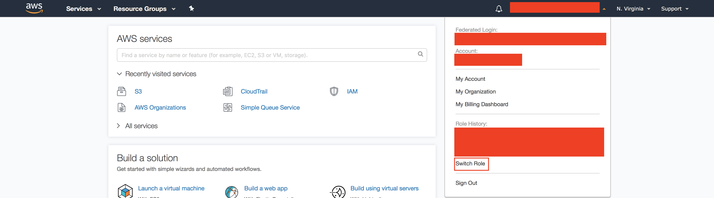
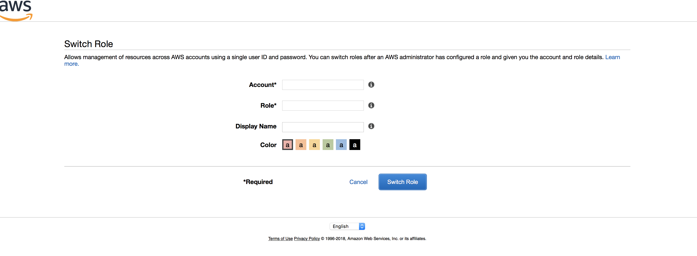
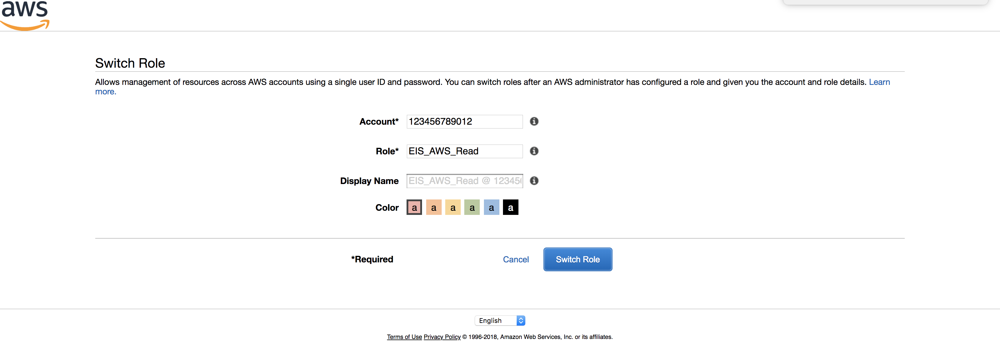
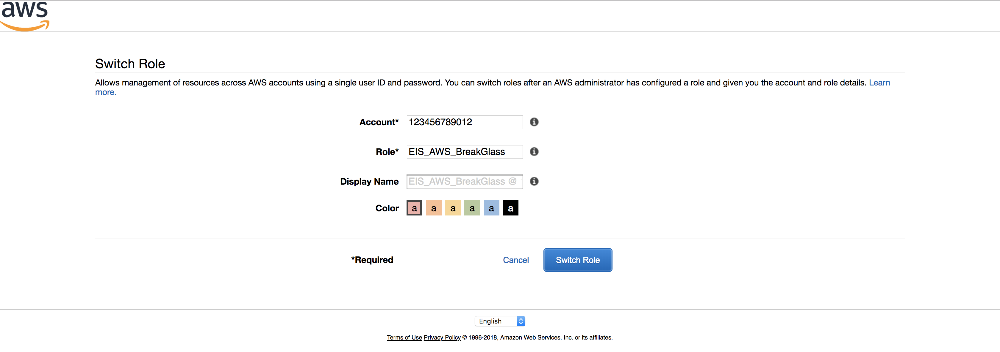
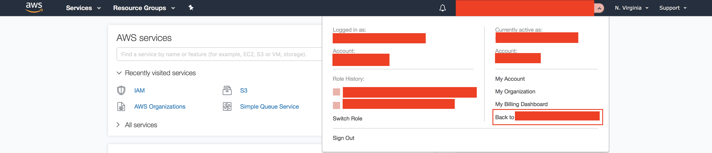

# Assume Read/Break-Glass Role into an AWS Account

Guide to switch/assume the Read or Break Glass role into a Customer's AWS Account from the EIS Security Account.

## Single Sign On Links

* [AWS POC SSO](https://signontest.uhg.com/ping/AWSRouterSSO.asp) : https://signontest.uhg.com/ping/AWSRouterSSO.asp
* [AWS Enterprise SSO](https://signon.uhg.com/ping/AWSRouterSSO.asp) : https://signon.uhg.com/ping/AWSRouterSSO.asp

## Requirements

Access to the following IAM roles / Secure Global Groups within the respective EIS Central Account:
- __AWS_614817484114_EISRead__ : For access to the POC Customer's __EIS_AWS_Read__ role.
- __AWS_614817484114_EISBreakGlass__ : For access to the POC Customer's __EIS_AWS_BreakGlass__ role.
- __AWS_494528487614_EISRead__ : For access to the Enterprise Customer's __EIS_AWS_Read__ role.
- __AWS_494528487614_EISBreakGlass__ : For access to the Enterprise Customer's __EIS_AWS_BreakGlass__ role.

## Assuming Role

From the AWS Account Console after logging to the previous mentioned roles/groups in the EIS Security Account, navigate to the __Switch Role__ under the drop down for the AWS User in the upper right.

---
After navigating to the __Switch Role__ page, you'll see the available fields to modify:
- __Account__ : (Required) The AWS Account you would like to assume into.
- __Role__ : (Required) The Role in the AWS Account you would like to assume.
- __Display Name__: (Optional) The Display Name you would like to call this specific __Switch Role__ setting.
- __Color__ : (Optional) The Color for the Display Name.

---
If logged in as a __Read__ role, you can assume into the respective __EIS_AWS_Read__ role in another account like below. Assume we've logged into the __AWS_494528487614_EISRead__ role and  __123456789012__ is the account we would like to read into.

Click the __Switch Role__ button and you'll navigate to the AWS Console into the desired account.

Use the same process for the __AWS_614817484114_EISRead__ and __EIS_AWS_Read__.

---
If logged in as __BreakGlass__ role, you can assume into the __EIS_AWS_BreakGlass__ role in another account like below. Assume we've logged into the __AWS_494528487614_EISBreakGlass__ role and __123456789012__ is the account we would like to break glass into.

Click the __Switch Role__ button and you'll navigate to the AWS Console into the desired account.

Use the same process for the __AWS_614817484114_EISBreakGlass__ and __EIS_AWS_BreakGlass__.

---
To navigate back to the EIS Security Account, navigate to the __Back to *Account*__ under the drop down for the AWS User in the upper right.

## Resources

[AWS Documentation : Switching to a Role (console)](https://docs.aws.amazon.com/IAM/latest/UserGuide/id_roles_use_switch-role-console.html)