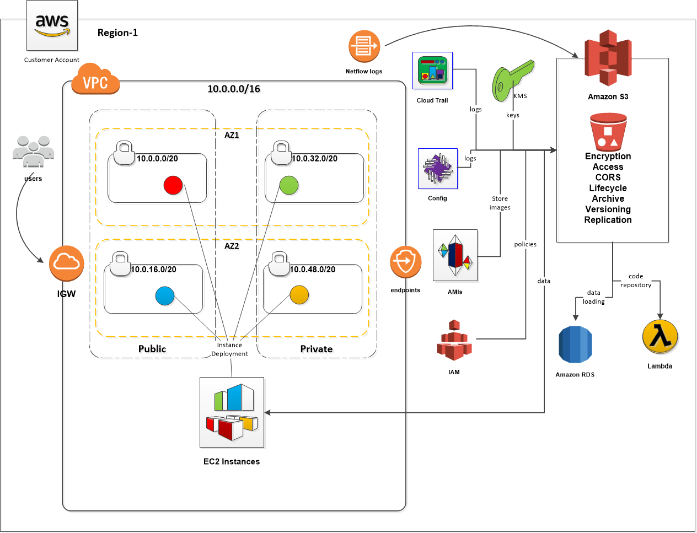

# aws_s3

## Overview
AWS S3 provides a service that store and retreive files from AWS from anywhere on the web, [see this document](http://docs.aws.amazon.com/AmazonS3/latest/dev/Welcome.html)

This repository describes the setup and implmentation of AWS S3 using terraform.

Benefits of Using S3:
* Store and retreive any amount of data
* Highly Scaleable, reliable, fast
* Inexpensive data storage
* All API calls are automatically logged, including API calls from the console, AWS CLI and 3rd party tools
* S3 is a 'global' service

**NOTE:** Not all AWS projects may benefit from using S3.



Terraform
---------

### Features:
* Creates proper S3 buckets and permissions
* Can automatically setup versioning for S3 buckets, default encryption, lifecycle events, logging etc for S3 buckets
* Create S3 bucket compatible as a Cloud Front origin to host static contents

### S3 Bucket Properties:
There are optional properties that can be applied to S3 buckets. The following properties are available in this module:

|S3 Bucket Property|Description              |
|----------------|-------------------------------|
|Terraform Lifecycle Management|Prevents a Terraform resource from being destroyed accidentally|
|Logging             |Tracks access requests to the S3 bucket|
|Website Hosting via CloudFront|Static website hosting from the S3 bucket|
|Cross Region Replication |Enables automatic, asynchronous replication of S3 objects across buckets|

The following grid shows the proper Terraform module folder to use when applying S3 properties:

|Module Path    |Logging|Terraform Lifecycle |Website Hosting via CloudFront|Cross Region Replication|
|---------------|----|-------|-------|-----------|
|modules/simple-with-storage-class    | | | | |
|modules/simple    | | | | |
|modules/log       |X| | | |
|modules/existing-log       |X| | | |
|modules/tflife    | |X| | |
|modules/tflife-log|X|X| | |
|modules/tflife-existing-log|X|X| | |
|modules/cf-origin       | | |X| |
|modules/rep       | | | |X|
|modules/rep-log   |X| | |X|

#### Testing:

* Ensure that ruby and bundler have been installed, install the required gems and run the tests
* In order to run the integration tests manually, find the test that you want to run in the inspec/controls directory, then run the associated terraform script based on the name of the test.

**Example:** In this case you can see that the inspec test is for usecured_bucket so you would run terraform apply against the code in the unsecured_bucket directory.
```
~/terraform/aws_s3 $ ls inspec/controls
unsecured_bucket_spec.rb
~/terraform/aws_s3 $ ls examples/
README.md                              bucket_with_tflife/                    simple_bucket_with_kms_key_encryption/ simple_bucket_without_policy/
bucket_with_logging/                   cf_origin_bucket_with_policy/          simple_bucket_with_policy/             unsecured_bucket/
bucket_with_logging_and_tflife/        simple_bucket_with_encryption/         simple_bucket_with_role/
``` 

After applying the Terraform code, you would need to create the output as a json and write to a file to the aws_s3/inspec/files directory (create the directory if it doesn't exist)
```
~/terraform/aws_s3/examples/unsecured_bucket/ $ terraform ouptut -json > ../../inspec/files/unsecured_bucket.json
```

Repeat above steps for all inspec tests

Now you're able to run the rspec and inspec tests
```
~/terraform/aws_s3 $ ruby --version
~/terraform/aws_s3 $ bundle install
~/terraform/aws_s3 $ rspec
~/terraform/aws_s3 $ inspec exec inspec/ -t aws://
```

The tests should all pass.

Examples
--------

Examples are included in this repository, for more information see the examples folder.

## EIS Security Endorsement

This module helps to enforce the following EIS mandates:

| Req ID | Requirement | How module addresses requirement |
|-------------|-----------|-----------|
|**2.1** | *key strength*: Cloud native functionality protecting the confidentiality, authenticity and integrity of data must be enabled to encrypt data at rest and in motion. | Storage module enforces AES-256 encryption at rest, HTTPS when in motion|
|**2.2** | *key management*: Key Management: Optum Technology will manage keys and certificates associated with encryption. Storage at Optum technology data centers or on approved hardware service modules required. Auditing of all key management activities required. | This module does not allow us to directly manage the key used to encrypt a storage resource.  A storage resource is created and a new key is managed by AWS.|
|**2.3** | *data in transit*: Cloud native functionality protecting the confidentiality, authenticity and integrity of data in transit must be implemented. | Storage module enforces HTTPS.|
|**2.4** | *data at rest*: Cloud native functionality protecting the confidentiality, authenticity and integrity of data at rest must be implemented. | Storage module enforces AES-256 encryption at rest.  Public Access to a module is restricted (by default).|
|**3.1** | *Information System Boundaries*: A native collection of solutions shall be selected to provide information system boundaries for information services, users, and information systems to prevent information leakage and unauthorized access.| Boundry protected by RBAC.  A storage account cannot be accessed unless a group or user is given a role to do so.  |