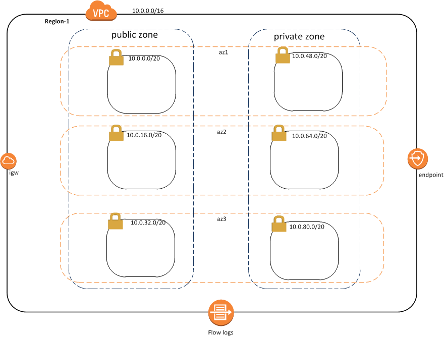

# aws_vpc
### Overview
Amazon Virtual Private Cloud (Amazon VPC) lets you provision a logically isolated section of the Amazon Web Services cloud where you can launch AWS resources in a virtual network that you define, [see this document](http://docs.aws.amazon.com/AmazonVPC/latest/UserGuide/VPC_Introduction.html) for more information.

This repository describes the setup of VPC with certain opinionated policies using Terraform.



Assumptions:
* VPC defaults to zero ingress or egress from the internet. The module can be passed a variable to setup an internet gateway and public subnets to go along with it.
* Subnets in public network zone is open to Internet and hence limited to run load balancers ,Egress proxy, NAT gateways and in some cases bastion hosts
* Private network zone runs rest of the workloads such as Web/Application servers, Container platform ,Databases etc and has access only from public zone on specified ports
* VPC uses NACL & Security Group with certain default rules to secure the private & public Subnets. Rules are further extensible
* When NACL is enabled 2 new ACL is added to public and private subnets and default rules only allow http & https
* Current VPC implementation doesn't support VPN access or Direct connect
* [SSM](https://github.optum.com/CommercialCloud-EAC/aws_ssm) module is used as an alternative to implementing a "Bastion host" (ie. ssh) in an AWS account
* Default VPC setup doesn't have outbound Internet access for instances running in private zone. Egress proxy enables the controlled & audited outbound access for private subnets. Please refer [vpc_with_egress_proxy](./example/vpc_with_egress_proxy) example. For more details, refer the [egress_proxy](https://github.optum.com/CommercialCloud-EAC/aws_egress_proxy) module
* VPC Gateway endpoints can enabled to allow private connection to S3 & DynamoDB in the same region for no additional cost 
* Support for adding additional subnets is provided as a [submodule](terraform_module/subnets/)
* Support for Flow logs is provided as a [submodule](terraform_module/flow_logs/) to capture IP traffic for an existing VPC including all subnets and ENI associated with it
* This module also supports [endpoint-interface](terraform_module/endpoint-interface) to connect to various AWS services using private links. More details on supported services [here](https://docs.aws.amazon.com/AmazonVPC/latest/UserGuide/vpc-endpoints.html)
----------------------------------------

## VPC
#### Variables: 
|Variable        |Description                 |Default|
|----------------|----------------------------|-------|
|vpc_name                 |Name for the VPC| pe |
|vpc_cidr            |Classless Inter-Domain Routing (CIDR) block for the VPC                           | 10.0.0.0/16 |
|aws_region|AWS region create resources| us-east-1 |
|aws_azs          |AWS availability zones within the single region where Subnets are created.if not specified all AZ with in the regions are selected by default. Default value is [ "" ] to overcome the terraform function issue  | [""] |
|vpc_enable_dns_support          |Indicates whether the DNS resolution is supported for the VPC| true |
|vpc_enable_dns_hostnames|Indicates whether the instances launched in the VPC get public DNS host names              | true |
|internet_gateway_enabled|Indicates whether the VPC requires Gateway for internet. When set to 'true', public subnets will be created | false |
|nat_enabled |Indicates whether the instances in a private subnet to connect to the Internet using NAT Gateways.Requires `internet_gateway_enabled` to be true Use [egress_proxy](https://github.optum.com/CommercialCloud-EAC/aws_egress_proxy) for controlled Internet access for private subnets. By default no outbound internet access from Private subnets                | false |
|enable_dynamodb_endpoint |Indicates whether to provision an DynamoDB endpoint to the VPC               | false |
|enable_s3_endpoint |Indicates whether to provision an S3 endpoint to the VPC               | false |
public_subnets_cidr           |CIDR for public subnets.This should be selected only if custom CIDR is needed.If default value is changed,then number of elements in `public_subnets_cidr` must match availability zones.CIDR of subnets cannot overlap and should be within the VPC CIDR range.Do not change the default value if you are not sure.if not specified, CIDR  for each subnet is calculated with maximum of 4094(/20 mask) address | [""] |
|private_subnets_cidr|CIDR for private subnets.This should be selected only if custom CIDR is needed.If default value is changed,then number of elements in `private_subnets_cidr` must match availability zones.CIDR of subnets cannot overlap and should be within the VPC CIDR range.Do not change the default value if you are not sure.if not specified, CIDR for each subnet is calculated with maximum of 4094(/20 mask) address | [""] |
|enable_public_ip_on_launch |Specify true to indicate that instances launched into the subnet should be assigned a public IP address | false|
|associate_dynamodb_endpoint_with_public_subnets| Specify true to indicate that public subnet should have private route to dynamodb |false|
|associate_s3_endpoint_with_public_subnets| Specify true to indicate that public subnet should have private route to s3|false |
|enable_nacl          |Enable NACL for the public and private subnets.Setting this to false make VPC to use default NACL and that explicitly allows all inbound and outbound traffic| true |
|allow_public_inbound_http |Allows inbound HTTP traffic from any IPv4 address to public subnets | true |
|allow_public_inbound_https|Allows inbound HTTPS traffic from any IPv4 address to public subnets| true |
|allow_public_inbound_response_to_internet|	Allows inbound return traffic from hosts on the Internet that are responding to requests originating in the subnets| true |
|allow_outbound_http_from_public_subnet|Allows outbound HTTP traffic from the public subnets to the Internet|  true  |
|allow_outbound_https_from_public_subnet|Allows outbound HTTPS traffic from the public subnets to the Internet| true |
|allow_outbound_response_to_internet_from_public_subnet|Allows outbound responses to clients on the Internet (for example, serving web pages to people visiting the web servers in the subnet)| true |
|allow_public_inbound_icmp_for_pmtu_discovery|Adds ICMP rule to allow path MTU discovery to work | true |
|allow_inbound_http_from_vpc_subnets|Allows inbound HTTP traffic from any subnet within VPC| true |
|allow_inbound_https_from_vpc_subnets|Allows inbound HTTPS traffic from any subnet within VPC| true |
|allow_private_inbound_return_traffic_via_nat   |Allows inbound return traffic from the NAT device in the public subnet for requests originating in the private subnet| true  |
|allow_outbound_http_from_private_subnet |Allows outbound HTTP traffic from the private subnet to the Internet| true |
|allow_outbound_https_from_private_subnet|Allows outbound HTTPS traffic from the private subnet to the Internet| true |
|allow_outbound_response_to_internet_from_private_subnet|Allows outbound responses to the public subnet (for example, responses to web servers in the public subnet that are communicating with DB servers in the private subnet)| true |
|tag_name_identifier |Specify the tag name identifier for the aws_vpc resources| pe |
|other_public_subnet_tags|Addtioanl public subnet tags to be applied to created resources| {} |
|other_private_subnet_tags|Addtioanl global private subnet be applied to created resources| {} |
|global_tags |Addtioanl global tags to be applied to created resources | {terraform = "true"} |


#### Outputs:

|Output        |Description                 |
|----------------|--------------------------|
|vpc_id        |Unique identifier for the created VPC|
|vpc_name      |Name of the VPC|
|vpc_cidr_block |CIDR for the VPC|
|vpc_public_subnets_az |Availability zones where public subnets are created|
|vpc_private_subnets_az |Availability zones where private subnets are created|
|vpc_internet_gateway_id|Internet gateway for the VPC|
|vpc_public_subnet_cidrs | CIDR for public subnets created|
|vpc_private_subnet_cidrs| CIDR for private subnets created|
|vpc_private_subnet_ids | Unique identifier for the private subnets created|
|vpc_public_subnet_ids | Unique identifier for the public subnets created|
|vpc_public_route_table|Route table associated with public subnets|
|vpc_private_route_table|Route table associated with private subnets|
|vpc_public_elb_sg_id | Unique identifier for the elb Security group created for elb instances|
|vpc_public_sg_id |Unique identifier for the public Security group created for instances in public subnets|
|vpc_private_sg_id |Unique identifier for the private Security group created for instances in private subnets|
|vpc_public_nacl_id |Unique identifier for public NACL created|
|vpc_private_nacl_id |Unique identifier for private NACL created|
|vpc_s3_endpoint |VPC gateway endpoint for S3 service|
|vpc_dynamodb_endpoint |VPC gateway endpoint for DynamoDB service|
|vpc_nat_gateway|List of VPC NAT gateway ids|
|flow_log_cw_log_group_name|Log group assigned to Flow logs|

## Subnets
AWS Subnets is a logical network subdivision of a VPC.Each subnet resides entirely within one Availability Zone and uses subset of the VPC CIDR block for ip allocation.

The purpose of this module is for creating addtioanl subnets if needed on top of whats provided in [aws_vpc](terraform_module/vpc/) module.By default module [aws_vpc](terraform_module/vpc/) creates `n` number of public and private subnets where `n` is the number of avilablity zones.
It is recomonded to run services where data storage involved (like RDS ,Elastic Search etc..) in seperate subnets to create logical network isolation between presentation ,application and data layers.

#### Terraform Inputs:

| Name | Description | Default |
|------|-------------|:-----:|
|aws_region|AWS region create resources|`us-east-1`|
|list_of_aws_az|The AZ for the subnets|``|
|vpc_id|The VPC id for the subnets to associate with |``|
|number_of_public_subnets|number_of_public_subnets|`0`|
|internet_gateway_id|The id of the specific Internet Gateway to retrieve. Must when `number_of_public_subnets` > 0|`""`|
|list_of_cidr_block_for_public_subnets|list of CIDR block for the public subnets|``|
|public_ip_on_launch|Specify true to indicate that instances launched into the subnet should be assigned a public IP address|`false`|
|vpc_endpoint_dynamodb_id|VPC dynamodb endpoint id|`""`|
|vpc_endpoint_s3_id|VPC s3 endpoint id|`""`|
|associate_dynamodb_endpoint_with_public_route_table|Specify true to indicate that instances launched into the public subnet should have route to dynamodb|`false`|
|associate_s3_endpoint_with_public_route_table|Specify true to indicate that instances launched into the public subnet should have route to s3|`false`|
|create_nacl_for_public_subnets|create seperate NACL for the public subnets.If 'false' , default NACL is assigned to the subnets|`true`|
|number_of_private_subnets|Number of private subnets to be created|`0`|
|list_of_cidr_block_for_private_subnets|list of CIDR block for the private subnets|``|
|associate_nat_gateway_with_private_route_table|Specify true to indicate that instances launched into the private subnet should have access to outbound internet|`false`|
|vpc_nat_gateway_ids|list of NAT Gateway ids to associate with private subnets.Must when `associate_nat_gateway_with_private_route_table` is true|`[]`|
|associate_dynamodb_endpoint_with_private_route_table|Specify true to indicate that instances launched into the private subnet should have route to dynamodb| `false`|
|associate_s3_endpoint_with_private_route_table|Specify true to indicate that instances launched into the private subnet should have route to s3|`false`|
|create_nacl_for_private_subnets|create seperate NACL for the private subnets.If 'false', default NACL is assigned to the subnets|`true`|
|tag_name_identifier|tag name identifier|`pe`|
|other_public_subnet_tags|Addtioanl public subnet tags to be applied to created resources|`{}`|
|other_private_subnet_tags|Addtioanl private subnet tags to be applied to created resources|`{}`|
|global_tags|Addtioanl global tags to be applied to created resources|`{terraform = "true"`}|


#### Terraform Outputs

| Name | Description |
|------|-------------|
|subnets_public_subnet_ids|List of public subnet ids created|
|subnets_private_subnet_ids|List of private subnet ids created|
|subnets_public_subnet_cidrs|List of CIDR's for public subnets |
|subnets_private_subnet_cidrs|List of CIDR's for private subnets |
|subnets_public_nacl_id|NACL id for public subnets |
|subnets_private_nacl_id|NACL id for private subnets||
|subnets_private_route_table|Route tables associated with private subnets|
|subnets_public_route_table|Route tables associated with public subnets|
|subnets_public_az|AZ associated with public subnets|
|subnets_private_az|AZ associated with private subnets|
 

## Flowlogs
VPC Flow Logs enables you to capture information about the IP traffic going to and from network interfaces in your VPC. Flow log data is stored using Amazon CloudWatch logs.
Flow logs can be used as security tool to monitor the traffic that is reaching our instances. It also help us troubleshoot specific traffic is not reaching an instance.
 
#### Terraform Inputs:

| Name | Description | Default |
|------|-------------|:-----:|
| aws_region | AWS region to create resources |`us-east-1` |
| vpc_id | VPC id to associate Flow logs. | - |
| flow_log_group_name | Cloud watch log group name for flow logs| `vpc-flow-logs` |
| traffic_type | The type of traffic to capture. Valid values: ACCEPT,REJECT, ALL | `ALL` |
| flow_log_group_retention_in_days |Number of days to retain the logs | `7` | 
| tag_name_identifier | tag name identifier for the aws_base | `pe` |


#### Terraform Outputs

| Name | Description |
|------|-------------|
| flow_log_cw_log_group_name | CloudWatch log group name for flow logs  |
| flow_log_id | Unique ID given to flowlogs |
| flow_log_role_arn | ARN of the role associated with flow logs |
| flow_log_traffic_type | Traffic type captured by the flow logs  |

#### Flow log format
||version| account| eni| source| destination| srcport| destport| protocol| packets| bytes| windowstart| windowend| action| flowlogstatus|
|------|-------------|:-----:|:-----:|:-----:|:-----:|:-----:|:-----:|:-----:|:-----:|:-----:|:-----:|:-----:|:-----:|:-----:|
|ex:|2| 123456789010| eni-1235b8ca| 203.0.113.12| 172.31.16.139| 0| 0| 1| 4| 336| 1432917027| 1432917142| ACCEPT| OK|


## Endpoints (Interface Type)

A VPC endpoint allows you to securely connect your VPC to another service. We have support for Gateway type endpoints used for S3 & Dynamo DB connection in our [vpc](terraform_module/vpc). The purpose of this module is to support Interface type endpoints to connect to other AWS [supported](https://docs.aws.amazon.com/AmazonVPC/latest/UserGuide/vpc-endpoints.html) services or to services hosted by other AWS customers and partners in their own VPCs.

#### Terraform Inputs:

| Name | Description | Default |
|------|-------------|:-----:|
| aws_region | AWS region create resources | `us-east-1` |
| vpc_id | The VPC id for the endpoint to associate with | - |
| type_of_service | Type of endpoint interface service. `aws` or `custom` | `aws` |
| endpoint_service_name | Endpoint interface service name. if `aws`, one of `kms`,`ec2`,`ec2messages`,`elasticloadbalancing`,`kinesis-streams`,`servicecatalog`,`sns` and `ssm` OR Custom service name | - |
| list_of_endpoint_subnets | List of subnets to associate with the endpoints | - |
| list_of_security_group_ids | list of security groups to allow access to endpoint | - |
| private_dns_enabled | Whether or not to associate a private hosted zone with the specified VPC.This enables you to make requests to the service using its default DNS hostname instead of the endpoint-specific DNS hostnames | `false` |

#### Terraform Outputs

| Name | Description |
|------|-------------|
| interface_endpoint_id | The ID of the VPC endpoint |
| interface_endpoint_state | The state of the VPC endpoint |
| interface_endpoint_network_interface_ids | One or more network interfaces for the VPC Endpoint |
| interface_endpoint_dns_entry | The DNS entries for the VPC Endpoint  |
| interface_endpoint_primary_dns_name | Primary DNS name for the endpoint created  |
| interface_endpoint_primary_dns_zone_id | Route53 hosted zone for the primary dns record |

------------------------------------
#### Testing:

* Ensure that ruby and bundler have been installed, also the install the required gems and run the tests
```
> ruby --version
> bundle install
> rspec
```

#### Examples:
Please refer [examples](examples/)

#### Innersource Guidelines:

All contributions to the CommercialCloud repositories must follow the guidelines outlined in the following guides:
* [Commercial Cloud Terraform Developers Guide](https://github.optum.com/CommercialCloud-EAC/welcome/tree/master/DEVELOPER_GUIDE.md)
* [Contributing](https://github.optum.com/CommercialCloud-EAC/welcome/tree/master/CONTRIBUTING.md)
* [Contributor Code of Conduct](https://github.optum.com/CommercialCloud-EAC/welcome/tree/master/CODE_OF_CONDUCT.md)

#### &#x1F53B; Note: 
* Changing VPC configurations like CIDR after creating other resource on top of subnets can result in undesirable results. Proper planning is needed
* Terraform apply can some time result in `does not have attribute 'id' for variable` error message due to AWS taking more time than usual to replicate changes made by Terraform .Re-running `terraform apply` solves the problem

## EIS Security Endorsement 

This module helps to enforce the following EIS mandates:

| Req ID | Requirement | How module addresses requirement |
|-------------|-----------|-----------|
|**3.1** | *Information System Boundaries*: A native collection of solutions shall be selected  to provide information system boundaries for information services, users, and information systems to prevent information leakage and unauthorized access. | The VPC module allows users to provision an isolated VPC network for their AWS resources. The VPC default NACL's permissions that allow all IPv4/IPv6 traffic are automatically removed by Terraform. The created VPC defaults to zero ingress or egress from the internet. The module can be passed a variable to setup an internet gateway and public subnets to go along with it. Public and private subnets are created to further segmentate the VPC. Route tables are used to manage traffic to these subnets of which the private subnet has no internet access by default. Custom NACL's are also generated for the VPC subnets with default rules to only allow http/https and will deny all other traffic until additional rules are added. The module also supports interface and gateway endpoints to allow for the setup of secure communication between services inside the AWS network.|
|**5.3** | *Internal information Systems*: Functionality ensuring confidentiality, integrity and availability of internal information systems shall exist preventing exploitation technical security weaknesses. | Description for 3.1 also addresses 5.3 requirements.|
|**6.1** | *Secure Configuration Baseline*: Functionality shall exist providing baseline security configurations for CSP environments. Assets instantiated in the cloud must adhere to enterprise standards, hardening guideline and compliance mandates. | Description for 3.1 also addresses 6.1 requirements.|
|**7.1** | *Defense in Depth*: Native functionality shall be deployed in a tiered architecture model to protect ingress and egress perimeter routes against blended threats. functionality shall be deployed in a tiered architecture model to protect ingress and egress perimeter routes against blended threats. | Description for 3.1 also addresses 7.1 requirements.|
|**7.2** | *Isolation Stack*: Native functionality providing segregation, segmentation and isolation. | Description for 3.1 also addresses 7.2 requirements.|
|**7.4** | *IDS/IPS Stack*: Native functionality enabling detection and alerting of intrusions or alerting and preventing intrusions. | Description for 3.1 also addresses 7.4 requirements.|
|**8.1** | *Platform and Software Levels*: Cloud native functionality must be enabled to capture security events. | Module provides functionality to provision AWS Flow Log to capture VPC IP traffic and send it to CloudWatch.|
|**8.2** | *Tehcnology Stack hardware and software*: Native cloud functionality must be enabled to capture security events from the software, platform and infrastructure levels. | Description for 8.1 also addresses 8.2 requirements.|
|**12.1** | *Data Protection*: A collection of native and traditional solutions shall be selected to protect data to prevent data tampering and reduce the possibility of unauthorized access by unauthorized persons. | Description for 3.1 also addresses 12.1 requirements.|
|**12.4** | *Environments*: Native and Commercial off the Shelf (COTS) shall exist enabling protection of environments through established boundaries and preventing opportunistic and unauthorized access. | Description for 3.1 also addresses 12.4 requirements.|

Note: The Flow Logs submodule also utilizes the Commercial Cloud AWS IAM Module. You can check the module's [repository](https://github.optum.com/CommercialCloud-EAC/aws_iam) to view its EIS Security Endorsement information.
