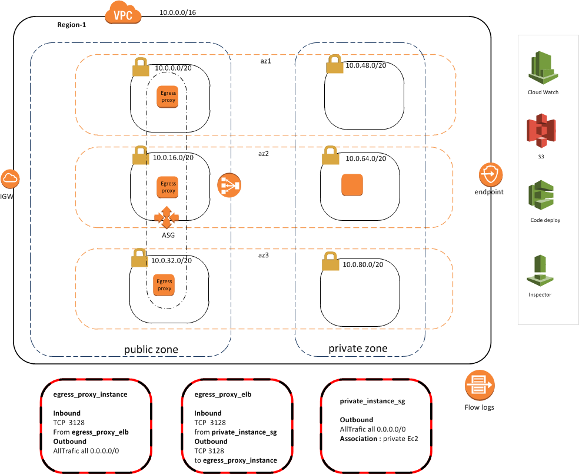
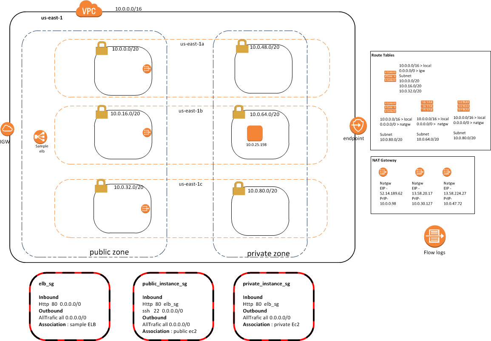

## VPC Examples
-----------------

## vpc_base
* This example uses [VPC](../terraform_module/vpc) module to create virtual network with private subnet.Private subnets are completely isolated from internet or any other AWS endpoints 

## vpc_flow_log_map_to_log_group
* This example uses [VPC](../terraform_module/vpc) module to create virtual network with public and private subnets
* Uses existing cw_log_group created while provisioning account using launchpad, and the log group name is unique as "vpc-flow-logs".
* [FlowLogs](https://github.optum.com/CommercialCloud-EAC/aws_flowlogs) to capture IP traffic across all ENI's within VPC.
* Uses AWS NAT Gateways for Internet outbound access

## vpc_with_internet_gateway_and_gateway_endpoints
* This example uses [VPC](../terraform_module/vpc) module to create virtual network with public subnet, private subnet, internet gateway, s3 gateway endpoint, and dynamodb gateway endpoint

## vpc_with_egress_proxy_and_flow_logs
* This example uses [VPC](../terraform_module/vpc) module to create virtual network with public and private subnets
* [egress_proxy](https://github.optum.com/CommercialCloud-EAC/aws_egress_proxy) module for setting up secure outbound Internet access 
* [SSM](https://github.optum.com/CommercialCloud-EAC/aws_ssm/tree/master/terraform_module) to emulate SSH access to the private instances 
* [FlowLogs](https://github.optum.com/CommercialCloud-EAC/aws_flowlogs) to capture IP traffic across all ENI's within VPC

#### Validate Example:

* Run SSM command targeting private instance to initiate the outbound Internet connection 
```
#1 aws ssm send-command --document-name "AWS-RunPowerShellScript" --parameters commands=["curl -I https://www.google.com"] --targets "Key=instanceids,Values=<private Instance ID>"

#2 aws ssm send-command --document-name "AWS-RunPowerShellScript" --parameters commands=["curl -I https://www.newrelic.com"] --targets "Key=instanceids,Values=<private Instance ID>"

```
* View the Output 
```
aws ssm list-command-invocations --command-id <CMD ID> --details --query 'CommandInvocations[*].CommandPlugins[*].Output' --output text
```

Output for the command #1 should show http status 403 forbidden and for Command #2 http 200 Success.




## vpc_with_nat_gateway_and_flow_logs
* This example uses [VPC](../terraform_module/vpc) module to create virtual network with public and private subnets
* Uses AWS NAT Gateways for Internet outbound access
* [SSM](https://github.optum.com/CommercialCloud-EAC/aws_ssm/tree/master/terraform_module) to install Nginx server on EC2 instance which can be accessed via elb endpoint
* [FlowLogs](https://github.optum.com/CommercialCloud-EAC/aws_flowlogs) to capture IP traffic across all ENI's within VPC



## vpc_with_additional_subnets
* This example uses [VPC](../terraform_module/vpc) module to create virtual network with public and private subnets
* Uses AWS NAT Gateways for Internet outbound access
* This example demonstrates the use of [subnets](../terraform_module/subnets) module to create news subnets to run services like RDS. New set of subnets help provide the logical network separation between presentation-application-data layers 

## vpc_with_endpoint_interface
* This example uses [VPC](../terraform_module/vpc) module to create virtual network with public and private subnets
* This example demonstrates the use of [endpoint-interface](../terraform_module/endpoint-interface) module to create private connection to KMS service

#### Run the examples

```
> cd <example folder>

Update the terrraform.tfvars file with the proper AWS access and secret keys

> terraform init
> terraform plan
> terraform apply
```

Cleanup the example from AWS
```
> terraform destroy
