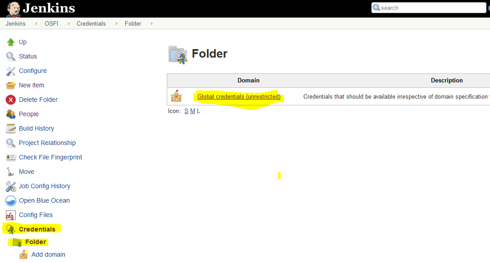
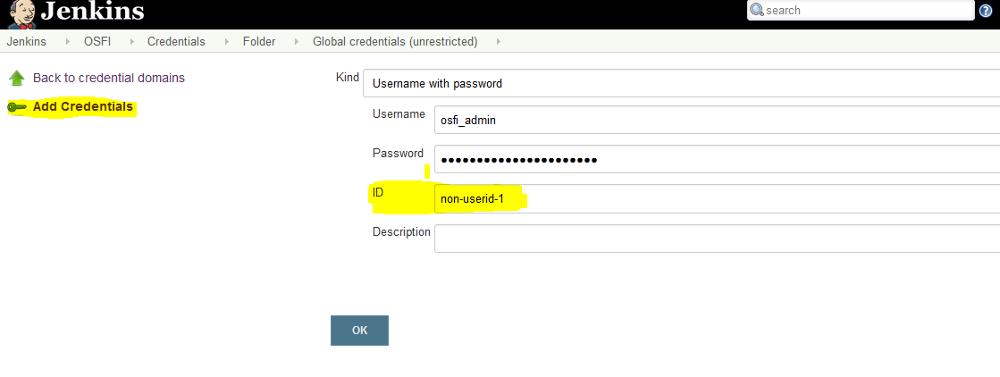
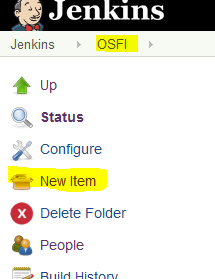
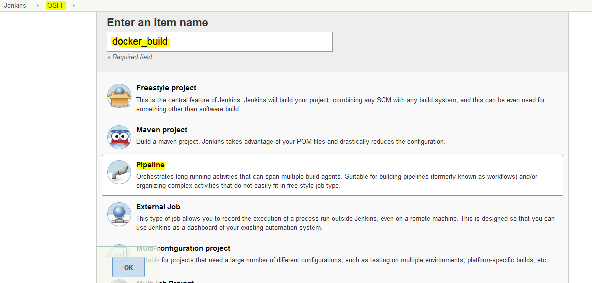
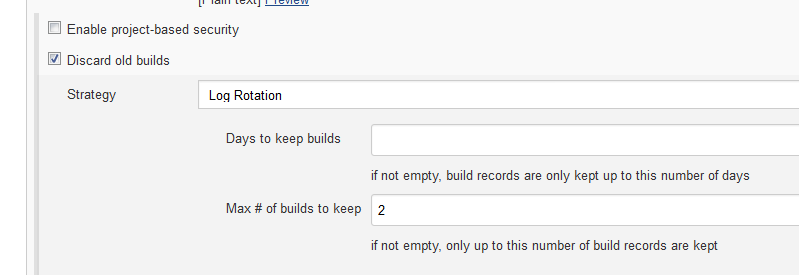
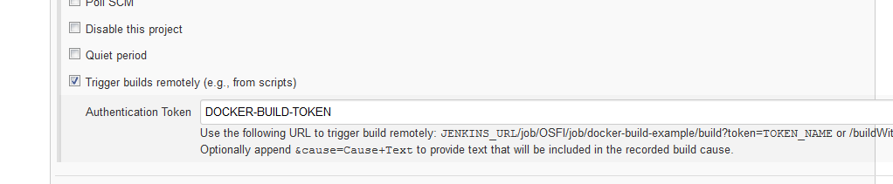
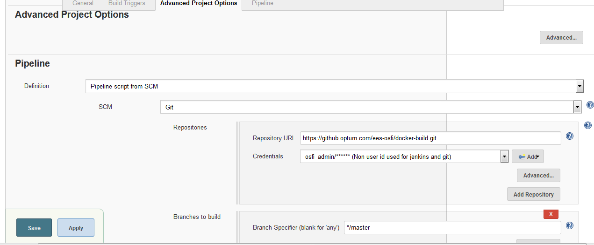
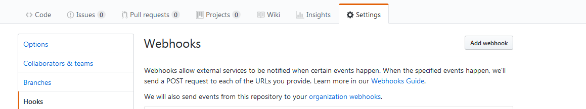
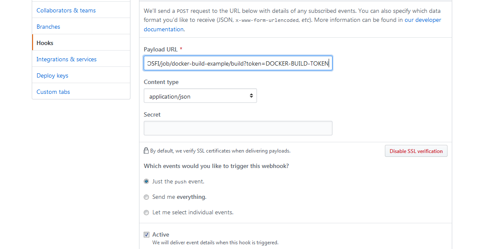

# Building Docker images

## Prerequisites

* Acces to Optum DTR - request for secure group "dtr_users" if not present already

[Optum Developer](https://www.optumdeveloper.com/content/odv-optumdev/optum-developer/en/developer-centers/agile-delivery-development-center/continuous-integration/definative-software-libraries--dsl-/docker-trusted-registry-dtr.html)

* GIT - request for secure group "github_users" if not present already 

[Optum Developer](https://www.optumdeveloper.com/content/odv-optumdev/optum-developer/en/development-tools-and-standards/quality-tools/git.html)

* Jenkins - (if you are using Mac to build Docker images this is not required) Refer below optum Developer site to get access

[Optum Developer](https://www.optumdeveloper.com/content/odv-optumdev/optum-developer/en/developer-centers/agile-delivery-development-center/continuous-integration/build-services/jenkins.html)

## Write Docker file

* Fork this git repository into a repo
* Update the [Docker file](deploy/Dockerfile) Choose the correct base images from optum DTR and install additional components required for your usecase.

Ex:
```
FROM docker.optum.com/bdp_tech/python:3.5.5_alphine

RUN pip install --no-cache-dir dash==0.21.1 \
                                dash-renderer==0.13.0  \
                                dash-html-components==0.11.0   \
                                dash-core-components==0.24.0  && \
pip install --no-cache-dir plotly --upgrade

```
Refer this guide for best practices https://docs.docker.com/develop/develop-images/dockerfile_best-practices/

* update  [jenkins-build.props](jenkins/jenkins-build.props) with the correct values.

Ex:

```
IMAGE_NAME='cd-demo-app'
IMAGE_VERSION='dash-0.21.1'
DOCKER_USER='osfi_admin'

```

## Build and Deploy to DTR

* Login into [jenkins](https://jenkins.optum.com/central/)
* choose/search for the folder you are willing to create the project
* add the DTR credentials to Jenkins credentials > Folder > Global Credentials
<p align="center"> 

</p>

add new credentails, remember the ID field to replace it in  JenkinsFile(deploy/Jenkinsfile) 

credentialsId: 'non-userid',

<p align="center"> 

</p>

Go to the project folder and create new build pipeline

<p align="center"> 

</p>

<p align="center"> 

</p>

In the pipeline configuration choose "Discard old builds" and use appropriate value for "Max # of builds to keep"

<p align="center"> 

</p>

In the "Build Triggers" choose "Trigger builds remotely" and enter some value for "Authentication Token"	. This value will be used to configure git hook.

<p align="center"> 

</p>

In "Advanced Project Options" > "Pipeline" choose "Pipeline script from SCM" and enter Git repo URL and creds.

Use the credentials configured before (same credentials can be used for both git and DTR)

<p align="center"> 

</p>

In the "Script Path" give the JenikinsFile location of the git project.

<p align="center"> 

</p>


## Git Hook 

Login to github.optum.com and goto the forked project > settings

<p align="center"> 

</p>

Configure the hook

Payload URL: https://jenkins.optum.com/central/job/{FOLDER}/job/{PROJECTNAME}/build?token={SECRET TOKEN SET IN JENKINS}

Ex: https://jenkins.optum.com/central/job/OSFI/job/docker-build-example/build?token=DOCKER-BUILD-TOKEN

Content type : application/json

Choose "Let me select individual events." > "pushes"

Choose "Active"

<p align="center"> 

</p>

Now if you make any commit in the Git repo and build would be triggered and the Docker image would be pushed into DTR.
