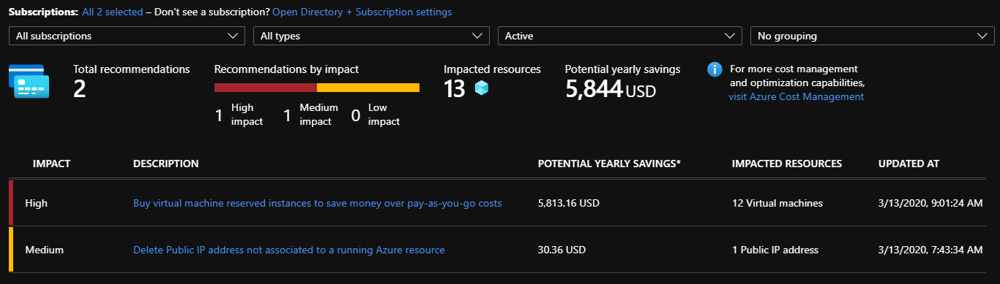
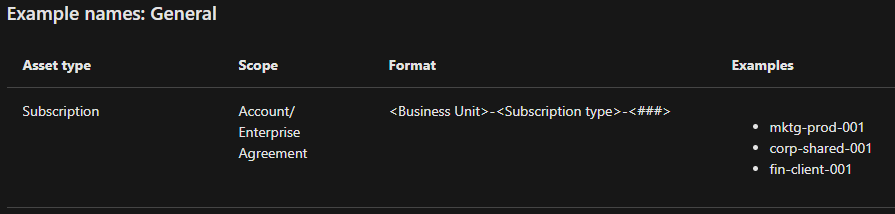

## Caveat Emptor

### The Tale of Greg Brady and Azure Cost Estimation and Management

I just love to fall back on simple things that I learned in my childhood. Believe it or not, some of those things were actually communicated via television shows. Don't laugh, but [The Brady Bunch](https://www.imdb.com/title/tt0063878/) was one of those television shows that left little nuggets of wisdom in my little kid brain. These things just seem to bubble up every now and again. Weirdly, going through the exercise of attempting to use the Azure pricing tools caused one such nugget to float right to the top. It reminded me of an episode where Greg Brady (the impetuous oldest son) purchased a very cool looking car from one of his friends. His friend wasn't completely honest about all of the car's issues and his father (Mike Brady) had to help him understand the consequences of not doing his due diligence. So, I guess that makes me the "Mike Brady" in this tale.

Like Greg's car, Azure is cool. For IT organizations, the changes that it can provide may offer significant savings and increased productivity over on-premise solutions. It is a VERY shiny new way to do things. Sometimes, however, the "shininess" of something new can override our ability to rationally judge its necessity. It happened to Greg Brady, and if it happened to him, it can happen to you. So, remember the immortal words of Mike Brady, "*The important thing is you're the buyer, you have to keep your guard up, see. It's the old principle of caveat emptor. It's Latin for let the buyer beware*." Wise words from a wise man. Well, he was a TV dad, but that doesn't diminish the value of the lesson. So, as you begin to plan your journey into the Azure Cloud, take a few of these thoughts along with you and maybe you will have a much more realistic idea of the true nature of both cost and savings.

## Estimating Cost

First and foremost, everyone needs to keep in mind that the maximization of cost savings and increased productivity are not fully realized until (on average) three years of full implementation.

([https://blogs.gartner.com/marco-meinardi/2018/11/30/public-cloud-cheaper-than-running-your-data-center/](https://blogs.gartner.com/marco-meinardi/2018/11/30/public-cloud-cheaper-than-running-your-data-center/)) So, the cost of the first couple of years may be hard to swallow. But this is one of things that you, and your business/finance partners, need to be all in on. You can't be a "maybe". As you keep that in mind, remember that efficiently operating your subscription will cause the savings to be realized sooner. We will get to that shortly.

## Using Pricing Tools to Estimate Cost

The Azure Pricing Tools are made up of two calculators and five in-portal tools. The calculators are designed to assist you with evaluating the cost of moving to the cloud and the in portal tools are designed to assist you in keeping track of how much you are spending in the cloud. Each of these could be the subject matter for an entire learning module, all by themselves. You think Greg Brady would read up on these? Nope. So, I will **briefly** cover what each does.

### The Azure Pricing Calculator

There are multiple ways to get to the [calculator](https://azure.microsoft.com/en-us/pricing/calculator/) from the Azure Pricing page. Without going too far down the rabbit hole, let's just assume that you and Greg Brady have arrived there of your own accord. The pricing calculator has four tabs. They are Products, Example Scenarios, Saved Estimates, and FAQ's. On the Products tab, resource categories, such as Virtual Machines, are displayed on the left side of the interface. Selecting one of these will present you with the options available for selection. Once you select one of these options, it is added to your estimate. As you scroll down the page, you come upon your estimate. It is here that you are able to select resource attributes. As you can see, in my example, I am building a VM to host a SQL Server. Each one of the attributes will effect your estimated price.

I selected an enterprise version of SQL Server on the standard tier, running 4 cores, and 16 GB of RAM. A pretty standard set up for an enterprise level SQL Server. In the next section of the Calculator, I selected the one year reserved option for the 40% savings option. As a reminder, Optum360 recommends choosing one-year, billed monthly, reserved instances for virtual machines that will live [at least] that long.

- A reservation only covers the virtual machine compute costs. It doesn't cover additional software, networking, or storage charges. It's like locking in a monthly compute cost. Reservations are available for a wide variety of Azure options in either one or three year options.

Scrolling down further, you get to the Managed Disk section of the calculator. I selected four 512 GB standard SSD disks, one for tempdb, one for data, one for logs, and one for backups. You have to approximate the number of transactions you will need monthly. I selected one hundred thousand units of ten thousand transaction per month. I'm an optimist. You will see the total for each section on the right.

The very last part of the Pricing Calculator presents your support and licensing options (below). There is a toggle that allows you to choose whether or not you want what you have just priced out to be dev/test or production. In the image above, you can see that what I have chosen will cost approximately $437.19 per month. I selected the dev/test option. When I turn that off, the calculator assumes that I intend this to be a production instance and the price becomes $1532.19 per month. There are multiple support options to select from, all of which are more expensive than the "included" option (default), so that is where I left it. Optum has an extensive support agreement with Azure so leaving these as default is appropriate. While I had to accept the default licensing option, as I am working through this without being logged into Azure with my entid, therefore, the only available option was "Microsoft Online Services Agreement" (default), Optum does not generally support BYOL (Bring Your Own License) options and recommends using PAYG (the default, Pay-as-you-Go licensing).

The remaining tabs are the Pricing calculator tab (it takes you right back to the calculator), the Reservations tab, the Total Cost of Ownership calculator, and the Cost Management tab. The reservations tab contains a much more in depth explanation of how the reservation process can save you money than the brief description I provided above. I will detail the Total Cost of Ownership calculator, shortly. In the meantime, the Azure Cost Management tab describes some of the in module tools designed to help you manage cost and allow you to see where your costs are accumulating. I will go into a bit more detail with those as well. But first, the Total Cost of Ownership calculator. Greg Brady likes gadgets.

### The Total Cost of Ownership Calculator

The Total Cost of Ownership Calculator (TCOC) is the closest cost approximation you are going to get without doing a POC. The "Define Your Workloads" section of the TCOC allows you to define two workloads by loosely defining your current server infrastructure and the type of workload for each one.

You can define your database back end, storage, and average bandwidth consumption.

Along with knowledge of your current infrastructure hardware and licensing expenditures, you really need to have a decent knowledge of all your current costs. This includes everything from electricity to a breakdown of the rack units required to support your current data center. As, once you hit the next button at the bottom of the page, you will have the opportunity plug in all of those numbers.

Right now, Greg Brady is cluelessly gazing out into oblivion. Completely unaware of all thoughts but one, "Azure is cool". Don't be Greg Brady. Getting to an accurate cost requires patience…

You have now entered the "Adjust Assumptions" portion of the TCOC. This section allows you to say yes to Microsoft Software Assurance and

- If you have current Windows or SQL Server licensing, this is where Microsoft takes that into account and provides you a licensing discount by assuming what you currently have (based on your defined workloads information). The savings takes the form of a percentage off of the Azure service you are moving to. As mentioned above, Optum generally does not support BYOL to cloud providers.

You can elect Geo-Redundant Storage where your data is replicated to another region that is hundreds of miles from your primary region. This option is only required if you plan to do multi-region DR (either hot-cold or hot-hot). Many solutions in Optum360 are choosing to utilize DR within a region. You should have a basic understanding of [how Azure rolls out updates](https://docs.microsoft.com/en-us/azure/best-practices-availability-paired-regions) before choosing this option.

You can also elect to opt out of burstable "B-Series" virtual machines. These are typically used when the server workload doesn't continuously require the full performance of the CPU.

Accounting can be tedious. However, knowing the details can really help you paint a much more accurate picture of what your Total Cost of Ownership in Azure might be. It is here that you will begin to add those costs into the TCOC. Electricity costs, storage costs, and IT labor costs are listed for you to quickly fill in. As a general guideline, Optum tends to use $180,000 as the fully loaded cost of a single, full-time, technology worker.

The "Other Assumptions" section consists of assumed costs in expandable lists. These, too, are editable and will affect the outcome of your TCO.

Finally, you can select "next" and generate our TCO report. Once the report is generated, you we can use a drop down to display your our estimated savings in increments of one to five years. Regions and licensing programs are also selectable. There are multiple representations of how the costs break down, comparing on premises costs to Azure costs. The entire report can be downloaded, shared, or saved.

## Utilizing the "In-Portal Tools"

Let's move on to the "in portal" tools. These are part of your azure subscription and available for your use in your quest to monitor expenditures and make informed spending decisions. The tools are all part of the cost management and billing functionality. They are Azure Cost Analysis, Azure Cost Alerts, Azure Budgets, Azure Advisor Recommendations, and Exports. There are also Azure Cost Management API's that are available for programmatic access to this information, should you want to do something a bit more custom. However, I will not expound on the API options here.

### Azure Cost Analysis

These are the details where the devil lives and you can use this tool to see exactly why your spend is more (or less) than you thought it would be. You can use filtering to isolate items of interest or grouping to show cost combinations.

Aside from manually generating a report, whatever you come up with can be scheduled as a report and exported to CSV or Excel.

### Azure Cost Alerts

This tool is a good one. It allows you to alert on three main areas of how you are spending your money in Azure. You can set up budget, departmental spending, and credit alerts. Make sure to set your scopes appropriately here to limit alert fatigue (i.e. alerts that don't mean anything).

In Budget Alerting, alerts can be set to inform when a predefined limit on the amount of spending is approaching or breached. The alert can also be set to trigger on resource consumption and/or overall cost.

If you have an Enterprise Agreement, fixed spending limits are set and configured in the Azure Enterprise Agreement portal. You can set alerting to fire at predefined thresholds, such as, 50% or 80% of the limit.

Credit Alerting, however, is only for organizations with enterprise agreements and begin alerting when Azure credit monetary commitments reach 90% and 100% of your Azure credit balance.

For each of these cost alerts, the alert will be displayed in the cost alerts portal and an email will be sent to the appropriately identified recipients.

### Azure Budgets

Budgets!? We don't need no stinking budgets! Well, yes you do and within Azure Cost management you can stay right on top of your expenditures. Azure Budgets allows you to set up notifications and alerts across all of your Azure Subscriptions. The budgets are named and are given your budgetary constraints for whatever timeframe you wish. The budgetary periods can be in months, quarters, or years; whatever you need. As in all of these tools, alerts are set up based on percentage of use and sent to those whom you need to be notified.

### Azure Advisor Recommendations

The Azure Advisor is a very comprehensive tool and, as such, is only available to those whom the administrators have designated as able to view and apply the recommendations.

The Advisor gives you the ability see recommendations in the areas of performance, availability, security, and cost. I will discuss the cost portion of that, we are trying to help Greg Brady not get taken to the cloud cleaners…remember?

The folks at Microsoft are very interested in keeping their customers happy and aware of how much they are spending. They are also interested in offering up ways for their customers to save money and the Azure Advisor is pretty good at offering up suggestions to do just that. Let's assume that there are some cost savings to be had, your recommendations will look something like this.

$5844 may not seem like much, but imagine that you see several of these kind of alerts in a week or in a month. Six thousand dollars becomes eighteen thousand dollars in a matter of days. And, when your monthly cost is 20 thousand dollars, every little bit helps. Each of the alerts listed is selectable and will allow you to see the details of the recommendation. In this case, there are unused IP addresses that are being paid for and the suggestion for purchasing Reserved Virtual Machines. It is possible to get recommendations for every aspect of the way you use your subscription.

### Exports

Exports is an easy interface inside of Azure Cost Management that allows you to generate and/or schedule financial reporting. It allows you to export the reports in CSV format, so that they can be used in external systems as part of a larger financial reporting mechanism.

We have talked about the tools for keeping a good eye on your Azure Costs, now let's talk about some solid strategies to reduce the cost of Azure by using cost control. No Greg, you can't have a raise in your allowance.

## Azure Efficiency Strategies

In every IT organization, there is sprawl. It can be seen in the form of scope creep in application development, I can be seen in having an exorbitant number of virtual machines, and it can be seen, for example, in the number of personal SQL Server instances on the network. Those examples are the ones I most often see and I am sure that you could name many more. Sprawl can happen in the cloud as well and there are several common situations that can be addressed proactively, saving you money.

### Virtual Machines

Typically, other IT organizations moving to the cloud will create many virtual machines. Optum, however, strongly recommends migrating away from Virtual Machines (when moving to a cloud provider), it is common to still have a few remaining VMs that cannot be moved to containers or serverless options. The problem is that many are not fully utilized or are idle. The concern here is that the organization is being charged full price the entire time they are up and running. As I mentioned in the section on the TCOC, there is another option. Burstable "B-Series" virtual machines. Some say that you can save anywhere from 5%-55% with their usage. These are typically used when the server workload doesn't continuously require the full performance of the CPU. During times when processing is doesn't go above the VM's baseline (let's say the baseline is 20% of a vCPU), the VM is building usage credits. When more processing power is needed, the B-Series VM's can utilize their stored credit to burst above their baseline (up to 100% of VCPU). That way, VM has processing power when it needs it and you aren't getting charged full processing price when it doesn't.

There are a couple of caveats:

- If your B-Series VM begins to consistently use more than its baseline, Azure will throttle it down until it begins to bank (and has) enough vCPU credits for peak processing times.
- If your B-Series VM is powered off, all accumulated vCPU credits are lost.
- Baselines vary and are dictated by the size of the B-Series VM.
- The B-Series VM is especially valuable in situations where your work load is predictable and consistent.

### Correct Resource Sizing

Every time I walk through the process of setting up a new cloud resource, I get the evil urge to build a super computer and take over the world. Not really. Although, it is really easy to both over and under allocate resources in a new cloud environment. It is essential that you have a good idea of what you need at the beginning of the process. I don't think anyone is ever going to nail it right off, especially when there are so many options available. Luckily, there are several ways to stay on top of this.

In the case that you have allocated to much CPU and memory to a VM or DTU's to a DB, you can always cut back on those. In order to know when to do so, you also have a couple of choices. If you are lucky enough to have access to a third party optimization tool, it can be set to monitor your tenant and notify you when that opportunity exists. Or, in the case that you do not have such a tool, you have other options. You can create custom reporting and alerts using a combination of Azure cost analysis and alerting alongside performance metrics, such as,  the CPU/Memory percentage graphs in the Azure portal to track that usage. If, over a longer period of time, the metrics in your reporting indicate utilization at or below fifty percent, you can feel safe in cutting down on those resources without damaging performance. The opposite is true for a resource that has high CPU/memory consumption.

### Managed Instances and Elastic Pools

It's generally not a good idea to attempt to translate your on prem architecture into Azure. It is never going to be a one for one swap. In Azure, each DB is allocated its own set of resources. So, in the case that your on prem environment had several SQL Server instances with many databases each; replication of that environment could be exceedingly expensive. Remember, Azure databases have their own resources and you are paying for each, no matter the utilization. It stinks to think about paying full price for resources that are not being used. However, in Azure, you have options.

Two options to consider are Managed Instances and SQL Elastic Pools. Managed Instances are VM's that host a SQL Server. You don't have to configure the host and you don't have to worry about most of the database maintenance. You also don't get all of the really cool Azure features that you would with, let's say, Elastic Pools.

Elastic Pools allows you to reserve a large number of resources and allow hundreds of databases to use them. That way, databases that sit idle (or mostly idle) aren't a black hole of spend. That doesn't mean elastic pools are the Showtime Rotisserie oven of cloud computing. You cannot just "Set it and forget it!" If your monitoring begins to reveal some databases that outpace the others (using 40% or more of the pool's DTU's) and appear to be in need of a possible move to a more expensive service tier, you might need to move it out into a single database instance. Then you can investigate moving the remaining databases to a more inexpensive service tier.

### Unused Disks

We started this section talking about "Cloud Sprawl" and ways to keep it under control or avoid it all together. Now, we are going to talk about some artifacts that Greg Brady might never be aware were there and costing him money. Unused Disk.

Yep, don't tell the dev guys, it will reinforce the idea that the infrastructure guys are hording it or that it is cheap and just laying around the office. The reality is that disks can be orphaned as the result of the deletion of another resource. Further, they can just be sitting there costing you money without you even knowing it. By way of example, Optum360 had an instance in its FL750 DR subscriptions where a team had left some relatively small premium disks (a few terabytes) in the subscription after deleting a backup VM. Each of these disks cost the company ~$2,300 per month. With four of them we were buying the equivalent of a brand new Honda every two months. The next task then is to find it and delete (after you make sure it is truly orphaned) it.

There are two types of Disk that you will be searching for, classic and managed. Let's deal with managed disks first. From the portal, simply search for "Disks". As you can see in the screen shot, you get a couple of options. Spoiler alert, managed disks are the ones without "(classic)" listed behind them.

Select "Disks" and you will get a list of managed disks from the subscription that you are currently logged into.  In the next image (below), you will see that there were two disks listed that did not have owners assigned to them. Those are the ones we are looking for. You will also see that these disks comprise 254 gigabytes of premium ssd storage. I would be willing to bet that allowing those to go unused might be something you would rather not be charged for. Verify that they are not ownerless for a reason and delete them.

Since they are all attached to VM's, you will have to do a bit more digging to find the Classic disks that have been orphaned. Start out by searching for "Disks" in the portal search bar and select Disk (Classic). Sadly, I do not have access to a subscription with any VMs. However, you would see list of the disks as above. The indicator that the disk may be orphaned is the "Attached to" column.

This is the part that is more complicated than dealing with orphaned managed disks. There are multiple steps to deleting a classic disk. This is because simply deleting the unattached file doesn't delete the VHD portion of the file. That portion is in a storage account and you have to manually delete it out of that. Here is how you do that:

- Select the unattached disk from the disk search
  - Make sure you pay attention to both the storage account and media link information - you will need it shortly.
- Delete the disk - confirm that you want to delete.
- Search for the storage account (step 1) in the portal search bar.
- On the left side of the results pane, select blobs.
- Using the file name from the end of the media link in step 1 (someDisk.vhd), choose the corresponding storage container on the right side of the blobs pane.
- This will open a window with a list of VHDS files in that container. Find the appropriate file (SomeDisk.vhd) and delete from the top menu.

That should take care of the orphaned Classic Disk. **Be aware**, however, Classic Disk is the easiest to overlook. You have to search for VHDS containers under blobs for every classic storage account. Inside the container file, there is a column called "Lease State". If the state is listed as "Available" it means that it is not attached to any VM and may be safe for deletion. But, YOU MUST CHECK each time.

### Idle Resources

Sprawl, left unchecked, will make it extremely difficult to detect and manage resources that are not being used or are underutilized. All of which, you are paying for. That's why a solid cloud cost governance plan (next section) is essential from the very beginning. If you don't have a CCGP (I'm just taunting Greg Brady - he hates acronyms - remember?), then you have some work to do.

Aside from the information you can get from various parts of the Azure Portal, you can also use custom code via the Azure API to generate the usage statistics you need. Close examination of these numbers will help you determine what resources are not in use or that are underutilized. There are third party tools (ShareGate Overcast) that will do this for you, but, we are trying to save money here - right Greg? He didn't answer. Let's talk governance plans.

## Azure Cost Governance

Cost governance is both painful and essential. It's painful because it forces structure and rules into a virtual world were the possibilities for what you can build and achieve are absolutely limitless. It is essential because the ability to be limitlessly achieving and building is not free.

Microsoft defines governance in this way, "*[governance refers to the ongoing process of managing, monitoring, and auditing the use of Azure resources to meet the goals and requirements of your organization](https://docs.microsoft.com/en-us/azure/architecture/cloud-adoption/getting-started/what-is-governance)*." Thus, you need to be thinking about the entirety of your cloud infrastructure, Azure and AWS (should you be using that too). That is going to require a great deal of organization in your plan. Let's start with making sure our cloud resources are using a logical naming convention. 

### Naming Conventions and Tagging

From the beginning, the creation of a consistent, logical naming convention is key. This allows for quick and easy tracking of resource utilization - without having to troll through metadata. The image below is from [Microsoft's page concerning best practices for naming conventions](https://docs.microsoft.com/en-us/azure/cloud-adoption-framework/ready/azure-best-practices/naming-and-tagging#example-names). However, Optum360 has strong guidelines for [tagging](https://github.optum.com/Dojo360/optum-resource-name/blob/master/README.md#overview) resources in the cloud and provides a common terraform module to support said guidelines.

Tagging is another practice that allows for the quick retrieval of resource information. Tags enable you to get info on resources that have the same name in the tag. This is most often info that would be used in the naming convention. Another quote from the page linked above, "*You want these tags to include context about the resource's associated workload or application, operational requirements, and ownership information. This information can be used by IT or business teams to find resources or generate reports about resource usage and billing.*" Another example:

### Expiration Dates

One of the great things about the cloud is the ease with which you can stand up or remove resources. One thing is for sure, in an efficiently managed Azure (or AWS for that matter) subscription, you will need to be able to get rid of anything that is not being used (#NoCloudSprawl).

A great way to make sure that the resources that have been deployed or created in your part of the cloud haven't out lived their usefulness is to routinely evaluate its need. You can do this by tagging each resource with an expiration date. Since the tags are just metadata, you can run quarterly reports that let you know what has expired. Utilizing the contact info tag from above, you also have a direct resource who can either justify its existence or delete it.

### Optimization

Information is the key to efficiently managing your Azure tenant. Implementation of RBAC, tagging, and expiration dates are super simple ways that you can make your cost management far more robust. Utilizing the Azure Cost Management features of the portal, combined with detailed reporting (using the genius of tagging) run through the Azure API, will allow you to keep a steady eye on your cloud costs. You can easily analyze cost spikes and prevent sprawl.

## Conclusion, Observations, and Concerns

For most folks the idea of moving to the cloud can be an overwhelming and exciting thing. You must prepare yourself for that journey. Research and knowledge regarding your current costs is essential. There is nowhere near enough emphasis on knowing what you truly need to set up before you begin to explore pricing options.

It is my opinion that those doing the cost estimations should be well acquainted with both the Azure pricing tools and what the organization really needs in the cloud. As, what the system looks like on prem will not (in most cases) be the same thing in the cloud. I say that because the Pricing Calculator can seem convoluted. It is easy for the user to misinterpret what their estimated monthly cost might be. This is where Greg Brady went wrong. In other words, the devil is in the details (Caveat Emptor).

In a perfect world and assuming that Greg Brady had educated himself as to the proper way to use Pricing Calculator, there would be a way to set up a zero cost "try before you buy" POC. This would enable the organization to effectively judge their systems viability in the cloud without the distraction of cost. At the end of the day, if a base version of your system performs poorly there may need to be some changes made to improve it before you move. Sadly, there is no way to do a true zero cost POC that would allow you to get a relative idea of actual performance under typical load.

Further, you must pay attention when first working with the main Azure informational pages. Several of the bullet points that generate the infamous Azure "Shininess" vibe are, in fact, just a bit misleading. For example, one will see the phrase "Built in high availability" in many places. For the users of SQL Server, this suggests that whatever you build, will be part of a high availability group. When the reality is that everything SQL Server related is built on a windows cluster not a High Availability Group. In order to get to that level of implementation, you have to go to the business Critical level of service. Without utilizing the hybrid licensing model (within the managed instance model), your base hourly rates will double from around $20 an hour to $54 dollars an hour.

Something else that might not be readily apparent is that the Total Cost of Ownership calculator automatically includes a reduction in administrative head count as a main part of the savings estimate. While this may be one of the ultimate goals of moving to the cloud, it is my opinion that eliminating any administrative staff prior to Azure consistently showing that it has made them redundant, is foolhardy. The move to the cloud must be a methodical exercise in common sense IT dogma. The tools that are available to help potential customers understand their costs are far less realistic than building your system and getting your base cost (before beginning to accumulate actual charges) would be. But, that is not an option.

Finally, the single biggest concern that I have is that there are no disclaimers surrounding the adaptation of the managed instance/database model. I would like there to be some type of up front definition that makes potential users keenly aware that Microsoft's managed models are (in many ways) the same thing as the current Optum Managed Services model.

This is seen in the way Microsoft reserves the right to conduct patching without regard to customer SLA's. For example, there is a 10 second outage when MS initiates the cluster failover process during updates and patching. It is also evident in the way some product offerings are available in preview mode and can be modified or removed from use without notice (this is true for Azure in general, not just the managed models). Further, assuming you select a service model such as business critical, you have limited ability to intervene in the process of auto tuning or auto scaling. Alternatively, you do have the option to discontinue these services and attempt to use alerting and monitoring to make you aware of needed manual intervention.

Azure is cool. You must be prepared to be "all in" if you move to the cloud. You must also do your homework, know your current costs, and be conservative when estimating what you need. Have a thorough Azure Cost Governance plan in place and stick to it. Remember, your true savings will probably not be recognized for several years. Until that time use the work you did to prepare for this move to efficiently manage your cost. And, please, don't let Greg Brady do ANYTHING in your Azure cloud. He just likes to press buttons.

