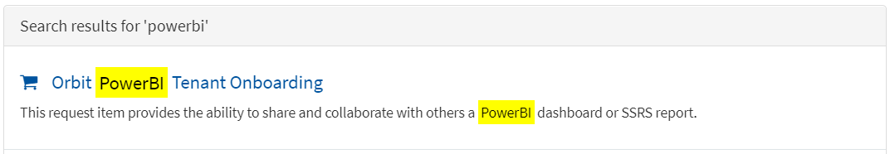
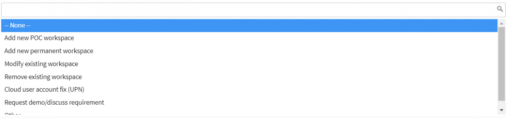

## Background

Optum/UHG's PowerBI subscription is managed by the Orbit team.  The PowerBI subscription is connected with UHG's Azure AD Tenant.

The Orbit team maintains a HubConnect site for PowerBI  https://hubconnect.uhg.com/groups/orbit-enterprise-bi/projects/power-bi-platforms

Interaction with the Orbit team is facilitated via ServiceNow.

## Interacting with the Orbit Team

1. In a browser, navigate to UHG's [ServiceNow Request Center](https://optum.service-now.com/itss2)
1. Search for PowerBI and from the search results select Orbit PowerBI Tenant Onboarding

  

3. You will see the following choices.  From past engagement with the Orbit team you typically start with a POC workspace prior to getting a Production/Permanent workspace.

  

## Steps to Onboarding

1. Using the ServiceNow guidance above request a POC workspace.

- This will allow you to start getting familiar with PowerBI and will grant you a 60 day PowerBI pro license
- The PowerBI Desktop is available in the UHG AppStore.  Note there are two versions, one for working with PowerBI in the cloud and one for working with PowerBI on-prem (which is also known as PowerBI Report Server).  Most likely you are only interested in the cloud version.  In the UHG AppStore search for "Microsoft Power BI Desktop Cloud"
- Note connecting to you backend database running in Azure with Power BI Desktop is challenging and requires the [TCP/SQL Proxy](https://confluence.optum.com/display/O360D/Azure+SQL+%28TCP%29+Proxy)
- Once you have all this you should be able to start creating reports and understand PowerBI's capabilities
- The Orbit team will likely share additional documentation with you as they get you setup

2. Create a Security Group in your Azure Subscription (under the UHG Azure AD Tenant)
  This is needed as part of the steps to authorize a service principle that you will create in the next step with access to your Power BI workspace
1. Create a Service Principle under the Security Group you just created.  This Service Principle will ultimately be used to embed PowerBI reports into your applications
1. Connect with Orbit team (probably via email but could also use ServiceNow) to have them add the Security Group under the PowerBI Tenant Settings and the Service Principle into your workspace
1. Once you have proven out everything in your POC workspace it is time to request your Permanent workspace.  Within your Permanent workspace you can create different folders to represent your different environments (Ex. folder for development, one for staging, one for production,…).  Use ServiceNow to request your Permanent workspace.

- Orbit team will create 3 security groups (Member, Contributor, and Viewers)
- You and your team members can request access to one of these groups
- Once someone belongs to the Member security group they can grant the Service Principle access to your permant workspace