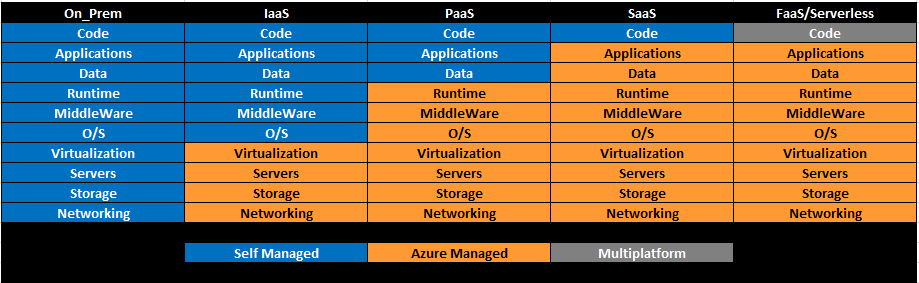
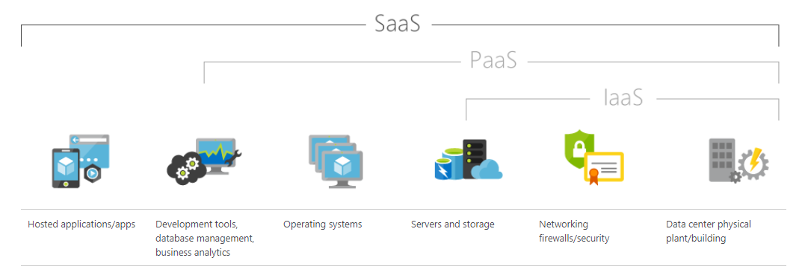
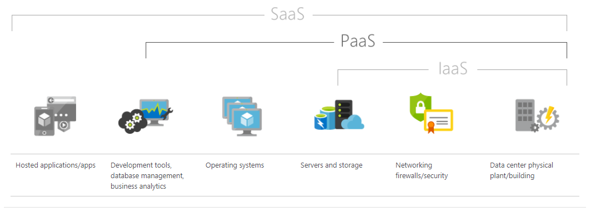
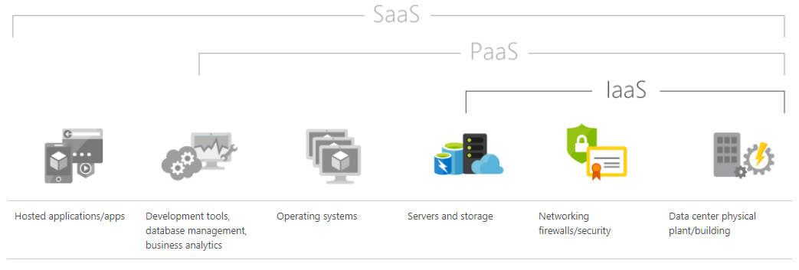
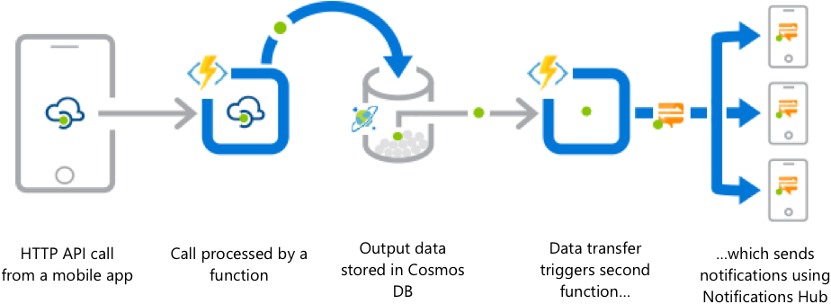

*Disclaimer: While developers and architects would do well to understand the concepts brought forth in this article please keep in mind that Provider has specific [Playbooks](https://github.optum.com/dojo360) for various architectural stacks. Please adhere to those playbooks whenever possible - fewer unicorns means cheaper Operations which means more money to develop customer value.*

## Concept

Understanding which cloud model is appropriate for your current setup is one of the most important aspects of planning to move to the cloud. Let's start by discussing each of the models and some reasons that might lead you to investigate each. Each of the models presents a different option regarding which portions of the cloud resources are managed by the business and which are managed by Azure. The image below demonstrates the separation of those duties by model.

In the graphic above, each model is made up of three possible management models. They are self-managed, Azure Managed, or multiplatform. Each management model has a different level of who controls what and how much. Obviously, resources that are "on-prem" (i.e. on premise) provide the business with the greatest amount of control and Software as a service, the least. The level of control that the business has moves in a continuum of most to least between the two. The "Multiplatform" model ascribed to the FaaS (Functions as a Service)/Serverless model is just that, Azure functions and serverless options can be used in conjunction with IaaS, SaaS, and PaaS. As, they are not tied to any single cloud computing module.

### SaaS: Software as a Service

SaaS provides a complete software solution that is purchased on a pay-as-you-go basis. The business pays for the use of preexisting software (such as Office365), and users connect to it over the Internet, usually with a web browser. The infrastructure, middleware, app software, and data are managed by Azure and housed in the data centers that support Azure infrastructure. Azure ensures the availability and the security of both the app and the data (according to a prearranged SLA). Use of SaaS applications can allow rapid implementation and use at a much smaller initial cost.

#### SaaS Characteristics

- Software is hosted on an Azure remote server and is always accessible through a web browser over Internet
- Applications are managed from an Azure central location
- Application users do not need to worry about hardware, software updates and patches. All of these are completely managed by Azure
- Any use of or integration with the third-party applications are done through Azure APIs

#### When should SaaS be your Cloud Model?

- Solutions that undergo a wide range of demand or seasonal/monthly variation
- Solutions that have demand for web as well as mobile access
- Short term projects that require collaboration
- Start-ups that want to quickly launch their sites without worrying about server configurations and software updates

#### SaaS Limitations and Concerns

- **Interoperability**. Integration with existing apps and services can be a major concern if the SaaS app is not designed to follow open standards for integration. In this case, organizations may need to design their own integration systems or reduce dependencies with SaaS services, which may not always be possible.
- **Data security**. Large volumes of data may have to be exchanged to the backend data centers of SaaS apps in order to perform the necessary software functionality. Transferring sensitive business information to public cloud-based SaaS service may result in compromised security and compliance in addition to significant cost for migrating large data workloads.
- **Customization**. SaaS apps offer minimal customization capabilities. Since a one-size-fits-all solution does not exist, users may be limited to specific functionality, performance, and integrations as offered by Azure.
- **Lack of control**. Using SaaS solutions involves handing control over to Azure. This includes the software version and updates, as well as, the data and governance. It may be necessary to redefine your data security and governance models to fit the features and functionality of the SaaS service.
- **Feature limitations**. Will limited customizability be an equal tradeoff for the security, cost, and performance, offered by the Azure solution you want to use? Will those same factors make it too difficult to leave Azure or to add new feature requirements in the future?
- **Performance and downtime**. Because Azure controls and manages the SaaS service, your customers now depend Azure to maintain security and performance. Even though a service level agreement (SLA) and its protections are in place, planned and unplanned maintenance, cyber-attacks, or network issues could impact performance.

### PaaS: Platform as a Service

Platform as a service (PaaS) is a complete development and deployment environment in the cloud. PaaS is, also, primarily a pay-as-you-go model that is accessed over a secure Internet connection. With PaaS, Azure provides the underlying hardware, middleware, operating systems, and tools required to develop and test applications. Optum is not responsible for the cost of maintaining, patching, or providing any capacity planning for the underlying platform. Optum is also able to avoid buying and managing software licenses, application infrastructure, and middleware. Optum manages the applications and services we develop. Azure manages everything else.

#### PaaS Characteristics

- Resources can be added or subtracted based on demand based on need.
- PaaS is an integrated development environment where services are provided to facilitate development, testing, deployment and hosting of software applications
- Multiple users can utilize the same development application
- Integrated web services and databases
- Billing and subscription are managed via Azure Cost Management and Billing

#### When should PaaS be your Cloud Model?

- In cases where multiple developers are working on the same project
- When external parties are involved in the development process.
- When you wish to make the most of your investment, the PaaS model reduces the organization's overhead costs by providing solid underlying infrastructure.

#### PaaS Limitations and Concerns

**Data security**. You can run their own apps and services using PaaS solutions, but the data residing in Azure controlled servers can pose security risks and concerns. As, security options may be limited. You may not be able to deploy services with specific hosting policies.
**Integrations**. The complexity of connecting your data (whether it is stored within an onsite data center or off-premise in Azure) is increased. That may affect which apps and services can be moved to the Azure PaaS cloud model. Not every component of your system will be ready for the cloud.
**Vendor lock-in**. Current business and technical requirements may not apply in the future and you may need to switch to other Azure options. Engage Microsoft to verify what their migration policies are and that switching to alternative PaaS options is possible (without effecting the business).

Infrastructure as a service (IaaS) is computing infrastructure, provisioned and managed over the internet. The IaaS model consists of cloud computing infrastructure, including servers, network, operating systems, and storage, delivered through virtualization technology. These cloud servers are provided to the Optum through the Azure portal, giving Optum IaaS clients complete control over the entire infrastructure. IaaS uses the same technologies and capabilities as an on prem data center without having to physically maintain or manage it. IaaS clients can still access their servers and storage directly, but it is all housed and managed in a virtual data center.

In the IaaS model, clients are responsible for managing aspects such as applications, runtime, OSes, middleware, and data. However, as the provider of the IaaS platform, Azure manages the servers, hard drives, networking, virtualization, and storage.

The IaaS model can quickly scale up and down with demand. Optum prefers the pay as you go model and IaaS allows you to pay only for what you use. Each resource is available as a separate service component. Usage and rental of that service only needs to take place for as long as you need it. Again, with IaaS, Azure manages the infrastructure. Your group will purchase, install, configure, and manage the software—operating systems, middleware, and applications.

#### IaaS Characteristics

- Generally, includes multiple users on a single piece of hardware
- Resources are available as a service
- Allows dynamic scaling capabilities
- Cost will vary based on the infrastructure selection
- Easy to automate deployment of storage, networking, servers, and processing power
- Very flexible cloud computing model
- Gives organizations a complete true control over their infrastructure

#### When to use IaaS

Just as with SaaS and PaaS, there are specific situations when IaaS is most advantageous. Larger companies, is some situations, may prefer complete control over their applications and infrastructure. Therefore, they want to purchase (rent) only what they consume or need. Solutions that are experiencing rapid growth like the scalability of IaaS, and they can change out specific hardware and software easily as the need arises. IaaS offers plenty of flexibility and scalability anytime you are unsure of a new application's demands.

#### IaaS Limitations and Concerns

Many limitations (mentioned above) with the SaaS and PaaS models, such as data security, cost overruns, vendor lock-in, and customization issues, also apply to the IaaS model. However, there are some limitations particular to the IaaS model.

They include:

- **Security**. While the customer is in control of the apps, data, middleware, and the OS platform, security threats can still be sourced from the host or other virtual machines (VMs). Insider threat or system vulnerabilities may expose data communication between the host infrastructure and VMs to unauthorized entities.
- **Legacy systems operating in the cloud**. While customers can run legacy apps in the cloud, the infrastructure may not be designed to deliver specific controls to secure the legacy apps. Minor enhancement to legacy apps may be required before migrating them to the cloud, possibly leading to new security issues unless adequately tested for security and performance in the IaaS systems.
- **Internal resources and training**. Additional resources and training may be required for the workforce to learn how to effectively manage the infrastructure. Customers will be responsible for data security, backup, and business continuity. Due to inadequate control into the infrastructure however, monitoring and management of the resources may be difficult without adequate training and resources available inhouse.
- **Multi-tenant security**. Since the hardware resources are dynamically allocated across users as made available, the vendor is required to ensure that other customers cannot access data deposited to storage assets by previous customers. Similarly, customers must rely on the vendor to ensure that VMs are adequately isolated within the multi-tenant cloud architecture.

### FaaS/Serverless: Functions as a Service

Serverless compute can be thought of as a function as a service (FaaS), or a microservice that is hosted on a cloud platform. Optum business logic runs in the form of functions and Optum doesn't have to manually provision or scale infrastructure. Azure manages the infrastructure. Your app is automatically scaled out or back depending on demand. There are several ways to build this sort of architecture in Azure. The most common approaches are Azure Logic Apps and Azure Functions. Building an application using Azure Functions is a way of achieving a "serverless" architecture. FaaS/Serverless model are most typically used when building microservices applications.

FaaS/Serverless is similar to Platform as a service (PaaS) applications, in that, it also hides infrastructure from developers. In most cases, both services usually have at least one server process running that is designed to receive external requests. However, FaaS/Serverless does not require a server process to execute. Because of this, at times, an initial execution can run longer than an application hosted in PaaS. Nevertheless, the use of caching can result in subsequent executions running in milliseconds.

FaaS/Serverless can be billed in three separate hosting plans:

- Consumption: Resources Scale automatically and we only pay for compute resources when our functions are running. Instances of the Functions host are added dynamically and dropped dynamically based on demand.
- Premium Plan: Scaling remains demand based. Idle functions may take extra time to ramp up to achieve optimum performance. So, the premium plan provides "pre-warmed worker" resources to ensure quick execution.
- Azure App Service plan: Functions are run at regular AppService plan rates. This is most appropriate for operations that consistently run for a long time and have predictable changes in demand. As, billing for scaling requirements can be anticipated and planned for.

#### FaaS/Serverless Characteristics

- Serverless applications: Functions allow you to develop serverless applications on Microsoft Azure.
- Choice of language: Write functions using your choice of C#, Java, JavaScript, Python, and PowerShell.
- Pay-per-use pricing model
- Functions supports NuGet and NPM.
- Integrated security: Protect HTTP-triggered functions with Azure Active Directory.
- Easy integration with Azure services and software-as-a-service (SaaS) offerings.
- CI/CD is supported via integration with GitHub, Azure DevOps Services, and other supported development tools.
- Stateful serverless architecture enables development to write serverless applications with Durable Functions. Durable Functions allow you to choreograph the executions of many functions without a timeout.
- Stateless logic can be used to create functions that are created and destroyed on demand.
- Functions are event driven. This means they run only in response to an event (trigger), such as HTTP requests.
- Open-source: The Functions runtime is open-source and available on GitHub.

#### When should FaaS/Serverless be your Cloud Model?

Functions are great for:

- Workloads with a wide fluctuation in demand
- Processing bulk data
- Integrating systems
- Working with AI and Machine Learning (internet-of-things)
- Building simple APIs
- Building Simple micro-services.
- Running code based on HTTP
- Scheduling code to run at a specific time
- Working with Cosmos DB and Azure Blob storage
- Responding to Azure Storage queue messages
- Respond to Azure Event Grid and Azure Event Hub events
- Connect to other Azure or on-premises services by responding Service Bus queue and Service Bus topic messages

#### FaaS/Serverless Limitations and Concerns

- **Consistent Workloads.** FaaS is ideal for workloads with a wide fluctuation in demand. If you have a relatively constant workload, however, you'll gain little from FaaS. As, there is no need for its massive scalability.
- **Vendor Lock-In.** Most FaaS platforms are tied to specific cloud-computing vendors, including those that are designed to be open source. It is possible to migrate FaaS workloads from one platform to another. However, it will require significant manual effort. What this means is that, if you use Azure or AWS FaaS today, expect to be bound to whichever platform you use for the foreseeable future.
- **Monitoring.** Robust monitoring solutions for FaaS are still (mostly) in development. Azure's tools can support monitoring FaaS applications. However, without digging into the Azure API, the monitoring features are relatively standard. Further, moving into the FaaS/Serverless model means that you will have to monitor processes that are made up of many discrete services, that will be a bigger challenge.
- **Long-Running Functions.** One of the main limitations of FaaS solutions are execution timeouts. By default, functions have a timeout of 5 minutes and is configurable to a maximum of 10 minutes. A that function needs more than 10 minutes to execute, should be hosted on a VM. Further, if your service is called/returned via an HTTP request/response, the timeout is restricted to 2.5 minutes. If you have a workload that is consistently delayed by issues such as, bandwidth limitations, a FaaS solution may not make sense.
- **Unsupported Language.** Most FaaS environments only support code written in specific languages. In general, your options are limited to programming languages supported by Azure.
- **Startup time.** Idle functions may take extra time to ramp up to achieve optimum performance. You must choose the premium billing plan to get "pre-warmed worker" resources to ensure quick execution.
- **Scaling.** Dynamic scaling could cause increased cost, as the resources that are utilized all have a cost.
- **Dependencies.** - As with monitoring, introducing many discrete services within a process will make inter-dependencies more difficult to manage. Hard coded dependencies on other services, makes managing change much more difficult. Use of an API Gateway (such as Azure API Management) to provide a layer of abstraction between services. This allows for versioning and redirection.

## Considerations

- Each of these models are designed to reduce both the cost and the effort to build and deploy applications.
- Typically, there are two billing models for most cloud providers, "pay as you go" or "pay as you use". Optum almost always prefers the "pay as you go" model.
- Communication, collaboration, and cooperation are going to be key in producing successful development outcomes and reliable, highly available applications.
- The business will need analyze any application intended to move to the cloud for suitability and possible architecture changes required for cloud integration.
- Some applications may not be ready for the cloud and will require extensive architecture changes to move to the cloud.
- New cloud services may need to be built to utilize cloud models.

In [Part 2](planning-a-cloud-migration-part2.md) of this article, I will discuss some conceptual information about the Cloud Adoption Framework and how it helps determine which model is the most appropriate for what you are trying to achieve. Further, we will look at Migration tools and the way that they will assist you in selecting the appropriate [Playbooks](https://github.optum.com/dojo360) for your implementation of SQL Server in Azure.
