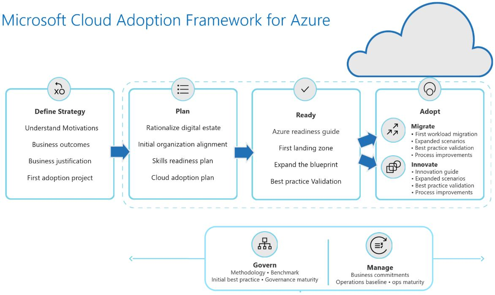
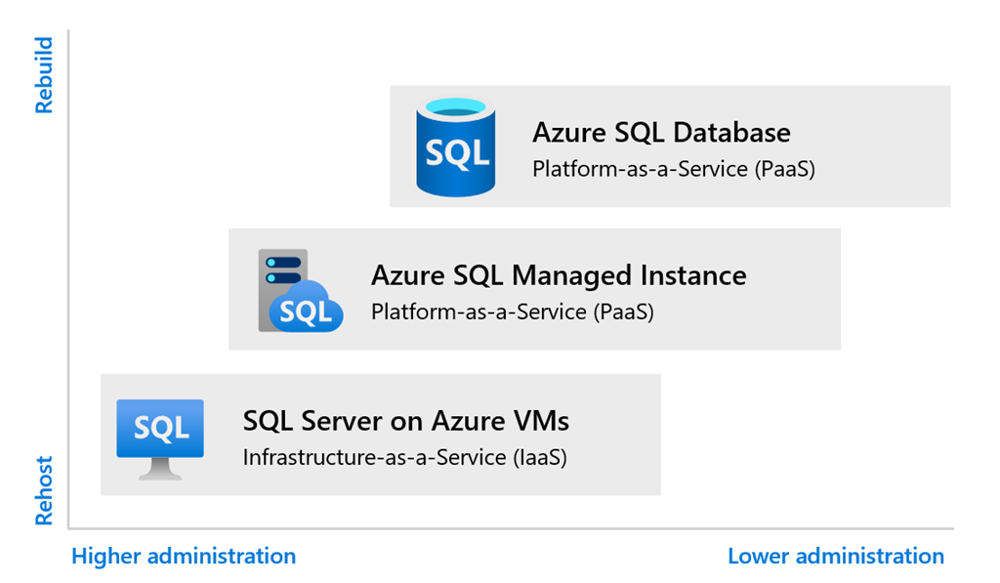
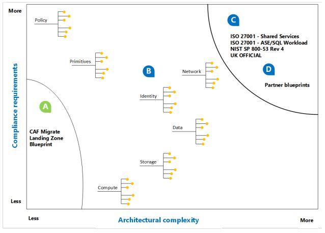
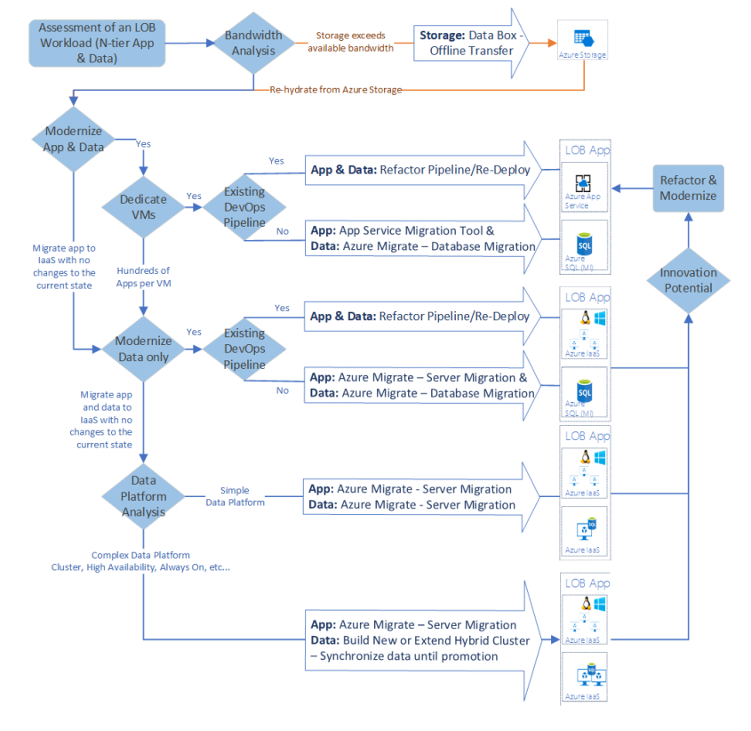

## Introduction

In [Part One](planning-a-cloud-migration-part1.md) of these articles, we covered each cloud model's characteristics. We discussed their advantages, areas of concern, and the most appropriate implementation situations for each. In this article, we are going to discuss the Azure Cloud Adoption Framework. More specifically, we are going to discuss the way it drives SQL Server migration to the cloud.

The idea behind using the Cloud Adoption Framework, is to build the right adoption strategy around the business, people, and technology. The Cloud Adoption Framework (CAF) can provide you a more comprehensive and holistic way to ensure that you take advantage of everything Azure can do to meet your migration goal. The CAF will assist in identifying how ready your application is for cloud adoption. As well as recognize what components need to be developed in order to ensure a successful migration to Azure.

Keep in mind that, for SQL Server, the process of following the CAF is what is happening all around your migration efforts. Much of what I am discussing in these first few paragraphs is being presented in order to assist you in gaining a general understanding of how the CAF works. Shortly, I will be discussing the SQL Server selection process, migration, and the use of Dojo [playbooks](https://github.optum.com/dojo360) more exclusively.

## How does it work?

First, let's get an overview of how the CAF is structured. The CAF has four main stages; Define Strategy, Plan, Ready, Adopt. Each iteration of the Plan, Ready, and Adopt stages are preceded by defining a strategy for that iteration and are encapsulated by an operations phase. Those will expand as you work through the CAF process. The following graphic may make that a bit clearer.

### Define Your Cloud Adoption Strategy (Strategy Phase)

In order to start using the CAF for your migration to SQL Server in the Azure cloud, a cloud adoption strategy must be developed. A cloud adoption strategy, typically, has 4 phases. These phases are designed to organize your process by mapping out the metrics and motivations of your cloud adoption strategy. The phases are as follows:

Phase 1 - Your Digital estate: Inventory and rationalize your digital estate based on assumptions that align with motivations and business outcomes.

Phase 2 - Initial organizational alignment: Establish a plan for initial organizational alignment to support the adoption plan.

Phase 3 - Skills readiness plan: Create a plan for addressing skills readiness gaps.

Phase 4 - Cloud adoption plan: Develop a cloud adoption plan to manage change across the digital estate, skills, and organization.

Microsoft has provided a template for that process here. Next, we will need to discuss the process of assessing the current and future state for all processes or workloads that are being considered for migration. This process will affect your SQL Server choices, as it will assist you in determining how you will be implementing SQL Server in Azure. The CAF refers to this process as Rationalization.

### Rationalize (Plan Phase)

It's important to note, immediately, that it is not necessary or recommended to rationalize all of your processes (workloads) prior to migrating them to the cloud. On the contrary, that could easily and significantly slow your migration down. The rationalization process requires extensive knowledge of each workload and the assets involved. Because of that, Microsoft recommends that you migrate an initial group of workloads that does not exceed 10 and is a mixture of complex and simple processes.

These do not need to be rationalized at the same time. As, each workload will have a separate set of assumptions (at the portfolio level). For example, when your portfolio is focused on using innovation to improve an app, it's safe to assume that it will be re-architected. When it's just a focus on migration, assume re-host. The goal in this process is to set a baseline of understanding regarding what you have (i.e. SQL Server Instances and configurations) and what cloud migration will look like for your "digital estate".

There are several different methodologies to rationalize your digital estate. The traditional method, the enterprise method, and the incremental method. As you will see, in the next session, Microsoft likes to do things incrementally.

#### The Traditional Method

In the traditional method of rationalizing your assets, Microsoft emphasizes "The Five R's" to help you make decisions regarding the future state of each workload. They are Re-host, Refactor, Re-architect, Rebuild, and Replace. Each workload will fall into one of these. The business (and you as the SQL Server person) will be able to determine which by analyzing common motivations, quantitative, and qualitative analysis of each workload. Here are some definitions for each.

- Re-host: This is commonly referred to as "Lift and Shift" (This is most often the IaaS model). The big question here is can the app be migrated to the cloud with little change in architecture?
Refactor: Refactor is most often used when adapting an application to use the PaaS cloud model or when code must be refactored for new business.
- Re-architect: Some applications will not be compatible with the cloud and will need to be rearchitected for migration, or, it may be that an application may be cloud compatible but there are opportunities to make it more efficient in both cost and operation. This, too, would typically fall into the PaaS cloud model.
- Re-build: In this situation, assessment has determined the cost of getting an application/workload ready for the cloud is just to big. Therefore, the decision to rebuild it as a cloud native app is made.
- Replace: This is the nuclear option for any application/workload that is intended for migration to Azure. Especially if the best technology and approach for that solution are available via a SaaS application. On the positive side, if that is the case, that portion of your migration can be delayed and not included in your current effort.

This method is terrific for small organizations. However, for organizations such as Optum, it is highly inefficient. As you can see, based on the process above, submitting each and every workload to that process would delay our move to the cloud significantly.

#### Enterprise Rationalization

This method is most often used (or should be) when a third party is hired in to evaluate the company's entire digital landscape.

#### Incremental Rationalization

Incremental rationalization is a process that relies on prioritizing the workloads that are to be migrated to the cloud. Thereby, staggering or delaying decisions on other workloads until a later date and preventing the risk of developing huge backlogs of workloads waiting for migration.

Rationalization is a huge part of getting to the nuts and bolts of migration. Once you understand what to do with the rationalization process, it can then be applied to your "Digital Estate". This simply means determine what assets you have, what processes you intend to migrate, what needs to be changed to migrate, and what you need to get rid of. Microsoft calls this "Digital Estate Planning".

### Digital Estate Planning (Plan Phase)

I want to go over (briefly) the different types of estate planning, as I think it will assist in understanding the process of rationalization and the identification of the appropriate processes for your initial migration.

Microsoft identifies three approaches to collecting the information you need to build a picture of your digital estate. They are the workload driven approach, the asset driven approach, and the incremental approach (their favorite).

The workload driven approach is a top down methodology that evaluates everything from security to operational requirements, to the financial benefits of an application, to business continuity and resiliency requirements for everything in your digital estate. Its very thorough and should be what everyone aspires to be able to do. However, depending on the size and time frame for your migration, this is typically a multiyear process.

The asset driven approach is based only on what assets support the application that is being migrated. This approach almost always indicates a lift and shift to the IaaS platform and relies heavily on statistical usage data. This approach is a bit faster than the others but can miss some of the dependencies that exist between assets and applications. This approach also requires that the migration process set aside a decent amount of time to validate those dependencies before the application is migrated and deployed.

Finally, the incremental approach. This is the approach that Microsoft recommends, as the entire process of migrating to the cloud has multiple phases, so should the way you collect information about your digital assets. The incremental approach has four parts:

- Initial Cost Analysis
  Get a cost calculation for all of your assets without This will provide you with a worst-case scenario for the cost of migrating to Azure
- Migration Planning
  Get your team together and build an initial workload driven backlog of what to migrate. A side benefit of this is that it fosters significant collaboration within your team and makes the workloads smaller and lighter.
- Release Planning
  Simply put, this is the process pruning and reprioritizing the backlog to better reflect the most relevant business impact.
- Execution Analysis
  Double check what you are about to release, make sure it is in keeping with the goals and strategy of your cloud migration.

The biggest benefit to the incremental approach is the ability to streamline planning activities and, thereby, accelerating results. Further, it allows for there to be time to evaluate decisions and create the appropriate documentation archive of application/migration details. Now that we know how to sort out what we have and what we want to do with it, we need to select a workload.

### Define Your First Workload\Landing Zone (Ready)

"*The term workload is typically defined as an arbitrary unit of functionality, such as an application or service. It helps to think about a workload in terms of the code artifacts that are deployed to a server, and also other services specific to an application.*"

In order to get a handle on what you want the first workload to be, remember to use the power of 10 (as I mentioned above) to prioritize what is going to go first. Once those have been prioritized, agreed upon, and everyone is in place, you can define the first landing zone.

"*A landing zone is the basic building block of any cloud adoption environment. The term landing zone refers to an environment that's been provisioned and prepared to host workloads in a cloud environment like Azure. A fully functioning landing zone is the final deliverable of any iteration of the Cloud Adoption Framework's Ready methodology.*"

The graphic above depicts multiple landing zone options. Notice, however, that they are displayed in a continuum of requirements and complexity that goes from least to most in a diagonal from lower left to upper right. Further, it is separated into zones A-D and represent a type of landing zone.

1. A landing zone in the A section of the diagram needs to be consistent and repeatable, possibly from a template or provided [Terraform code](https://github.optum.com/dojo360). This would be considered a very general type of landing zone, not for sensitive data or mission critical workloads
1. Zone B provides the opportunity to expand on the code mentioned in zone A, as your landing zone will be more complex.
1. Zone C would indicate a complex landing zone that has requirements that require external compliance standards to be met.
1. Zone D is a partner provided landing zone

When discussing the deployment of your landing zone, you have to consider different networking options, load balancing, gateways, security, anything that has to do with what your infrastructure would need for your workload to function in the cloud. For the purposes of this article, I am going to point you in the direction of the DoJo. There, you will find the Playbooks needed to create and deploy your first landing zone and create the initial assets for your first workload migration. With that said, it is important to talk about Migration tools and what they do.

### Migration Tools

The strategy and tools you use to migrate an application to Azure will depend on the way you rationalized your digital estate, the timelines given to you by the business, and your understanding of the workloads and assets being migrated will help you decide what you need. The graphic below represents a very high-level process for selecting the best migration tools. Consider this decision tree to be a starting point. The choice to migrate using platform as a service (PaaS) or infrastructure as a service (IaaS) technologies is driven by the balance between cost, time, existing technical debt, and long-term returns. IaaS is often the fastest path to the cloud with the least amount of required change to the workload. PaaS could require modifications to data structures or source code but produces substantial long-term returns in the form of reduced operating costs and greater technical flexibility. In the following diagram, the term modernize is used to reflect a decision to modernize an asset during migration and migrate the modernized asset to a PaaS platform.

The following is a list and brief description of some of the migration tool options that are available.

1. Azure Migrate is the "On Stop Shop" for migration. It provides you the ability to assess your on prem assets, migrate them (using your choice of available tools) and track your progress from start to finish. [Here](https://docs.microsoft.com/azure/migrate/tutorial-migrate-physical-virtual-machines) is a link to a tutorial for Azure Migrate.
1. Azure Site Recovery provides users the ability both migrate on prem resources to Azure and create DR for on prem assets with Azure VMs. the link to that tutorial is [here](https://docs.microsoft.com/azure/site-recovery/migrate-tutorial-on-premises-azure).
1. Azure Database Migration Service (DMS) is a fully managed service. Meaning, you create an instance of Azure Database Migration Service, point it at the target subscription as the destination, select a source and hit go. It does all the required steps to move the targeted asset to Azure. Its not quite that simple, but that is the essence of the process. These are links to a few more resources regarding an overview of the [Azure Database Migration Service](https://docs.microsoft.com/azure/dms/dms-overview), [how to create an instance of DMS](https://docs.microsoft.com/azure/dms/quickstart-create-data-migration-service-portal), [Azure Migrate in the Azure portal](https://portal.azure.com/#blade/Microsoft_Azure_ManagementGroups/HierarchyBlade), and [how to create a migration project in the Azure portal](https://portal.azure.com/#create/Microsoft.AzureMigrate).
1. The Database Migration Assistant (DMA) is a utility that aids in the detection of compatibility issues between you on prem SQL Server DB, a newer version of SQL Server, or Azure SQL Database. It can also recommend improvements for implementation on the target db. However, and most importantly, it can move your data, schema, and uncontained object from your source to your target. You can download it [here](https://www.microsoft.com/download/details.aspx?id=53595), and [here](https://docs.microsoft.com/sql/dma/dma-overview) is an overview of how it works.
1. The SQL Server Migration Assistant (SSMA) is designed to aid in the migration of data from multiple platforms to SQL Server. Sources include Access, MySQL, Oracle, and SAP ASE. Instructions on how to use this tool for each of those sources can be found [here](https://docs.microsoft.com/sql/ssma/sql-server-migration-assistant).
1. The Database Experimentation Assistant is designed to assess SQL Server workloads that are going to be upgraded to a newer version. This tool captures traces on the production server (source) and replays them over and over on the target server. It then generates reporting and analysis regarding how the upgrade will impact the performance of the workload. An overview of this tool can be found [here](https://docs.microsoft.com/sql/dea/database-experimentation-assistant-overview).
1. The Azure Cosmos DB Migration Tool will pull data into Azure Cosmos DB collections and tables from JSON files, CSV files, SQL, MongoDB, Azure Table storage, Amazon Dynamo DB, and Azure Cosmos DB SQL API collections. The documentation for this tool is available [here](https://docs.microsoft.com/azure/cosmos-db/import-data).

To this point, we have developed a cloud adoption strategy, done an assessment of our digital estate, rationalized the assets in our digital estate, identified which workloads we are going to migrate, identified most of the components of our first landing zone, and investigated different migration tool options. We have not, however, defined which type of SQL Server we are going to implement in Azure. In Azure, you can have your workloads running in IaaS-based SQL Server (Azure VM) or on Azure SQL Database (PaaS).

#### Choosing SQL Server in Azure

As we have said earlier, this boils itself down to a combination of what the migration tools suggest you use and whether you are interested in going the IaaS (you mange) or the PaaS (Azure manages) route. In some cases, compatibility issues will require the use of IaaS-hosted SQL Server. That is, unless you intend to make the changes needed to accommodate Azure.

For me, the penultimate questions are, how big are your databases and how many of them are there?

- If your instance is fairly small (5 TB or less) and supports very few or a single database, Azure SQL Database is the target for your workload.
- If your on prem SQL Server supports multiple databases and has a cumulative storage foot print of 5 TB or less, I would consider migrating to Azure SQL Managed Instance.
- If your current instance supports large databases (with a cumulative storage footprint of 8 TB or more) or your workload needs OS level access, migrate to SQL Server on an Azure VM

I like to keep it simple.

Now, we have developed a cloud adoption strategy, done an assessment of our digital estate, rationalized the assets in our digital estate, identified which workloads we are going to migrate, identified most of the components of our first landing zone, and investigated different migration tool options, and identified which type of SQL Server we want to migrate our work load to. Its time to Migrate.

### Migrating to Azure (Adopt Phase)

At Optum, we have adopted the "Everything as Code" method to repeatably create consistent Azure assets. Optum has had the presence of mind to provide many "template" resources for application teams to use to create needed assets in the cloud. They can be found out on the [Dojo](https://github.optum.com/dojo360). Once your landing zone is created, you have assessed your workload, made the changes required, or decided that your migration will be a lift and shift, it is time to migrate. I suggest using the Database Migration Assistant. [This article](https://docs.microsoft.com/en-us/sql/dma/dma-migrateonpremsqltosqldb?view=azuresqldb-mi-current) provides step-by-step instructions for migrating SQL Server on-premises to Azure SQL Database by using the Data Migration Assistant. It is a very straightforward process with the following basic steps:

- Select the source server and database.
  - This requires server name and authentication type
  - You must also select a SINGLE database source
    - You can select the Assess database check box. Doing this will point out recommended fixes
- Specify the target server and data base
  - This requires the name of the Azure SQL Database instance and authentication type
  - Select the target database
- Select the Schema objects
  - "Some of the objects that cannot be converted as-is are presented with automatic fix opportunities. Clicking these objects on the left pane displays the suggested fixes on the right pane. Review the fixes and choose to either apply or ignore all changes, object by object. Note that applying or ignoring all changes for one object does not affect changes to other database objects. Statements that cannot be converted or automatically fixed are reproduced to the target database and commented."
- Generate a SQL Script
- Deploy the schema
- Migrate the data

Obviously, the process of migrating to Azure is a complicated one. The point of these two articles has been to distill away as much of the process as I could as a way to get to the meat of the process. So, yes, I skipped a lot. And, yes, I was very general with some of what I discussed. However, I have also provided many links to resources that will provide a much more in-depth discussion of the process. So, I hope these two articles have been informative and have assisted you in getting a clearer picture of all the moving parts involved in understanding what it means to migrate a SQL Sever to Azure and the thought processes of getting to that point.