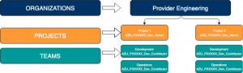

# What is Azure DevOps?

Azure DevOps is a cloud hosted service that helps developers bring any idea to a production usable solution by supporting any language and any platform. The service includes five components:

- Azure Boards - Plan Projects with Agile Tools
- Azure Repos - Version Code using Git
- Azure Pipelines - Deploy your code from a cross platform CI/CD system with full traceability and visibility
- Azure Test Plans - Manage your Test Plans from the Web
- Azure Artifacts - Package Management

Azure DevOps is setup by organizations to help connect groups of related projects. An organization for Provider Engineering is now setup to connect our portfolio of many projects and teams.

## Benefits of Azure DevOps

By using Azure DevOps for deploys of JPAC builds microservices and infrastructures automations work seamlessly in a (CD) continuous deployment pipeline. Jenkins deploys IAC code (terraforms, etc) and Azure DevOps deploys product packages.

**Artifact Storage -** Artifacts are versioned and can be tagged as being successfully deployed in each environment. Artifacts feeds reduce complexity of common code via exposed APIs.

**Workflow -** Pipeline executing can fork and merge allowing one to deploy to two or more environments at the same time or skip environments in the pipeline. For example, spinning down a performance environment for cost savings allows the pipeline to skip that environment. Another example is where QA reverts to a previous package which was deployed by mistake. Here we can keep the latest package in development and deploy straight to QA.

**Reusability -** YAML definitions can be reused at multiple levels: step, job, stage. By using one YAML file allows you to deploy every single package and re-use it in all releases. For example, deploy one package, several packages or all packages from three different pipelines using the same code.

**Scalability -** Jobs run on different agents, if jobs do not have dependencies on other jobs then they can run in parallel via hosted or self-hosted.

**Approvers System -** You can configure an approver setting for every environment by adding AD/DevOps groups as approvers for the environment. You have an option to require one member from all groups to approve the deployment, or just one of the groups is sufficient for the deployment to continue.

**API -** DevOps functionality is exposed via API to start a release, pass data to a release, get latest packages from Artifact feed, create Artifact feed and integrate Jenkins with DevOps.

**Ports -** Because Azure DevOps is outside of Optum network it can communicate on ports other than port 80 or 443. That is important because DevOps can connect to SQL server on port 1433.

**AKS Self-Hosted Agents** create synergies by using Self-hosted pipeline agents

- Build AKS Cluster using Terraform
- Agents run in Docker Containers
- Projects Share AKS Cluster hosting pipeline agents
- Maintain Cross Project Subscription and VNET FW Rules
- Maintain Docker Containers
- AKS Cluster added cost

**ACI Self-Hosted Agents** create ephemeral pipeline agents using ACI - Azure Container Instance

- Run basic Docker images ubuntu with deploy agent
- Creates a short-lived pipeline agent
- Reduces most maintenance cost
- NO FW VNET issues across projects
- Projects can use shared modules

## Management and Governance

- Hard security boundaries and isolation between organization using Secure Groups
- Separate Product Projects shifts administration and gives teams autonomy to manage
- Billing Alignment under Provider Hub umbrella captures all costs
- Analytic views via Power BI capture chargebacks along with future work items from boards
- Reduces complexity and provides team flexibility of artifact feed of common code
- Promotes same iteration schedule and improves communication once mature
- Cost savings and easy controls help promote synergies with common code and agent use
