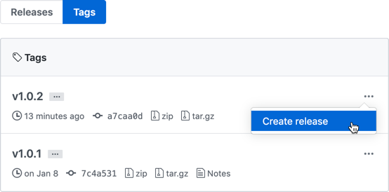

# Concept

Writing a Terraform module (or software in general) can be a complex task. Communicating to users when a new version has been released can be equally complex.

- Do I have to have to upgrade?
- What's new?
- What's been fixed?
- What's been deprecated?
- How much time do I have to allocate to complete the upgrade?

When done properly, you give users what they want: consistency and reliability. Here are some guidelines on how to version and subsequently communicate to users when that version has been released.

## Semantic Versioning

1. Create a tag using [semantic versioning](https://semver.org/). You're probably already doing this but may not know the formal name. In a nutshell (from [https://semver.org/](https://semver.org/)):

    > Given a version number MAJOR.MINOR.PATCH, increment the:
    >
    > - MAJOR version when you make incompatible changes,
    > - MINOR version when you add functionality in a backwards compatible manner, and
    > - PATCH version when you make backwards compatible bug fixes.
    >
    > Additional labels for pre-release and build metadata are available as extensions to the MAJOR.MINOR.PATCH format.

2. Create a release and document what’s included in the release.

    

    We recommend setting the *release title* to match the *tag name* and using the following markdown template for the description:

    ```markdown
    
    # <tag name> (<release date>)
    VERIFIED AGAINST
    - Terraform <version>
    - AzureRM <version>
    NOTES (if applicable)
    - Initial release version (will suffice for the first release)
    - Otherwise, provide a bulleted summary of each feature, breaking change, improvement, etc. that you plan on going into detail in one of the sections below.  Provide external links when appropriate.
    UPGRADE NOTES (if applicable)
    - Document upgrade notes and link to issue(s) if applicable
    - Next upgrade note
    BREAKING CHANGES (if applicable)
    - Document deprecated fields/blocks
    - Next breaking change
    FEATURES (if applicable)
    - Document new features and link to issue(s) if applicable
    - Next feature
    IMPROVEMENTS (if applicable)
    - Document dependency updates, such as referencing a new version of another module linking to that version’s release
    - Document new fields and/or support for behavior in referenced modules
    - Next improvement
    BUG FIXES (if applicable)
    - Document bug fixes and link to issue(s) if applicable
    - Next bug fix
    KNOWN ISSUES (if applicable)
    - Document unexpected/undesirable behavior and link to issue(s) if applicable.
    - Next known issue
    
    ```
  
    Remember that your intent is to provide valuable insight on what's changed since the last release and that links can be external, such as an issue in another repo or a provider.

3. Communicate the release via all the appropriate forums, such as Microsoft Teams Channels (hint, hint... *[Provider Engineering's All Things Cloud](https://teams.microsoft.com/l/channel/19%3a0b1ae6df378d4e868291b2bc6ba04e7c%40thread.tacv2/All%2520Things%2520Cloud?groupId=0c33f636-8b2b-4a45-92c0-a84df8a9a1af&amp;tenantId=db05faca-c82a-4b9d-b9c5-0f64b6755421)*).
4. Sit back, relax, and give yourself a pat on the back for a job well done.

Check out the releases for the [Azure App Services](https://github.optum.com/Dojo360/azure-app-service/releases), [Optum IPs](https://github.optum.com/Dojo360/optum-ips/releases), and [Optum Tags](https://github.optum.com/Dojo360/optum-tags/releases) Terraform modules for examples within Optum. If you're feeling ambitious, check out [Terraform Provider for Azure (Resource Manager)](https://github.com/terraform-providers/terraform-provider-azurerm/releases).
