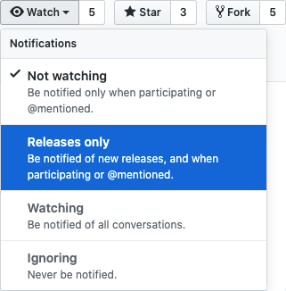

# Overview

The current iteration of the Dojo Azure profiles support Terraform 0.12 and are versioned v2.x. Because Terraform 0.14 does not support state files formatted prior to Terraform 0.13, a successful run of ```terraform plan``` with Terraform 0.13 is required.

In a nutshell, you must upgrade your current code written in Terraform 0.12 to Terraform 0.13 before you can upgrade to Terraform 0.14. Any attempt to upgrade directly from 0.12 to 0.14 will result in an error when ```terraform init``` is run.

> **Error:** Invalid legacy provider address
> This configuration or its associated state refers to the unqualified provider "azurerm".
> You must complete the Terraform 0.13 upgrade process before upgrading to later versions.

## Upgrading to Terraform 0.13

To facilitate your Terraform 0.13 upgrade, we’ve introduced Dojo **Azure** profiles versioned v3.x.  The sole purpose of v3.x is to upgrade your existing state file (currently in 0.12’s state format) to 0.13’s state format.  There are no significant code changes between v2 and v3 except for the resolution of warnings introduced in 0.13.  The change to your code should be as simple as updating the version referenced by your module.

### Pre-0.13 Upgrade

```terraform

module dojo_plans {
    source = "git::.../azure-app-service-plan//profiles/scale-out?ref=v2.1.17"
    resource_group_names = azurerm_resource_group.dojo_rgs.*.name
    locations = var.locations
}

```

### Post-0.13 Upgrade

```terraform

module "dojo_plans" {
    source = "git::.../azure-app-service-plan//profiles/scale-out?ref=v3.0.8"
    resource_group_names = azurerm_resource_group.dojo_rgs.*.name
    locations = var.locations
}

```

When ```terraform plan``` is run, the output would look similar to below.  Note that the only change reflected in the plan is a change to the DojoVersion tag’s value from v2.1.x to v3.0.1.

```terraform

# module.dojo_plans.module...appserviceplans[0] ** will be updated in-place
~ resource "azurerm_app_service_plan" "appserviceplans" {
    ~ tags = {
		    "ASKID"            = "&lt;ask id value&gt;"
		    "AssignmentGroup"  = "&lt;assignment group&gt;"
			...
			"DojoProfile"      = "App Service Plan :: Scale Out"
		  ~ "DojoVersion"      = "v2.1.x" -&gt; "v3.0.x"
			...
        }
}

```

*Once a successful run of ```terraform apply``` is completed, the Terraform 0.13 upgrade is complete, and you can proceed to the Terraform 0.14 upgrade.*

## Upgrading to Terraform 0.14

To facilitate your Terraform 0.14 upgrade, we’ve introduced Dojo *Azure* profiles versioned v4.x.  Unlike the minor code changes between v2 and v3, we’ve refactored a number of the profiles to take advantage of features available in 0.14.

- Individual arguments/attributes have been grouped where appropriate. An example would be the admin-related arguments for servers where individual ```admin_user``` and ```admin_password``` arguments have been grouped into one ```admin``` “object” argument:
- The ```sensitive = true``` flag has been set for variables and output that contain sensitive or secret information such as usernames, passwords, and API tokens to prevent exposure in the CLI output.
- The likelihood of a destroy-and-recreate occurring has been reduced by replacing uses of ```count``` with ```for_each``` whenever possible.

Note: The use ```for_each``` in place of ```count``` results in a change to the resource address that causes an *existing* resource to be destroyed and recreated.  To prevent this from occurring, you will need to run the ```terraform state mv``` command prior to running ```terraform plan```.

Continuing with the snippet from the Terraform 0.13 upgrade, note that the ```resource_group_names``` and ```locations``` arguments in v3 have been consolidated into ```resource_groups``` in v4.

### Post-0.13 Upgrade / Pre-0.14 Upgrade

```terraform

module "dojo_plans" {
    source                = "git::.../azure-app-service-plan//profiles/scale-out?ref=v3.0.8"
    resource_group_names = azurerm_resource_group.dojo_rgs.*.name
    locations            = var.locations
}

```

### Post-0.14 Upgrade

```terraform

module "dojo_plans" {
    source          = "git::.../azure-app-service-plan//profiles/scale-out?ref=v4.0.7"
    resource_groups = azurerm_resource_group.dojo_rgs
}

```

If you run ```terraform plan``` without running any ```terraform state mv``` commands, the output would look similar to below.

```terraform 

# module.dojo_plans.module.appserviceplans...appserviceplans[0] will be destroyed
- resource "azurerm_app_service_plan" "appserviceplans" {
    ...
}

# module.dojo_plans.module.appserviceplans["eastus"]...plan will be created
+ resource "azurerm_app_service_plan" "appserviceplan" {
    ...
}

```

If there was an App Service or Function App associated with the App Service Plan, running ```terraform apply``` would fail.

>Error: Error deleting App Service Plan "..." (Resource Group "..."): web.AppServicePlansClient#Delete: Failure sending request: >StatusCode=409 -- Original Error: autorest/azure: Service returned an error. Status=&lt;nil&gt; &lt;nil&gt;


The ```terraform state mv``` command for the snippet would be

```terraform

terraform state mv 'module.dojo_plans.module.appserviceplans...appserviceplans[0]' 'module.dojo_plans.module.appserviceplans["eastus"]...plan'

```

*Note the single quotes that wrap both resource addresses.*

If you run ```terraform plan``` *after* running the ```terraform state mv``` command, the output would look similar to below.

```terraform

# module.dojo_plans.module.appserviceplans["..."]...plan will be updated in-place
~ resource "azurerm_app_service_plan" "appserviceplan" {
    ~ tags                         = {
        ~ "DojoVersion"      = "v3.0.x" -&gt; "v4.0.x"
        # (10 unchanged elements hidden)
    }
    # (8 unchanged attributes hidden)
    # (1 unchanged block hidden)
}

```

Additional information about the ```terraform state mv``` command can be on [HashiCorp's site](https://www.terraform.io/docs/cli/commands/state/mv.html).

*Once a successful run of ```terraform apply``` is completed, the Terraform 0.14 upgrade is complete.*

## Sample Project

The snippets above can be found in a [Terraform upgrade demo](https://github.optum.com/Dojo360/dojo-demo-terraform-upgrade) repository in the GitHub [Dojo360](https://github.optum.com/Dojo360) organization. Within this repository, you can view the original Dojo reference in the v2.0.10](https://github.optum.com/Dojo360/dojo-demo-terraform-upgrade/blob/v2.0.10/main.tf#L21-L28), [v3.0.9](https://github.optum.com/Dojo360/dojo-demo-terraform-upgrade/blob/v3.0.9/main.tf#L21-L28), and [v4.0.18](https://github.optum.com/Dojo360/dojo-demo-terraform-upgrade/blob/v4.0.18/main.tf#L21-L27) releases. Also, note that the [v4.0.18](https://github.optum.com/Dojo360/dojo-demo-terraform-upgrade/blob/v4.0.18/main.tf) release includes an update to the resource blocks where ```count``` has been replaced with ```for_each```.

The ```terraform state mv``` commands that prevent the existing resources from being destroyed and recreated can be found in the [Jenkinsfile](https://github.optum.com/Dojo360/dojo-demo-terraform-upgrade/blob/v4.0.18/jenkinsfiles/deploy/dev/jenkinsfile#L139-L149).

## Suggested Path to Upgrade from Terraform 0.12 to 0.14

- Identify all of the Dojo *Azure* profiles that your code is referencing.
- Verify that these profiles are still available in v4.  Below is a list of profiles that have been deprecated in v4.

| Repository | Deprecated | Replacement |
| ---------- | ---------- | ----------- |
| [Cosmos DB](https://github.optum.com/Dojo360/azure-cosmosdb-account) | No Failover | [Single Failover](https://github.optum.com/Dojo360/azure-cosmosdb-account/tree/main/profiles/single-failover) |
| Ingress | Front Door | Front Door v2 |
| [Networking](https://github.optum.com/Dojo360/azure-networking) | Large Virtual Network <br /> Medium Virtual Network <br /> Small Virtual Network <br /> Subnet | [Virtual Network](https://github.optum.com/Dojo360/azure-networking/tree/main/profiles/virtual-network) <br /> [Subnet](https://github.optum.com/Dojo360/azure-networking/tree/main/profiles/subnet) |
| PostgreSQL Services | PostgreSQL Server (No Failover) | PostgreSQL Server (Replica) |
| SQL Services | Single Database (Failover) <br /> Single Database (No Failover) <br /> Single Database with Private Endpoint (No Failover) | Single Database with Private Endpoint (Failover) <br /> Single Database with Private Endpoint (Failover) <br /> Single Database with Private Endpoint (Failover) |

- Before commencing with the 0.13 upgrade, it is strongly recommended that you:
  - Migrate to the “replacement” profile if your code is referencing one of the deprecated profiles listed above.
  - Upgrade to the latest minor version of v2.x to address any breaking changes that were introduced.
- *Create a backup of your Terraform 0.12 state files.*
- Upgrade your v2.x references to v3.x.
- Run ```terraform apply```. Do *not* proceed to the next step until a successful run of ```terraform apply``` has completed.
- *Create a backup of your Terraform 0.13 state files.*
- Upgrade your v3.x references to v4.x.

## Tips

- *Back up your state files. You’ll need this in the event that you need to roll back to a previous Terraform version.*
- Focus on the Terraform upgrade.  Avoid modifying any settings for existing resources and/or adding new resources.
- Once you’ve identified all of the Dojo *Azure* profiles that your code is referencing, sign up to receive notifications when new versions of the profiles are published.

