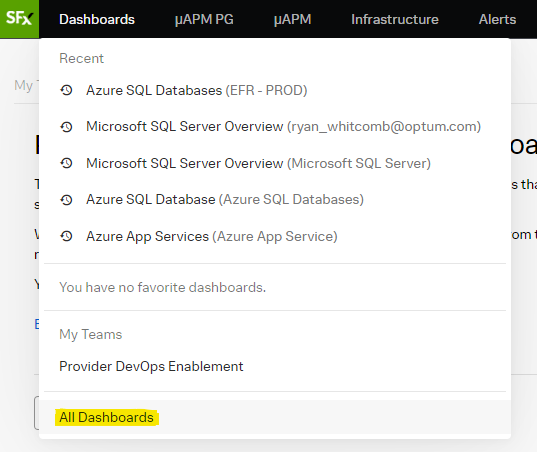
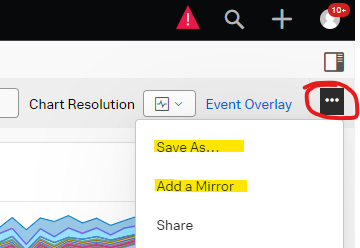

# Overview

Built-In dashboards are a good default starting point for visualization of data from many sources.  These dashboards cannot be modified by users and are set by SignalFX.  Generally, these dashboards will show data from all sources matching the integration type of the chosen dashboard.  From there, it's possible to filter down to the desired data set.  While these cannot be modified, it is possible to mirror them to your personal or group dashboard along with custom filters.  They can also be saved into a new dashboard, which users may then modify and save as-needed.  The purpose of this how-to is to illustrate the differences between mirroring and copying a dashboard, as well as how to create a copy or mirror.

Built-In dashboards can be reached from the main SignalFX menu in the top-left corner of the screen.  From there, hover over "Dashboards" and scroll down to/select "All Dashboards".

## Copying vs. Mirroring Dashboards

### Mirroring

When mirroring a dashboard in SignalFX, the information, metrics, graphs, etc. tracked within the mirrored dashboard will always look like the original.  This option is best used when it is desireable for new mirrors of the dashboard to match the look of the original.  For example, if SignalFX adds a new graph to its "Azure App Services" Built-In dashboard, then all existing AND future mirrors of that dashboard will be updated to look the same - with the exception of any filter overrides added to view specific data sets, time ranges, or chart resolutions.

### Copying

When copying a dashboard, you will use the "Save As…" dialogue in order to make a new copy of an existing dashboard.  When using "Save As…" to copy an existing Built-In, Group, or User dashboard, and modifications made to the original dashboard will not extend to the newly saved dashboards.  This is the key difference between a copied dashboard and a mirrored one.  Copying is more desireable for short-term use dashboards, or when it is not necessary to retain the look and feel of the original.

## How to Copy or Mirror a Dashboard

In order to copy or mirror a dashboard in Observability, just open any Dashboard, and look for the "…" menu icon on the top, right-hand portion of the screen.  It's circled in red above.  From there, choose "Save As…" or "Add a Mirror" and follow the prompts.

For more information on this subject from the Observability documentation page see the following links:

- [Creating, Sharing, and Protecting Dashboards](https://docs.signalfx.com/en/latest/dashboards/dashboard-create-share.html)
- [Mirroring Dashboards in Observability](https://docs.signalfx.com/en/latest/dashboards/dashboard-mirrors.html)