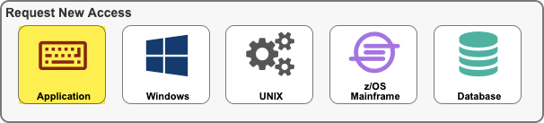
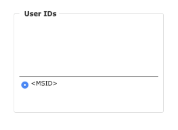
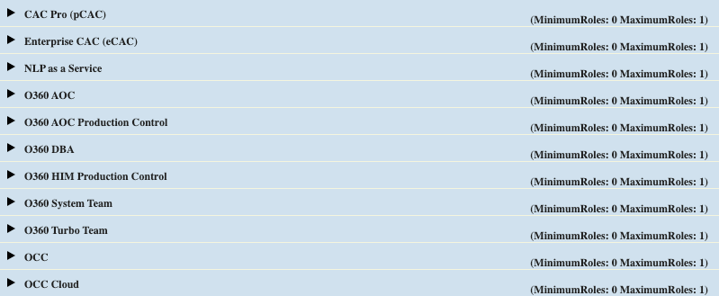
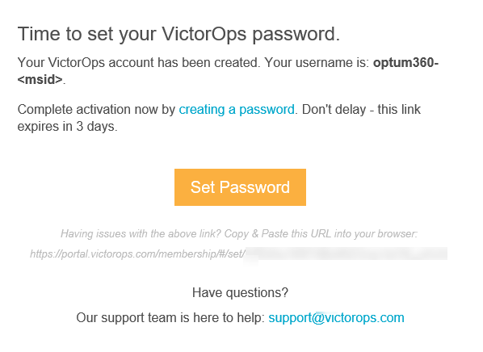
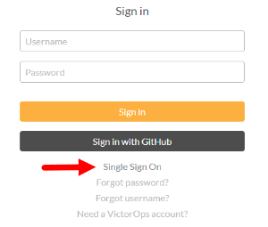
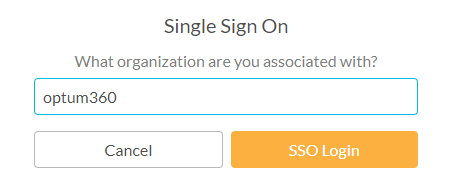
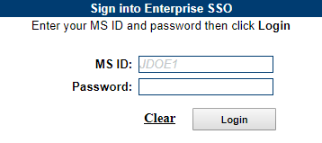

# Overview

Provider uses Splunk On-Call to provide incident management and on-call paging policies.

## Steps

1. Log into [Secure](https://secure.uhc.com)
1. Click Application

  

2. On the next screen select the following:

  - Application: **Provider VictorOps**
  - Environment: **Prod**

3. For User ID, click Create New User ID.  Your MSID should be automatically displayed. Note: If you have multiple MSIDs, select the appropriate one (i.e. the one that you used to log onto Secure).

  

4. For Categories
  
- Expand the "All Users" section and check **General Users**.
    
- Expand the product and/or support team(s) to which you want to be added and select the desired role (i.e. admin or user).
    

5. On the subsequent screen, provide the required justification and click the "Submit" button.

## After Submission

When your Secure request has been approved and your VictorOps account has been provisioned, an auto-generated message from VictorOps (noreply@victorops.net) will be sent to your Optum email address.  The message will contain your VictorOps username and a unique  "set password" link. To complete the account activation process, click on the link and set the password for your VictorOps account.

The "creating a password" link is valid for 72 hours. If you fail to complete the account activation process within this time, you will need to contact Provider DevOps System Operations at [provider_de_systemoperations@ds.uhc.com](mailto: provider_de_systemoperations@ds.uhc.com). Another message will be sent to your Optum email address having a new unique "creating a password" link. This new link is valid for 24 hours. After this second invitation link becomes expired, engage the Provider DevOps System Operations team by following the instructions here: [FICS-DEVOPS Confluence](https://confluence.optum.com/display/FICSDO/Service+Now+Engagement).

Once you've successfully set your password, you'll be redirected to the Optum360 VictorOps landing page: [https://portal.victorops.com/client/optum360](https://portal.victorops.com/client/optum360).  This completes the account activation process. Subsequent logins will require you to use UHG SSO.  Proceed to the section below to link your VictorOps account to UHG SSO.

## Login using UHG SSO

1. Go to On-Call's [portal](https://portal.victorops.com)
1. Click the "Single Sign On" link

  

3. Enter **optum360** in the "Organization Slug" textbox and click the "SSO Login" button.  Note that the organization slug is case sensitive and is in all lowercase letters.

  

4. If you're already logged in via UHG SSO, skip to Step 5.  Otherwise, you will be redirected to the UHG SSO page.  Log on using your MS credentials.

  

5. Once you've successfully logged in, you'll be redirected back to the Optum360 VictorOps landing page.

## Request a new Splunk On-Call Team

Contact Provider DevOps System Operations at [provider_de_systemoperations@ds.uhc.com](mailto: provider_de_systemoperations@ds.uhc.com).  Provide the following information:

- The team name as it will be displayed in VictorOps
- The MSID and full name (as it appears in the employee directory) of the manager(s) who will be responsible for approving subsequent Secure requests from users who want to be added to the team.
