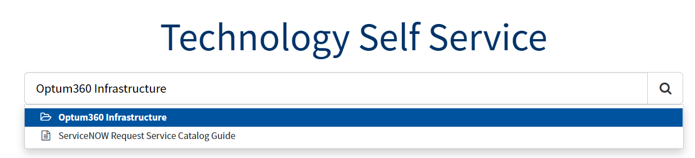
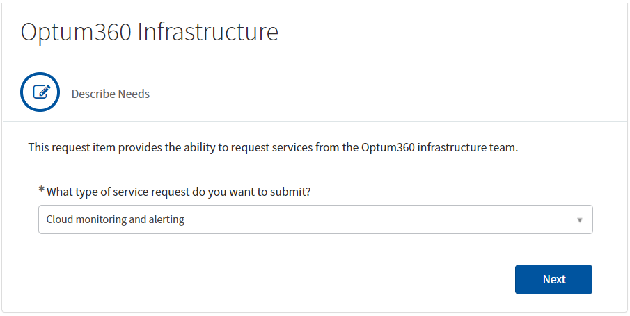
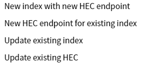

# Overview

Optum360 supports our own instance of Splunk. The instance is currently hosted in Azure and available to all clouds and data centers. The content available here provides guidance with regard to requesting SPLUNK indexes.

In a clustered Splunk instance, indexes and HEC Tokens are stored in a special directory on the cluster master and pushed out to the indexing peers and Heavy Forwarders respectively. Indexes and HEC Tokens in Azure must be added through source control.

> **Note:** Indexes or HEC Tokens added through the WEB UI or through the CLI will not be replicated to the indexer peers and have the potential to be destroyed if a peer or the cluster master is destroyed and replaced, as they will not be located in the designated directory

## Steps

1. Navigate to the [ServiceNow IT Self Service Portal](https://optum.service-now.com/itss2)
1. In the Search bar begin typing "Optum360 Infrastructure"
1. Use the predictive text to highlight the appropriate choice and click, or press enter on "Optum360 Infrastructure"
  
1. On the next screen from the drop down below the question * What type of service request do you want to submit? select the choice "Cloud monitoring and alerting"
  
1. Click the Next button
1. This is the main form, from here you will select one of the options listed below and then fill out the form as necessary including values for all required fields.
  
  
