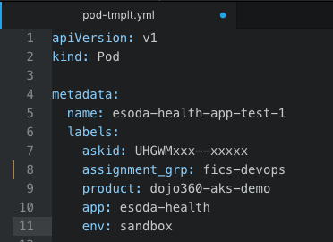

# Concept

Using Kubernetes labels within templates to ensure we include pertinent downstream information for assignment of incidents should be a priority.

Example of how this could be applied within a yaml template file:

Reference:
[9 Best Practices and Examples for Working with Kubernetes](https://www.replex.io/blog/9-best-practices-and-examples-for-working-with-kubernetes-labels)