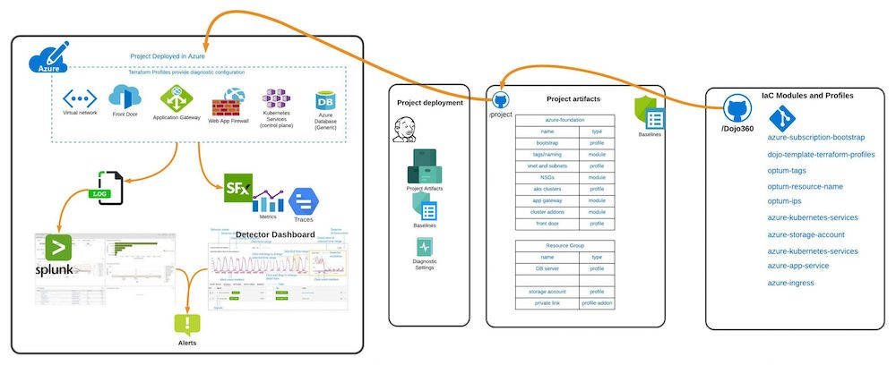

# Concept

*Note: this article is primarily discussing application logging. Infrastructure logging is mined by Splunk Observability directly using the Cloud Provider's own APIs.*

The Dojo infrastructure as code modules treat application observability as a first-class citizen during design. A layered approach can be observed whereby a standard methodology for identifying resources and auto-generating incidents can be constructed. Product engineers are guided towards a proper implementation through a series of standard profiles and required arguments.

## Application Observability

The first step in creating the observability application flows is to enable a series of event hubs for applications to log too. This is accomplished in the [Dojo Azure Bootstrap](https://github.optum.com/Dojo360/azure-subscription-bootstrap) module when setting up the baseline infrastructure on the subscription. The bootstrap module enables a team to set up a bare Azure subscription so that Terraform modules can use the subscription to deploy Azure artifacts. Applications can send events to these event hubs using any standard framework (e.g. Log4j / Log4Net).

Some artifacts defined in the Bootstrap modules are:

- A **Container Registry** to store images
- An **Event Hubs Namespace** for the specified regions (defaults to eastus, eastus2, westus, and centralus)
- **Event Hubs** within each Event Hubs Namespace with the following names: application, database, iam, infrastructure, ness, and network
- **Key-Vault** to store keys, secrets, and certificates
- An "artifacts" **Storage Account** to store deployment artifacts
- A "sysbackups" **Storage account** to store system backups (eg. SQL)

## Infrastructure Observability

As previously mentioned, the applications are responsible for sending their own logs to the event hubs but infrastructure logging is mined automatically by Splunk Observability. In order to support routing the infrastructure streams to appropriate dashboards and incident response teams a standard set of [tags](https://github.optum.com/dojo360/optum-tags) has been defined. All Dojo modules implement and require these tags on resources thereby ensuring proper routing of events and metrics.
