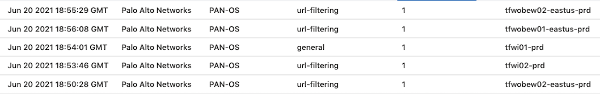

# Overview

The Transit Hub utilizes Palo Alto VM Series in a highly available Transit Hub configuration. This pattern separates traffic into inbound and outbound-backhaul-east-west (OBEW) clusters. This allows for independent horizontal scaling within the platform. As evidenced in *Figures 1*, all traffic within the transit hub is routed through one of these firewalls (most commonly the OBEW firewalls) before carrying on to its final destination. This ensures that inspection occurs at layers 3, 4, and 7 (Reference: [OSI Model](https://en.wikipedia.org/wiki/OSI_model)). The VPN appliances in *Figure 1* are provided for traffic routing reference only and do not impact the filtering of the firewalls.

*Figure 1: Transit Hub detailed traffic flow through the Firewalls*

## Traffic Routing

Azure networking supports Hub and Spoke routing via Network Virtual Appliances (NVA). The NVAs in the Transit Hub use case are the Palo Altos. In order to achieve proper routing of TCP/IP packets, incoming traffic is routed to an internal load balancer, which then forwards the traffic to the inside NIC of one of the firewalls. *All* OBEW traffic flows to the load balancer without exception. The Palo Alto then applies policy and routing rules to the incoming traffic to determine whether to accept or reject the traffic. Assuming the traffic is acceptable it will then route to the Virtual Network Gateway on the inside subnet where Azure's on internal routing will take over.

## Data Loss Protection Policy

The Palo Altos apply several layers of policy to incoming packets including security zone, source, destination, port, and finally [application type](https://applipedia.paloaltonetworks.com/). All traffic is denied by default including within the same security zones. The following sections outline the specifics of the Provider implementation of these policies.

> **Troubleshooting Note:**
>
> Even though traffic may be allowed at the Transit Hub Firewall it may be denied in the network security groups of the peered subnets. Be sure to validate that the traffic is allowed there before submitting firewall change requests.

### TCP/IP Filtering (Layers 4/3)

The Palo Altos filter Layer 3 (IP) and Layer 4 (TCP) traffic in the traditional sense. For each use case, users of the Transit Hub will need to submit [Firewall Policy Change Requests](how-to-change-firewall-policy.md) requesting the source, destination, and port they wish to allow.

> **Implementation Note:**
>
> Typically, the source port will always be set to *Any*. This allows port address translation to occur within the cloud provider. The destination port **must** always be set to the correct port for the given protocol.

### Layer 7 Filtering

In addition to layer 3 and 4 inspection, Palo Alto devices inspect traffic at layer 7. This means they open the packets flowing through the firewall and make sure they match the expected traffic. This prevents a malicious user from exfiltrating a spreadsheet full of PHI out the DNS port (TCP or UDP 53). It also ensures that HTTPS traffic is, in fact, encrypted. The same is true for MS SQL connections. Layer 7 inspection is a critical tool in the DLP stack of all next-generation firewalls.

When requesting firewall policy changes, users must include which application protocol they are expecting to see on the given port. These can be found on Palo Altos aforementioned [Applipedia](https://applipedia.paloaltonetworks.com/). Any traffic that is not supported on the applipedia may require a PEX to move forward with.

### Outbound HTTP Inspection

Outbound HTTP inspection is a special case in any enterprise and centers around preventing users from visiting malicious web sites and malicious actors from performing tasks like uploading spreadsheets of social security numbers to DropBox. Outbound HTTP inspection is required for any virtual machine where an individual can log into said virtual machine.

Here again the Transit Hubs utilize Palo Alto's HTTP inspection service to inspect outbound traffic. By default, all traffic is denied however the Transit Hub team maintains a whitelist of commonly used sites (NPM, GitHub, SalesForce, etc.). If a product team would like to add to this whitelist they should submit the appropriate URL via a [Firewall Policy Change Requests](how-to-change-firewall-policy.md).

### Azure Sentinel (SIEM)

The Transit Hub leverages the SIEM functionality of Azure Sentinel to catalog and perform analysis upon the various feeds coming from the Palo Alto devices. This includes everything from configuration changes to malicious activity on the network.

*Figure 2: An example log output from Azure Sentinel*

## Transit Hub Observability

All devices and connections within the Transit Hub are monitored utilizing Provider's [Observability Suite](../../observability/index.yml).

## References

- [Palo Alto Infrastructure as Code](https://github.optum.com/Dojo360/azure-transit-hub)
- [Palo Alto Transit VNet Whitepaper](media/azure-transit-vnet-deployment-guide.pdf)
- [Hub-spoke network topology in Azure](https://docs.microsoft.com/en-us/azure/architecture/reference-architectures/hybrid-networking/hub-spoke?tabs=cli)
