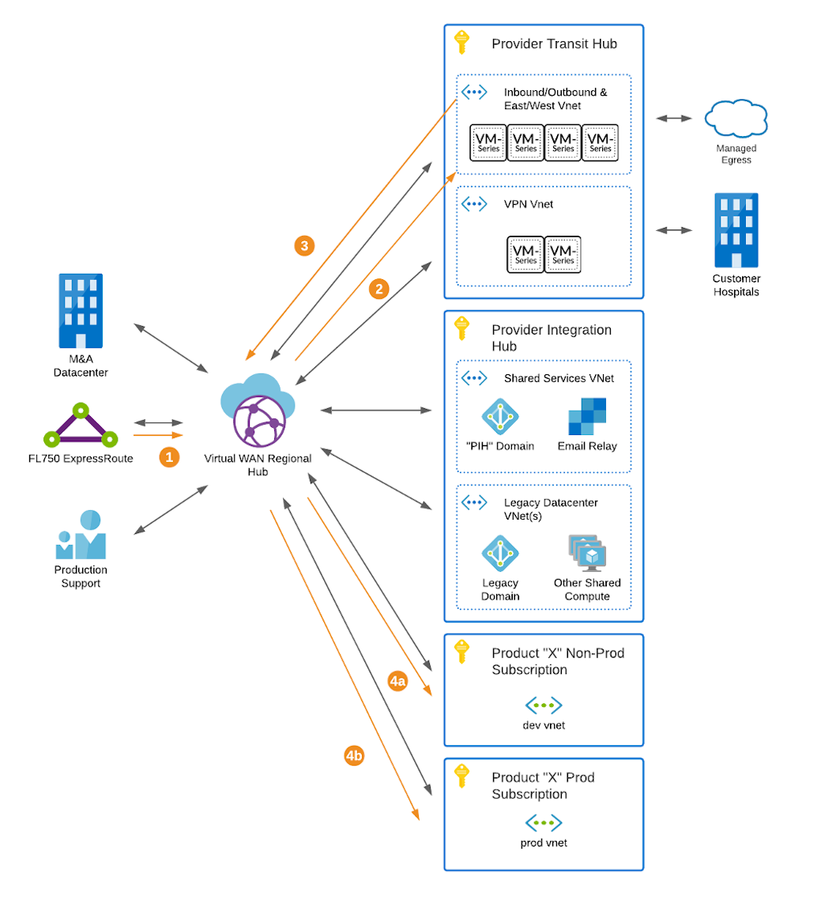

# Transit Hub Overview

- **ASK ID:** UHGWM110-026739
- [Original Transit Hub Intake Whitepaper](media/ProviderTransitHub.docx)

> **Note on Intent:**
>
> The Transit Hub is a business need for two reasons: 1) during cloud migrations the size of data that needs to be hoisted to the cloud forces the use of larger connections and 2) with brownfield applications we need to support some skeletons in the closet including HL7v2 connections, vendor apps running on virtual machines, etc. Long term the goal is to phase out these 'skeletons' and hopefully eliminate the need for the Transit Hub. This process will likely take years though.

The Transit Hub is an Azure Virtual WAN implementation that provides connectivity services between clouds, datacenters, and customers. Networks are isolated using Palo Alto firewalls in [Transit Hub configuration](media/azure-transit-vnet-deployment-guide.pdf) with data loss protection (DLP) at [Layers 3, 4, and 7](https://docs.paloaltonetworks.com/pan-os/7-1/pan-os-admin/threat-prevention/best-practices-for-securing-your-network-from-layer-4-and-layer-7-evasions). The Transit Hub leverages Azure's Sentinel service for Security Information and Event Management (SIEM) duties. The Transit Hub is designed to carry Provider connectivity through the next generation of Provider's platform services while supporting Provider's cloud migration program from legacy datacenters. As evidenced in *Figure 1* all traffic flows through a Palo Alto before carrying on to its destination.

*Figure 1: Transit Hub traffic routing*

Transit Hubs are currently established in Azure EastUS and CentralUS regions with plans to expand to WestUS and EastUS2 regions should the need arise.

> **Recommendation:**
>
> Prior to building out any cloud-based product, it is **strongly** advised to request [IP space](how-to-request-ip-space.md), for your product, from the Transit Hub regardless of whether or not you think you will need connectivity from the Transit Hub. It costs almost nothing up front but re-IP'ing at a later date can create significant downtime for your product.

Connectivity options vary depending on each situation. The sections below provide high-level examples of each option however it is advised to engage the DevOps team as early as possible during design to ensure that the particulars of any use case are accounted for. You can start an engagement by submitting a [Service Now ticket](../../itsm/service-now-engagement.md).

## Azure Use Cases

In addition to the use cases below, the Transit Hub provides a number of additional services to products residing in Azure:

- Peering between product Virtual Networks
- Egress inspection for Virtual Machines (required by EIS)
- Ingress inspection when not covered by Azure's own services (for instance AMQP)
- Connectivity to the [Integration Hub](../integration-hub/overview.md)

## AWS Use Cases

For a product, residing in AWS, the typical use case is to connect to the Transit Hub to provide access to the [Integration Hub's](../integration-hub/overview.md) services or the customer VPN connectivity located in the Transit Hub. This is accomplished by establishing a site-to-site VPN connection between the AWS VPC and the EastUS Transit Hub.

## Chaska and Elk River Use Cases

Any network, which is connected to the Transit Hub, can connect to Chaska and/or Elk River. This connectivity occurs via ExpressRoute in the Azure EastUS region. The EastUS region connects to the GA777 regional hub and from there to the broader Optum MPLS network. While the ExpressRoute is a dedicated connection at 10Gbps, the connectivity to Chaska and Elk River is a *shared* connection at 1Gbps. All connections are dual-homed for resiliency.

Upon completion of the majority of cloud migration work and subsequent closure of FL750 (and other datacenters) Provider will likely transition Optum core connectivity from the ExpressRoute over to a Site-to-Site VPN.

## M&A Datacenters Use Cases

Connectivity to and from merger and acquisition (M&A) datacenters is *typically* accomplished through one of two methods:

1. A Site-to-Site VPN between the datacenter and the Transit Hub, or,
1. If the datacenter is connected to Optum's MPLS network, via routing to GA777 and up the ExpressRoute.

In the case of larger transit need (above 2Gbps) dedicated lines can be connected via ExpressRoute to the Transit Hub.

## Customer Use Cases

Connectivity to and from customers (for instance Hospital HL7v2 feeds) is typically accomplished through Site-to-Site VPN services within the Transit Hub. All typical use cases are supported including, in the case of overlapping address space, source and destination network address translation (NAT).

## The Transit Hub is NOT…

To clarify before going to much farther, the Virtual WAN and Transit Hub is not a replacement for ingress and egress to Azure managed services. It is not replacing Azure Front Door, Application Gateway, nor is it facilitating ingress/egress for Azure Kubernetes Service. In point of fact, all resources using the Transit Hub for ingress/egress should have a plan to migrate to more native solutions as quickly as possible. This solution is meant to facilitate migration when there are other business factors driving a shift to the cloud which may not allow for adoption of more native technologies.

## Limitations

The Transit Hub imposes the following limitations:

1. Connected Azure Virtual Networks must utilize the IP ranges provided by the Transit Hub or utilize a connection where NAT is possible (i.e. Site-to-Site VPN).
1. In Azure, when connected to the Transit Hub use of the Virtual Network service tag is disallowed. This is because the Virtual Network service tag provides access to the current virtual network *and all connected networks*. Reference: [Service Tag Overview](https://docs.microsoft.com/en-us/azure/virtual-network/service-tags-overview).

## Chargebacks

There is, currently, no cost for utilizing Transit Hub services. This is subject to change depending on leadership guidance.