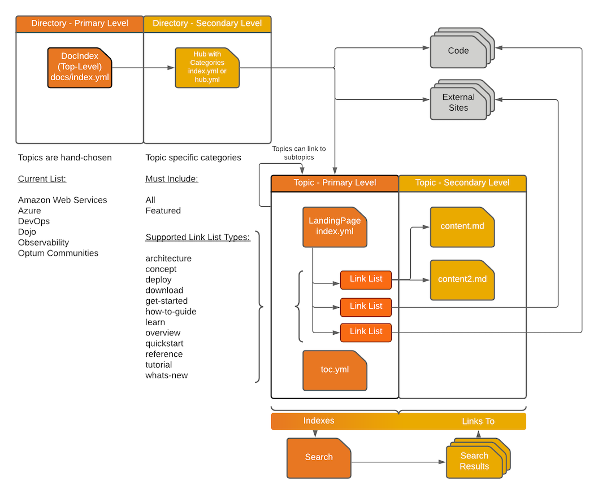

## Dojo Content Hierarchy

In its most basic form Dojo content is broken up into topics, subtopics, and content. Readers locate the content they need via two primary channels: the site search and the directory. A primary metric of any learning web site is how quickly readers can find the content they are looking for and the Dojo is no different. In general, readers should be able to locate their content on the first page of search results and within three (3) navigation events (i.e. clicking links with their mouse) when browsing through topics. Figure 1 illustrates the content structure designed to meet this navigational requirement.

*Figure 1: A graphical representation of the Dojo content hierarchy.*

### Search

The search is powered by [Azure Search](https://docs.microsoft.com/en-us/azure/search/search-what-is-azure-search) and is setup to parse the storage accounts after each site deployment. Since the site only changes via a deployment this frequency is sufficient. The storage account contains the site content in the same structure as the container hosting the site.

### Directory

The Dojo Directory is meant to provide direct access to Hub or Landing pages on the Dojo. The primary (i.e. "top") level page topics are hand chosen by Dojo administrators and represent the latest trends within Provider. Following the top level directory entries should land readers on a Hub page for the chosen topic. The Hub pages provide a categorical view of the various subtopics. Users can see all, featured, or categorical cards.The Hub pages, subsequently, link to Landing pages, external content, or code. A Hub card can link to individual content pages but this usage is less frequent.

### Topic Pages and Content

Topic pages utilize the Landing page template and provide a series of link lists that are designed to guide the reader to the correct content. These link lists categorize content into a link list "type" (e.g. architecture, concept, deploy, etc. See Figure 1 for full listing). At a minimum the Dojo team recommends creating enough content to provide an overview and a series of getting started or how to articles. It is also typical to include either concept or architectural related content at the same time.

The content found under the link lists should, generally, leverage one of the templates found under the ["mardown_templates"](https://github.optum.com/Dojo360/dojo-docs/tree/master/markdown%20templates) directory.
