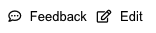
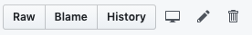
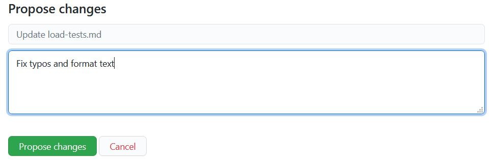
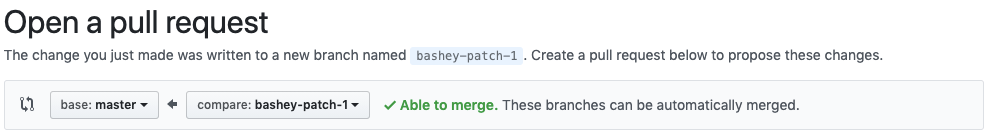

## Dojo Contributor Guide

Welcome to the Dojo Contributor Guide.

**Thank you** for your willingness to contribute to the development community within Provider and Optum as a whole. Folks like yourself help create a vibrant environment for continuous learning. Your contributions are greatly appreciated.

Now let's get down to business...

The Dojo works off an innersource model and leverages GitHub for both content and code contributions. This methodology allows us to automate contributions, reviews, publishing and more. In short, it allows us to accelerate shipping content while keeping staffing requirements lower - and the finance folks always appreciate that.

As a contributor to the Dojo you will leverage a number of tools and processes. If you have already used git and GitHub then these processes should seem familiar to you. If you have not yet used git and Github then we highly recommend that you walk through the [GitHub Beginner's Guide](https://guides.github.com/activities/hello-world/).

## Contributing Code

The Dojo hosts code on the [Dojo360 GitHub organization](https://github.optum.com/dojo360) and welcomes all contributions. To understand the workflow for contributions please see the [Code Contribution Guide](contribute-code.md). For contributing content please continue reading.

## Quick Edits to Content

The Dojo site exposes links on every page that allow a reader to rapidly log feedback or even directly edit the page in question. While we appreciate any and all feedback directly editing the content and submitting a pull request is the most expedient method to resolve minor issues like spelling or grammar mistakes.

1. **Some** docs pages allow you to edit content directly in the browser. If so, you'll see an **Edit** button like the one shown below. Clicking the **Edit** button takes you to the source file on GitHub. If the **Edit** button is missing, that means the documentation page is not available to be changed.

   

   If the **Edit** button doesn't appear it means the content is not open to public contributions.

2. In GitHub, select the pencil icon to edit the article. If the pencil icon is grayed out, you need to either log in to your GitHub account or create a new account.

   

3. Make changes in the web editor. Click the **Preview changes** tab to check the formatting of your change.

4. Once you have made your changes, scroll to the bottom of the page. Enter a title and description for your changes and click **Propose file change** as shown in the following figure:

   

5. Now that you've proposed your change, you need to ask the owners of the repository to "pull" your changes into their repository. This is done using something called a "pull request". When you select **Propose file change**, a new page similar to the following is displayed:

   

   Select **Create pull request**, enter a title, and optionally a description for the pull request, and then select **Create pull request**. If you are new to GitHub, see [About Pull Requests](https://help.github.com/en/articles/about-pull-requests) for more information.

6. That's it! Content team members will review and merge your PR when it's approved. You may get feedback requesting changes.

## Submit Feedback

If you would prefer not to directly edit a particular content item you can submit feedback against that item in the form of a [GitHub issue](https://guides.github.com/features/issues/). The Dojo team has added substantial automation around feedback requests to ensure they are routed and reviewed quickly. Please do not change any of the auto-generated text at the bottom of the issues.

1. To submit feedback for a particular page, look for the "Feedback" button to the left of the aforementioned "Edit" button. Clicking this button will direct the submitter over to GitHub. 

   

2. In GitHub, the submitter can give the issue a title and replace the "Enter feedback here" with a description of the issue. Please be as descriptive as possible when logging the issue. Do not change any other fields - the system will automatically overwrite any changes made and will reject issues that have invalid details.

3. Upon clicking **Submit new issue** the issue will be routed to the appropriate reviewers who will either accept, reject, or ask for additional information about the issue. Requests for additional information will be logged in the comments and you will receive an email when they occur.

## Larger Content Changes

For first time contributors with larger changes, such as adding extensive content sections, the Dojo team generally requests a quick conversation) to understand the proposal and to make sure it integrates with the general structure of the Dojo content (and is searched accordingly). Once a team has been through an initial engagement and completed its first submission(s) they can generally drive forward using the Pull Request model.

An engagement request can be accomplished by submitting a **New issue** on the [Dojo Docs repository](https://github.optum.com/Dojo360/dojo-docs/issues). Simply follow the aforementioned link, click "New Issue", add pertinent details, label the issue with the "engagement request" label, and click **Submit new issue**.

In parallel to the above engagement request, the [Working Locally](working-locally.md) guide will help the user setup their workstation for rapid content development.

When creating larger content contributions we highly recommend utilizing the [markdown templates](https://github.optum.com/Dojo360/dojo-docs/markdown%20templates/) when creating brand new content. This will ensure inclusion of the metadata and will provide basic guidance on style.

**Again, thank YOU for your willingness to contribute to our development community!**