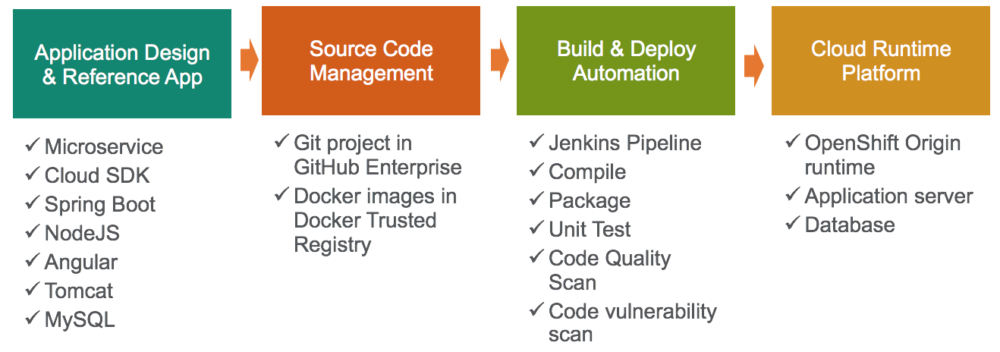

Cloud Scaffolding enables software engineers to quickly begin to develop enterprise grade cloud solutions. Through a set of integrated API's and tools, engineers can develop applications using recommended patterns and technologies for deployment on cloud platforms.

There are three primary components of the Cloud Scaffolding portfolio:
- [Mix-Master](mm)
  - Orchestration layer that communicates with DTC to automate the creation of resources to enable developer productivity
- [Devops Toolchain (DTC)](dtc)
  - Provides an abstraction layer with integration to backend automation targets
- [Codegen](codegen)
  - Generates code for a requesting team to help them get started with a working project.

All three are Java-based, Spring Boot applications that are built using Apache Maven. DTC and Mix-Master additionally use the Apache Camel integration library.

## Usage
See [Optum Developer](https://www.optumdeveloper.com/scaffolding) for details.

## Endpoints

| Service | Environment | URI |
|:--------|:------------------|:----|
| Mix-Master | Dev | [https://jumpstart-dev.optum.com](https://jumpstart-dev.optum.com) |
|| Test | [https://jumpstart-test.optum.com](https://jumpstart-test.optum.com) |
|| Prod | [https://jumpstart.optum.com](https://jumpstart.optum.com) |
| DTC | Dev | [https://dtc-dev.optum.com](https://dtc-dev.optum.com) |
|| Test | [https://dtc-test.optum.com](https://dtc-test.optum.com) |
|| Prod | [https://dtc.optum.com](https://dtc.optum.com) |
| Codegen | Dev | [https://jumpstart-codegen-dev.optum.com](https://jumpstart-codegen-dev.optum.com) |
|| Test | [https://jumpstart-codegen-test.optum.com](https://jumpstart-codegen-test.optum.com) |
|| Prod | [https://jumpstart-codegen.optum.com](https://jumpstart-codegen.optum.com) |

## CI/CD information

| Service | Environment | URI |
|:--------|:------------------|:----|
| Standalone Jenkins |  | [https://jenkins.optum.com/cloudscaffolding/](https://jenkins.optum.com/cloudscaffolding/) |

## OpenShift Projects

| Location | Name | Environment | Notes |
|:--------|:------------------|:----|:---|
| origin/ctc/nonprod/core | pbi-devops | Prod | All Cloud Scaffolding production applications are here |
|| pbi-devops-dev | Dev | Dev environment for DTC, MM/Jumpstart, and Codegen |
|| pbi-devops-test | Test | Test environment for DTC, MM/Jumpstart, and Codegen |

## Contributing
Please refer to our [Contribute](contribute) documentation for guidance on contributing to this project.

## Maintainers
- [RJ Seibert][m1_email]
- [Christian Rodriguez][m2_email]

## License
This Optum InnerSource Project uses the [Optum InnerSource License](https://github.optum.com/OPTUMSource/OPTUMSource/blob/master/OPTUMLicense.md)

[m1_email]: mailto:richard_seibert@optum.com
[m2_email]: mailto:christian_rodriguez@optum.com

# Feedback
* For questions/comments/issues visit the [Jumpstart Flowdock](https://www.flowdock.com/app/uhg/jumpstart) or [Send us an e-mail](mailto:CloudScaffoldingOps_DL@ds.uhc.com)
