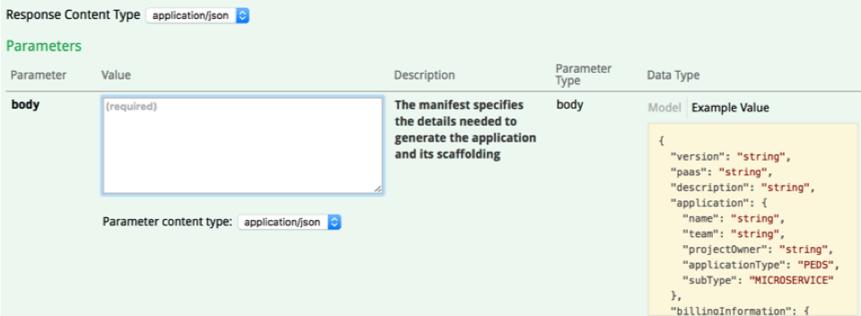
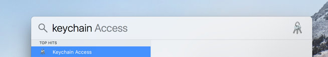
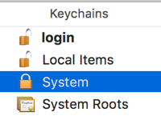
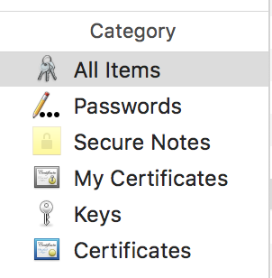
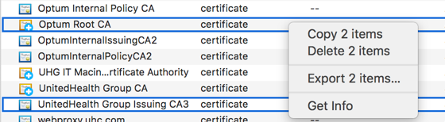

## Preface ##

**Windows Users**

At this current time, Windows users will not be able to perform the steps provided in this document. However, this is a
known issue and AppSense is working to make Go usable by Windows users. 

## Creating Your Application ##

**Using jumpstart.optum.com to Provision the Go Application Type**

At jumpstart.optum.com, select **Authorize** in the upper right-hand corner of the screen. Submit your credentials. Next, select the **orchestrate** -&gt; **POST** operation from the swagger UI. Insert a body with your desired data into the &#39;body&#39; field. If you are experimenting, an example body for the Go application type has been provided below. Insert this using your own project name, team namespace, MSID, TMDB, and/or ASKID. Then, click 'Try it out! to orchestrate the creation of your Go project. Follow the links provided in the **Response Body** to verify your project has orchestrated properly. Alternatively, these links can be found in your project&#39;s **manifest.go** file. Clone the github repository created into a meaningful directory on your local machine. Finally, navigate to your project in terminal and run the command below. (This command is also customized in your project&#39;s README.md)

CGO\_ENABLED=0 GOOS=linux go build -o **&lt;project name&gt;** -a -tags netgo -ldflags &#39;-w&#39; .

**Example Request Body** 

```json    
    {
      "version": "v1",
      "application": {
        "name": "<project name>",
        "team": "<team namespace>",
        "projectOwner": "<msId>",
        "applicationType": "GO",
        "subType": "MICROSERVICE"
      },
    "billingInformation": {
      "tmdbNumber": "TMDB-#######",
      "askGlobalId": "UHGWM###-######"
    },
    "features": [
    ] 
    }
```


## Observing the Application ##

**main.go**

Take a look at the main.go file inside your Go project. Note that, in Go, all imports must be used to build your application without error. We define **port** as a pointer to the value &quot;8080&quot;. This is used to host your application when running locally in the case that you have not already defined an environment variable for this PORT. We also instantiate a new ServeMux object **mux** which handles calls to the application&#39;s endpoint URLs. The mux and the host port are provided to the HTTP Server named **server.** As you can see there are already two endpoint paths created as part of the template project. The base path, ending with **/** will display the result of the landingpage function. The **/health** endpoint provides the state of your running service.

**Base Image Description**

Observe your project&#39;s Dockerfile. You will notice that the FROM declaration references Docker&#39;s scratch image. Using Docker&#39;s scratch image means that, instead of referencing an existing base image, you have created your own. The scratch image created from the example body provided is 1.89MB. Observe your image at **docker.optum.com**. Most base images, including Docker&#39;s own official node image, start much larger than this. However, the scratch image only includes what is necessary to run your service.

## Certificate setup ##

**Mac Users**

First, spotlight search for your local **Keychain Access** using the command-space keyboard shortcut.



Select your **System Keychains** using the menu on the left-hand side of the view.



Select your **All Items or Certificates Category** using the menu on the bottom, left-hand side of the view.



Locate the **Optum Root CA** and **UnitedHealth Group Issuing CA3** certs. Export both of these certificates to a meaningful directory on your local machine in **.pem (Privacy Enhanced Mail)** format.



Finally, open the **exported certificates** using your preferred text editor. Also open the **certs.go** file within your Go project. Inside your **certs.go** file, insert the new certs text into the certs array.


```golang
var pemCerts = []byte(' . . . <add your certs here> ')
```

Save the file. You are finished setting up the certificates for your project.

## Working with Your Go Application ##

**Running the Application Locally**

To run the application locally, begin by opening a terminal window. Navigate to your **&lt;project name&gt;** directory.

Run the following commands in terminal:
```bash
go build .
./<project name> -d landingpage/
```

Navigate to localhost:8080 using your browser to confirm that your service is running.

**Extending the Base Service to Add Another Endpoint**

Continuing our example, based on the body provided above, consider the endpoint at the URL

**http://<project name>-<team namespace>.ocp-ctc-core-nonprod.optum.com/directory**. For the sake of this example we will imagine our endpoint displays some example content that will be useful for your application. To create this endpoint, observe the **main.go** file.


Add a line to handle the new endpoint

```golang
package main

import (
	"fmt"
	"log"
	"net"
	"net/http"
	"os"
	"flag"
)

func health(w http.ResponseWriter, r *http.Request) {
	fmt.Fprintf(w, "UP")
}

func main() {
    port := flag.String("p", "8080", "port to serve on")
    mux := http.NewServeMux()
    hostPort := net.JoinHostPort("0.0.0.0", os.Getenv("PORT"))

    if (os.Getenv("PORT") == "") {
        hostPort = net.JoinHostPort("0.0.0.0", *port)
    }

    mux.HandleFunc("/", landingpage)
    mux.HandleFunc("/health", health)
    mux.HandleFunc("/directory", directory)//ADDED LINE
    log.Println("Starting $originalAppName service")
    log.Printf("Listening on %s\n", hostPort)
    server := http.Server{Handler: mux, Addr: hostPort}
    log.Fatal(server.ListenAndServe())
}
```

Add a new file to your project **directory.go**

```golang
package main

import (
	"net/http"
	"fmt"
)

var htmlDirectory = `
<!DOCTYPE html>
<html lang="en">
  <head>
    <title>Directory</title>
  </head>
  <body>
    <h3>Another directory API example</h1>
  </body>
</html>
`

func directory(w http.ResponseWriter, req *http.Request) {
    fmt.Fprint(w, htmlDirectory)
    return
}
```

Commit this code and view your running service at http:// **&lt;project name&gt;-&lt;team namespace&gt;**.ocp-ctc-core-nonprod.optum.com/directory.

**Extending Your Endpoint into a Basic API**

To verify that our certificates are properly set up, let us continue the endpoint example detailed above to include the ability to make some http calls. Add the following code to your **main.go** , below your health function.

```golang
type Contact struct{
    Name        string `json:"name"`
    PhoneNumber string `json:"phonenumber"`
}

var contacts []Contact
```

We will use a struct of type Contact to add contacts to a directory.

Now, in your **directory.go** file, make the following changes.

```golang
package main

import (
	"net/http"
"encoding/json"
    	"log"	
)

var htmlDirectory = `
<!DOCTYPE html>
<html lang="en">
  <head>
    <title>Directory</title>
  </head>
  <body>
    <h3>Another directory API example</h1>
  </body>
</html>
`
func getContacts(w http.ResponseWriter, r *http.Request) {
    json.NewEncoder(w).Encode(contacts)
}

func addContact(w http.ResponseWriter, r *http.Request) {
    decoder := json.NewDecoder(r.Body)
    var contact Contact
    err := decoder.Decode(&contact)
    if err != nil {
        log.Printf("ERROR: ")
    }
    contacts = append(contacts, contact)
    json.NewEncoder(w).Encode(contacts)
}

func directory(w http.ResponseWriter, req *http.Request) {
    log.Printf(req.Method + " request")
    if req.Method == "GET" {
        getContacts(w, req)
    } else if req.Method == "POST" {
        addContact(w, req)
    }
}
```

As you can see, we have added some imports, two new functions, and some logic to handle requests made at the **/directory** endpoint. The function getContact() performs a GET, returning the list of contacts. The function addContact() performs a POST and adds the contact data given in the request.

**Testing the Application Locally**

To test your new API, open a terminal window and run your application as described above. Observe your running service at http://localhost:8080/. Open a second terminal window. Provide the following command to add a contact to the directory:
```bash
curl -X POST -d "{\"name\": \"<your name>\", \"phonenumber\": \"<your phonenumber>\"}" http://localhost:8080/directory
```
Observe the updated list of contacts at the URL **http://localhost:8080/directory.**


**Useful Resources Moving Forward**

https://medium.com/golangspec/blocks-in-go-2f68768868f6

https://medium.com/golangspec/scopes-in-go-a6042bb4298c

https://golang.org/pkg/net/http/


 
