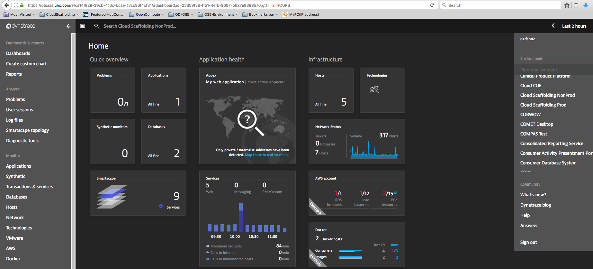
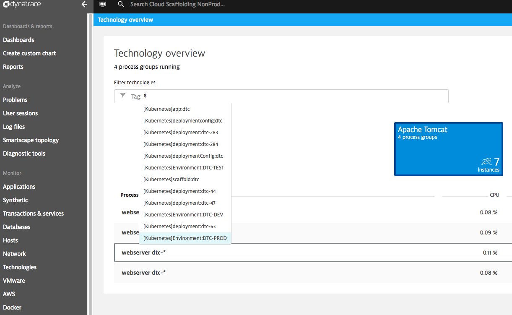

Dynatrace SaaS (DTSaaS) is an on-premise hosted agent-based monitoring and analytics tool. DTSaaS monitors full technology stack supporting an application with a single portal and agent, including host, process, service, application, db, log file, and end-user performance metrics.

For more details, refer to [Optum Developer](https://www.optumdeveloper.com/content/odv-optumdev/optum-developer/en/development-tools-and-standards/monitoring/application-performance/dynatrace-saas-managed.html)

## Steps to request and access DTSaaS
1. Submit SECURE request for the dtsaas_cloudscaffolding_nonprod group.
2. Environment Details https://dtsaas.uhc.com
3. Viewing DTSaaS dashboard.
    - Login to dtsaas
    - Select “Cloud Scaffolding NonProd”

4. Dynatrace allows you to automatically derive tags from your Red Hat OpenShift environment. This enables you to automatically organize and filter all monitored OpenShift application components based on labels. Currently prod/stage are both being monitored by a single DTSaaS environment and then we use filter OSE pods targeted for stage or prod.
    - select Technology overview from left
    - select Tag   
          - Example : Tag: [Kubernetes]Environment:DTC-DEV, Tag: [Kubernetes]Environment:DTC-PROD

More information regarding tags and how it configured : OSE tags coniguration for DTSaaS
Additional links for reference
- Dynatrace SaaS vendor documentation
- Dynatrace SaaS guided training courses
- Dynatrace SaaS on OptumDeveloper
- Dynatrace SaaS on HubConnect
- Dynatrace SaaS OSE/Docker examples on Github
- Dynatrace SaaS Alerting
