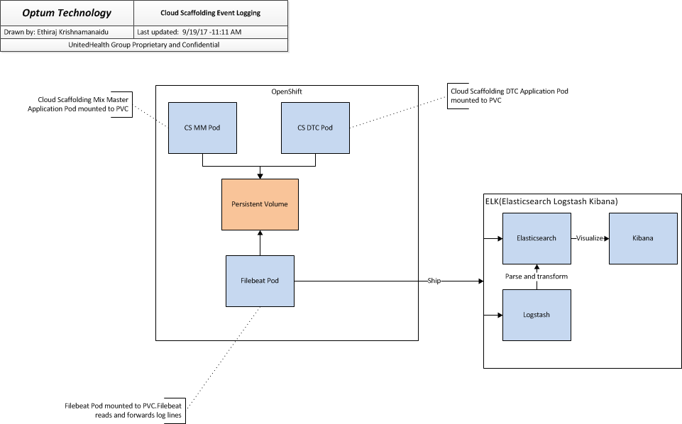
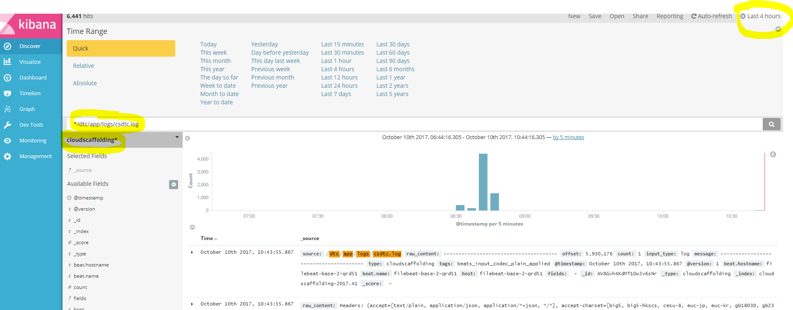

## Event Notifier and Logging Interceptor
Currently DTCEventNotifier is configured to log all in and out events using ExchangeCreatedEvent, you can find more details : http://camel.apache.org/eventnotifier-to-log-details-about-all-sent-exchanges.html
Implemented in com.optum.pbi.devops.toolchain.service.events.DTCEventNotifier.
Additionally, CXF Interceptor is configured to log all in and out client events using LoggingInInterceptor and LoggingOutInterceptor

## Steps to request and access ELK logs.
1. Submit secure request for below groups
    - Dev/Test: ELK_cloudscaffolding_nonprod
    - Prod: ELK_cloudscaffolding_prod
2. Proceed to the ELK instance for the environment you're interested in:
    - [Development](https://dev-elk.optum.com)
    - [Test](https://stage-elk.optum.com)
    - [Production](https://prod-elk.optum.com)
3. Searching and view logs in Kibana.
    - Login to ELK
    - Select “cloudscaffolding”
    - By default it show only last 15 minutes logs.  You can update as required, please refer below screen shot
4. Search for service specific logs with the following search terms:
    - For DTC: `*/dtc/app/logs/csdtc.logs`
    - For MM: `*/dtc/app/logs/csmm.logs`

## Reporting using ELK
Since DTCEventNotifier is configured to log all events, we have leveraged that to generate meaningful data for reporting. You can find the reports on both the DEV and PRD environments on ELK. If you click on the "Dashboard" tab and view the "cloudscaffolding_dashboard", you will see an aggregation of multiple “visualizations.” To generate more reports, you will have to utilize the "Visualize" tab. Here, you will be able to create a new visualization and display the data in various different ways. Currently, the reports are displayed in a data table view.

### Steps to create new visualization
1. Log into ELK
2. Click the "Visualize" tab on the left navigation bar
3. Click on blue "+" symbol to create new visualization
    - Select visualization type
    - Select "cloudscaffolding" from the list on the left

**NOTE - By default, the visualizations only show last 15 minutes of logs.  You can update as required.**

Once you have entered the visualization screen, you can change aggregations and filter logs. For example, to view how many times DTC and MM was called, you can do that by following these steps:
1. In the "Metric" section, change the aggregation to "Unique Count". Then select "correlation_id.raw" in the "Field" dropdown.
2. Under "buckets," click the "split table" button and for aggregation, choose "Terms". For the field, choose "caller.raw."
3. Click on the play button that is above the "Metric" section.

**NOTE - If you don't see any data, please make sure you have the correct time frame selected. You also might have to increase the "size" field under the buckets to see more data.**
