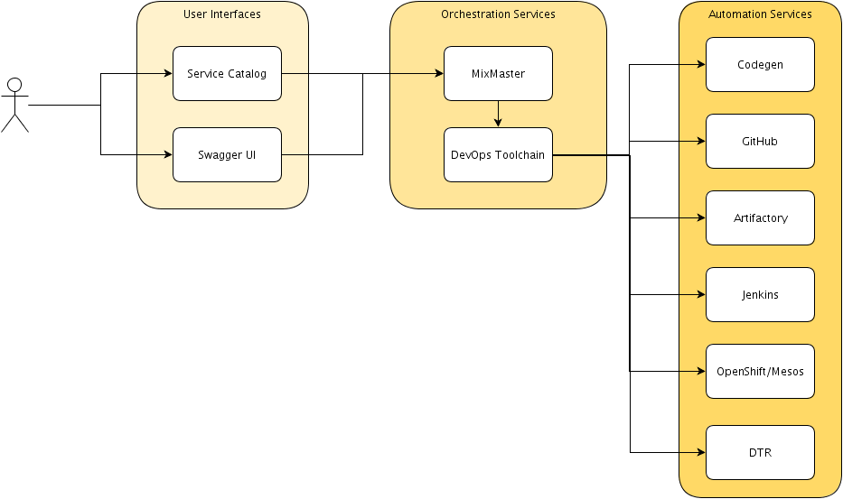

This section of the site contains information and documents about Cloud Scaffolding as a whole.

## High Level Architecture Diagram

## Naming Constraints

Constraints on the naming of teams and apps can be found [here](constraints).

## Performance and Event Monitoring

TBD
