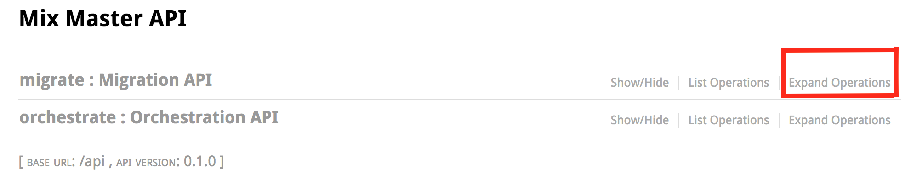
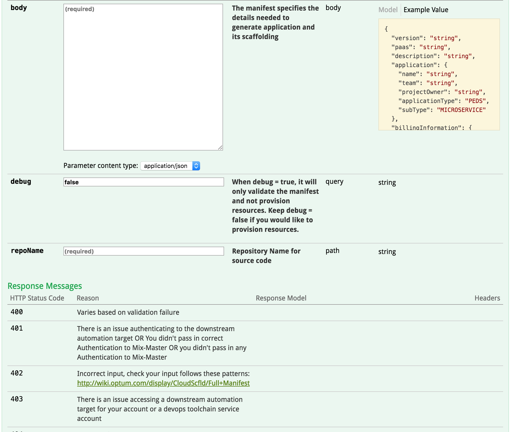

## Introduction
Teams that already have and existing application code base can now utilize the cloud scaffolding platform to migrate their applications onto the cloud environment. With the brownfield application migration process, teams will get a dedicated and integrated Jenkins environment with their Github repositories, Dockerized images of their applications on Optum’s Docker Trusted Registry (DTR) and Openshift Enterprise containers for their applications with the necessary application set up.


## Prerequisites
The cloud Scaffolding platform requires teams to have their existing application on a repository on Optum’s Github Enterprise. Users who would like to migrate their applications using the cloud scaffolding platform must own the Github repository under their MS ID.

The migration Process does not require a Jenkinsfile to be part of the codebase, the necessary Jenkinsfile will be provided and added to the codebase during the process.


## Migration Steps

Users and teams who would like to migrate their existing applications to cloud platforms and already have their projects’ codebases in repositories on Optum Github Enterprise could follow the following steps to migrate their applications:

### 1. Navigate to Mix Master, [jumpstart.optum.com](jumpstart.optum.com)
   Mix Master is the cloud scaffolding production environment for creating greenfield cloud applications and migrating existing applications to the cloud.
### 2. Authenticate:
  Click on the "Authorize" Button in the top right corner to authenticate using your MS ID and password.


### 3. Migrate API:
   Once authenticated, you will see two endpoints on the page for use, the "migrate: Migration API" and the "Orchestrate: Orchestration API", Click on “Expand Operations” next to the "migrate: Migration API" to Expand it.


### 4. Provide Necessary Information:
In the expanded section, you will see three fields for input: "Body", "debug", "repoName". The "debug" field is already filled in so we will leave it as is. We will only input the "body" and the "repoName" fields.

* In the “Body” field or text-area, provide the below information in the JSON string below surrounded by <>.


```json
{
  "version": "v1.0",
  "application": {
    "name": <name-of-your-app>,
    "team": <your-team-name>,
    "projectOwner": <your-MS-ID>,
    "applicationType": "BROWNFIELD",
    "subType": "MICROSERVICE"
  },
  "billingInformation": {
    "tmdbNumber": <Valid-TMDB-number>,
    "askGlobalId": <Valid-Global-ID>

  },
  "features": [
  ]
}
```

* In the “repoName” field, provide the Github Repository name that contains the codebase for the application you would like to migrate.

### 5. Start Migrating:
Click on the “try it out” button to start migrating your project.


## Post Migration
When the migration process is complete, you should see all the created services and their information in the response body section. The services that get created during the migration process are as following:
- Jenkins Environment for your application.
- Artifactory Environment for your project dependencies.
- Openshift project in the ocp, ctc, core-nonprod cluster.
- DTR Environment for your project docker images.
