# Elastic_Framework Automation Scripts
Elastic Search Framework on Mesos allows for easy deployment, monitoring and scheduling of Elastic Search Service across Mesos Framework. This project contains scripts that deploys and Updates the framework using Layer 7 proxy. All the user needs to do is create a jenkins pipeline that uses the provided jenkins pipeline files and update all json/conf files for spinning up these easy to use Frameworks for quick, on the fly, testing of spinning Elastic Search cluster .

## Obtaining Credentials to Consume APIs
Please follow [API Consumer: Getting Started](https://www.optumdeveloper.com/content/odv-optumdev/optum-developer/en/getting-started/apis/api-consumers.html) Optum Developer link to obtaining Credentials to Consume APIs.

## Install Pipeline Instructions
1. Login to [Jenkins](https://jenkins.optum.com/central)
2. Add your credentials for github to the jenkins global credentials store if you have not already done so: Jenkins -> Credentials -> System -> Global credentials (unrestricted) -> add credentials
 

  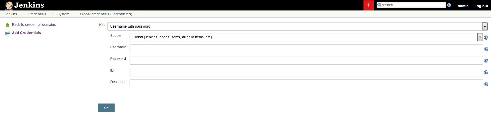

 
3. Get API Key and Secret by:
   * Logging into API Manager
   * Navigate to Application on Left Pane
   * Hover Over Application Gear
   * Select Edit in Gear Drop-Down
   
 

  

   * Navigate to Auth Tab in Window
   * Copy Key and Secret for future reference

 

  

4. Add API Key and API Secret Credentials in Jenkins by navigating to 
Credentials -> System -> Global credentials (unrestricted) -> add credentials

**Kind: Secret Text**

**ID: ClientSecret & ClientKey**

 

  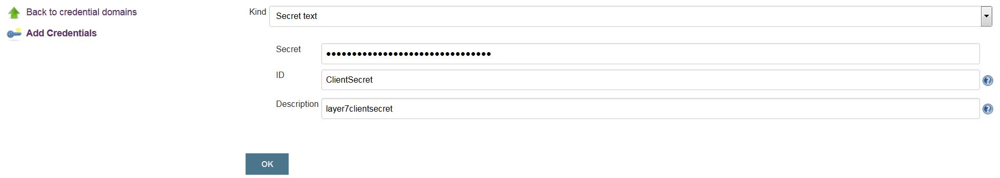

5. Update the Client ID in OSFI Mesos Application
 

  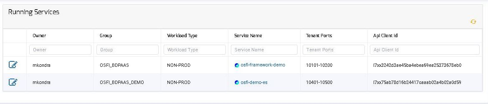

 

6. Go back to the Jenkins home screen by hitting the jenkins logo in the top corner, navigate to your folder and then hit new item:
 

  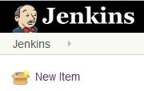

 

7. Give your pipeline a name and select the pipeline option and then hit OK:
 

  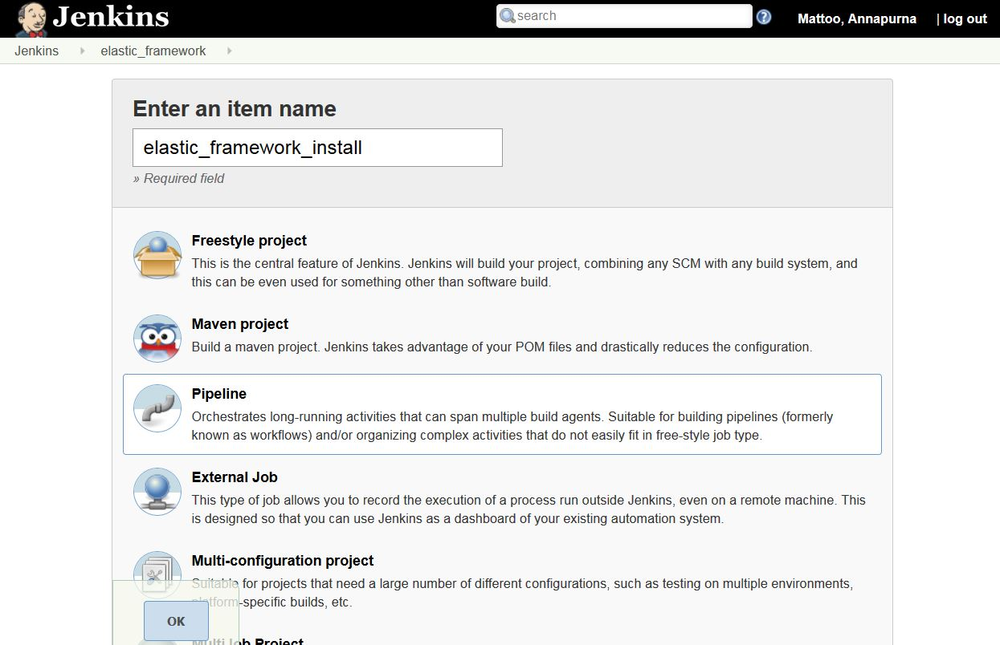

 

8. Now configure your pipeline so that it looks the same as below:
 

  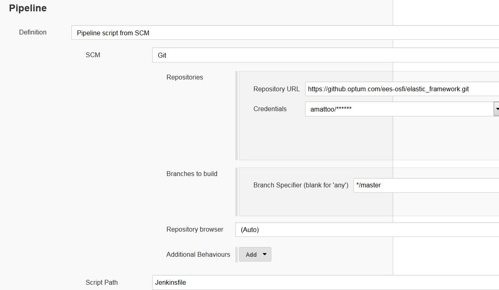

 

9. Save your pipeline

10. Edit install/options.json file (Important Configurations to Note)
   1. Update service.name (must be unique)
   2. Update nodes.count >= 3 nodes
   3. Update nodes.memory & nodes.cpu allocation
   4. Update nodes.disk_type [MOUNT, ROOT] , nodes.disk 
      - ROOT is for PoC type work 
      - MOUNT allocates dedicated disk for your framework
   5. Set marathon-lb port for exposing Elastic Search through Marathon-LB.
    
11.Add Layer 7 Base and auth url in the install/server.conf file.

12. Commit all changes to Master Branch

13. Start Jenkins Pipeline

14. Now navigate to your framework in Jenkins and run Build Now
 

  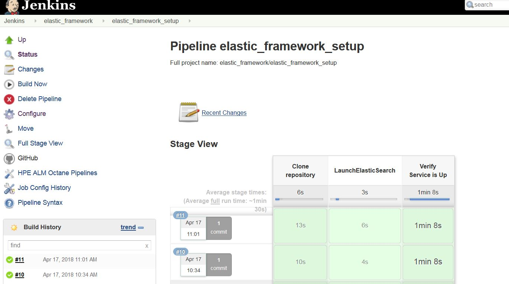
 

 
15. Click on the latest build in the build history which can be seen in the above screenshot
 
16. Open up the console log
  

  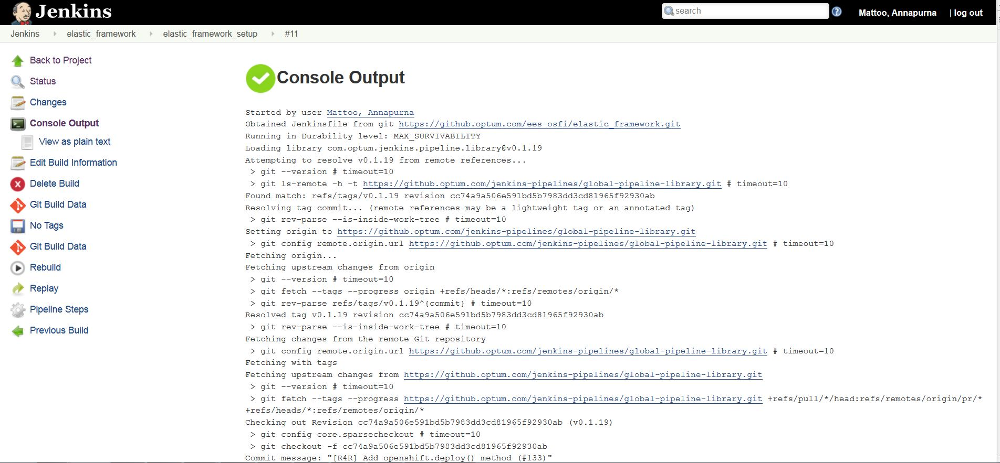
 

 
17. Wait until you see the Elastic Search Service up 
  

  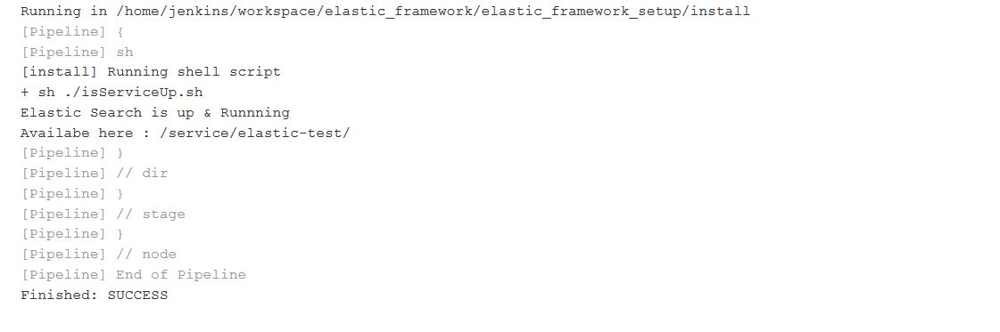
 

18. Your service is now running! :tada:

## Accessing Elastic Search from OSFI Mesos Application 
To see your Framework , log into the OSFI Mesos Application environment and you should see your Framework ID and Framework Name in the list of Frameworks deployed. From there on, you can check your Framework related information and access logs.

  
 

## Accessing Elastic Search Instance 
To access Elastic Search Service we expose Elastic Search through Marathon-LB.  Below are instructions on how to connect to Elastic Search instance running in Mesos .

1. Add following 3 HA Proxy labels to marathon.json file :
* HAPROXY_GROUP: external 
* HAPROXY_0_BACKEND_SERVER_OPTIONS: server elastic-coordinator coordinator.service.name.l4lb.thisdcos.directory:9200 
* HAPROXY_0_PORT: marathon-lb.port 

2. Check Marathon-LB HA-Proxy UI and look for your Elastic Search Service.

You should see the service running like below:

http://10.205.220.32:9090/haproxy?stat

  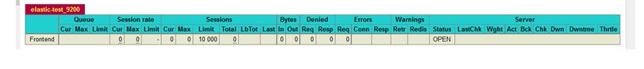
 

To access your service,take note of the IP Address of Marathon-LB and Port assigned to service 
http://10.205.220.32:9200//

  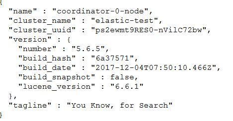
 

Congrats you can now access your Elastic Search instance running in Mesos.

## Uninstall/delete Framework Instructions
Please contact BDPaaS Admin for uninstalling or deleting your framework application.

