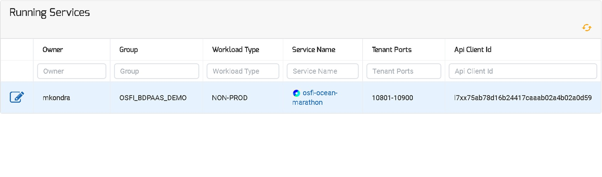
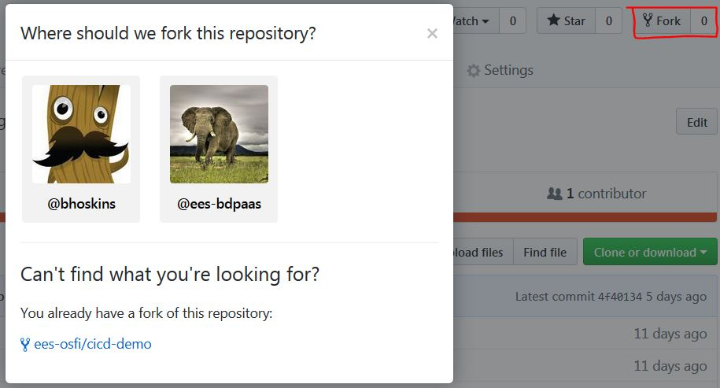

# API Marathon Deployment
Getting Started Guide for Docker Image Build, Push and Deploying Image to Tenant Marathon using Layer7 REST Proxies to OSFI Mesos using Jenkins Pipeline.

## Pre-Requirements
* Access to [Optums Git](https://github.optum.com)
* Access to [Optums Docker Trust Repository](https://docker.optum.com/)
* OSFI team already published the APIs with Layer 7(Please follow instructions below to Consume APIs)
* Tenant is on boarded in OSFI Mesos Application
* Tenant creates a consumer in Layer 7 and gets the client ID and secret
* Tenant updates client ID in OSFI Mesos Application

  
 

 
## Instructions to Consume API
1. Please follow [API Consumer: Getting Started](https://www.optumdeveloper.com/content/odv-optumdev/optum-developer/en/getting-started/apis/api-consumers.html) Optum Developer link to:
* Request an Optum ID
* Request Access to API Manager for Non-Production (Send Email with Optum ID and a Project Name to <developer@optum.com>)
* Create New Application
* Add API to Application based on which environment your Tenant Marathon was provisioned by searching for API NAME from below list.

| Mesos | Env | API NAME  | API |
| ----- | ----- | -------------------------------- | -------------------------------------------------------------------- |
| EMR | STAGE | OSFI Mesos Tenant Marathon Stage | https://api-int-stg.uhc.com:8444/api/dev-emr/osfi/tenantmarathon/v2/ |
| CTC-CORE | PROD | OSFI Mesos Tenant Marathon PROD CTC | https://api-int-stg.uhc.com:8444/api/prd-ctc/osfi/tenantmarathon/v2/ |
| PTC-CORE | PROD | OSFI Mesos Tenant Marathon PROD PTC | https://api-int-stg.uhc.com:8444/api/prd-ptc/osfi/tenant/register/v2/ |

## Edit Configurations application.json
Labels to set to deploy the application:
* Replace HAPROXY_0_GROUP value with same SERVICE NAME as your tenant marathon instance
* Replace HAPROXY_0_VHOST value with same SERVICE NAME as your tenant marathon instance with suffix of -lb.marathon.mesos
## Port Mappings:
Your port mappings should look like this:
"portMappings": [
{
"containerPort": 80,
"hostPort": 0,
"protocol": "tcp",
"name": "APP_NAME",
"servicePort": 10551
}
]
* "containerPort" should match the port your service is exposed on in the docker image.
* "servicePort" should be picked from within range of ports from the table "Tenants Port" from your OSFI Mesos Application as below:

  
 

2. Fork [ees-osfi/cicd-demo](https://github.optum.com/ees-osfi/cicd-demo) git repository to your own repo

  
 

 3. If not already created, follow link to [Optum Jenkins and Create a Folder with valid FOLDER_NAME and USER_ID](https://jenkins.optum.com/central/job/Create%20Folder/build?delay=0sec)

  

4. Login and Navigate to newly created folder in Jenkins
5. Follow README.md instructions of ci-cd git repository which you forked to setup Jenkins Pipeline and deploy your custom application
 
## Check Application is Up and Running
Find Your Application listed in one of the 2 HA-Proxy URLs for your mesos environment. 

| Mesos Cluster | Public Nodes | HA-Proxy URLs |
|:-----:| ----------------------------- | --------------- |
| CTC | 10.205.220.32,10.205.220.53 | [LB-1](http://10.205.220.32:9090/haproxy?stats), [LB-2](http://10.205.220.53:9090/haproxy?stats) |

  

 

## Access Tenant Application via Marathon-LB
To access your service,take note of the IP Address of Marathon-LB and Port assigned to your service 
* http://10.205.220.32:servicePort//
* http://10.205.220.53:servicePort//

