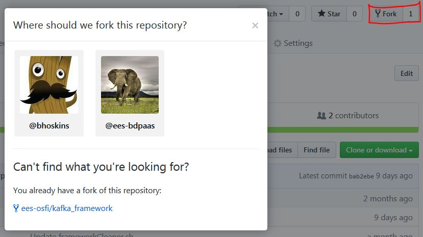
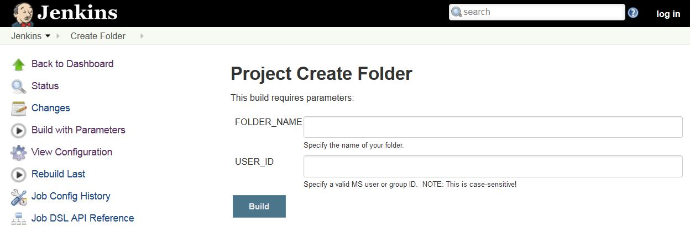

# Mesos Framework Deployment
Follow below instructions to deploy one of the many Mesos Frameworks

## Pre-Requirements
* User Account in [Optums Github](https://github.optum.com/)
* OSFI team already published the APIs with Layer 7(Please follow [API Consumer: Getting Started](https://www.optumdeveloper.com/content/odv-optumdev/optum-developer/en/getting-started/apis/api-consumers.html) Optum Developer link to obtaining Credentials to Consume APIs)
* Tenant is on boarded in OSFI Mesos Application
* Tenant creates a consumer in Layer 7 and gets the client ID and secret
* Tenant updates client ID in OSFI Mesos Application

Once all above steps are completed,tenant is ready to deploy a framework in Mesos.

  

 

## Instructions
1. Select Framework you would like to deploy in Mesos.
    * Confluent Kafka <https://github.optum.com/ees-osfi/kafka_framework.git>
    * Cassandra <https://github.optum.com/ees-osfi/cassandra_framework.git>
    * Elastic <https://github.optum.com/ees-osfi/elastic_framework.git>
    * Spark <https://github.optum.com/ees-osfi/spark_framework.git>
    * Jenkins <https://github.optum.com/ees-osfi/jenkins_framework.git>

2. Fork the frameworks git project to your own git repository.
 
 

  
 

 
3. Follow link to [Optum Jenkins and Create a Folder with valid FOLDER_NAME and USER_ID](https://jenkins.optum.com/central/job/Create%20Folder/build?delay=0sec)

  

 
4. Login and Navigate to newly created folder in Jenkins

5. Follow README.md instructions of framework git repository which you forked to setup Jenkins Pipeline and deploy your framework
