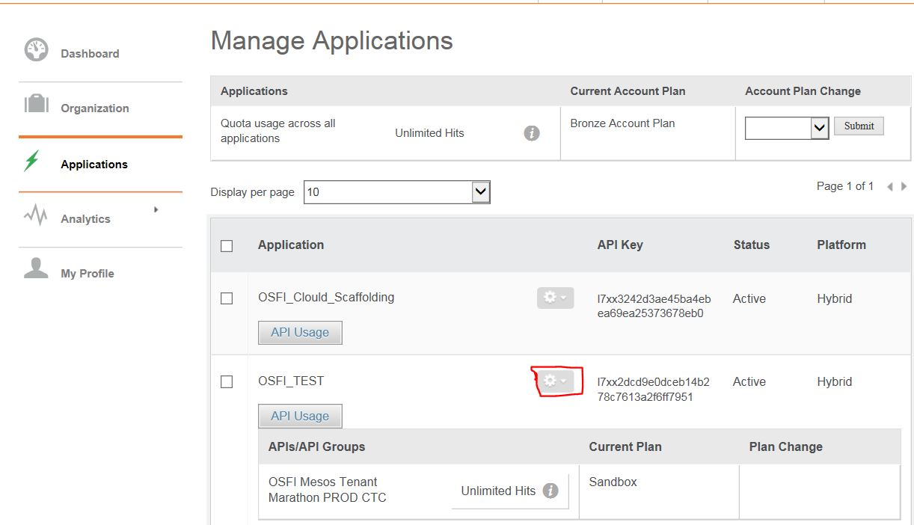
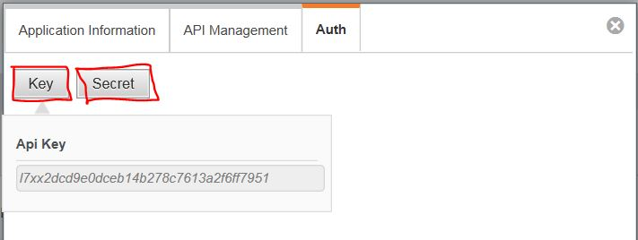

# OSFI Getting Started Guide
Getting Started Guide for Deploying Applications to OSFI Mesos

Follow the Instructions in below folders to deploy:
* Marathon Application using Tenant Marathon UI
* Marathon Application using Layer 7 APIs
* Mesos Frameworks (Kafka, Cassandra, Spark, Jenkins, etc.)

# Deployment Using Layer 7
## Obtaining Credentials to Consume APIs
Please follow [API Consumer: Getting Started](https://www.optumdeveloper.com/content/odv-optumdev/optum-developer/en/getting-started/apis/api-consumers.html) Optum Developer link to obtaining Credentials to Consume APIs.

### Available APIs

#### Tenant Marathon
| Mesos | Env | API NAME  | API URL |
| ----- | ----- | -------------------------------- | -------------------------------------------------------------------- |
| EMR | STAGE | OSFI Mesos Tenant Marathon Stage | https://api-int-stg.uhc.com:8444/api/dev-emr/osfi/tenantmarathon/v2/ |
| CTC-CORE | PROD | OSFI Mesos Tenant Marathon PROD CTC | https://api-int-stg.uhc.com:8444/api/prd-ctc/osfi/tenantmarathon/v2/ |
| PTC-CORE | PROD | OSFI Mesos Tenant Marathon PROD PTC | https://api-int-stg.uhc.com:8444/api/prd-ptc/osfi/tenant/register/v2/ |

# Get API Key and Secret by:
   * Logging into API Manager
   * Navigate to Application on Left Pane
   * Hover Over Application Gear
   * Select Edit in Gear Drop-Down
   
 

  

   * Navigate to Auth Tab in Window
   * Copy Key and Secret for future reference

 

  

