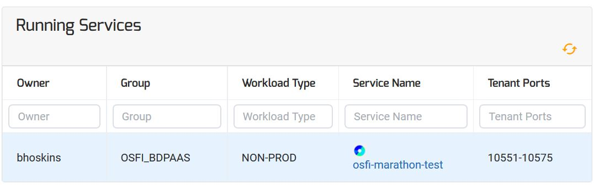
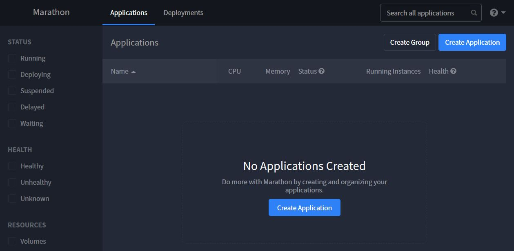
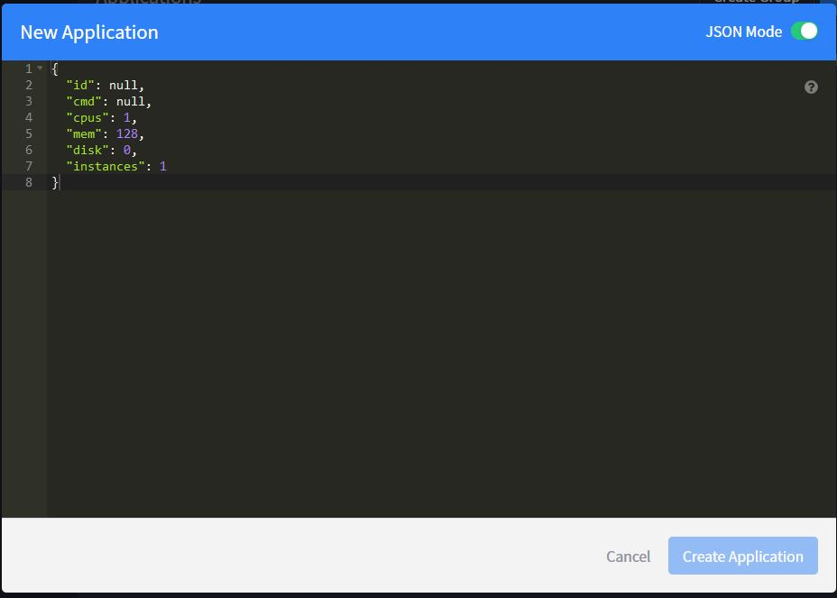
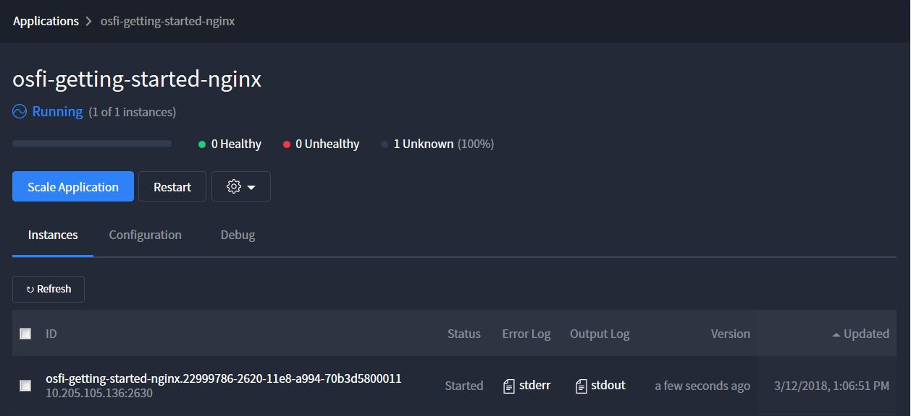
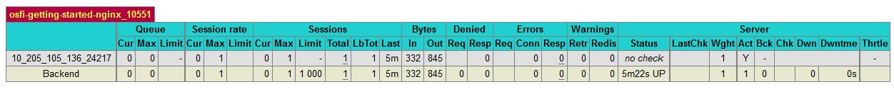
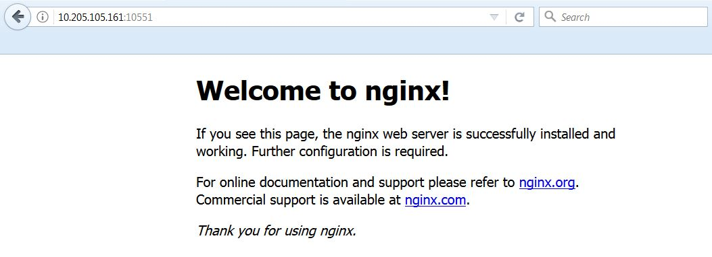

# UI Marathon Deployment Instructions
Follow below instructions on Deploying a Simple Application using Tenant Marathon UI

## Pre-Requirements
1. Provision Tenant Marathon
2. Access to Tenant Marathon Instance via Secure Group (OSFI_*)

## Definitions
* Tenant Marathon - Secure Marathon Container Orchestration UI dedicated to each Tenant of Mesos Cluster
* Tenant Marathon-LB - Internal HA-Proxy dedicated to each Tenant which allocates port range exposed to External Marathon-LB. 
* Tenant Ports - Range of 25 ports dedicated to each Tenant Marathon Instance for external exposure via Marathon-LB

## Instructions
1. Log into OSFI Mesos Security Application using MS ID
    * CTC - https://osfi-mesos-ctc-core.optum.com
    * PTC - https://osfi-mesos-ptc-core.optum.com
 
 2. Select Service Name Link to route to Tenant Marathon UI.
 <p align="center">
  
</p> 
 
:exclamation: NOTICE: "Tenant Ports" range of ports is listed 

3. Select Create Application in Tenant Marathon
<p align="center">
  
</p> 

4. Hit JSON Mode Radio Button in top right corner
<p align="center">
  
</p> 

5. Copy/Paste Below JSON into JSON Editor of Marathon "New Application" UI

```
{
  "id": "/osfi-getting-started-nginx",
  "cmd": null,
  "cpus": 1,
  "mem": 128,
  "disk": 0,
  "instances": 1,
  "acceptedResourceRoles": [
    "*"
  ],
  "container": {
    "type": "DOCKER",
    "docker": {
      "forcePullImage": false,
      "image": "nginx",
      "parameters": [],
      "privileged": false,
      "network": "BRIDGE"
    },
    "volumes": [],
    "portMappings": [
      {
        "containerPort": 80,
        "hostPort": 0,
        "labels": {},
        "name": "http",
        "protocol": "tcp",
        "servicePort": 10551
      }
    ]
  },
  "labels": {
    "HAPROXY_GROUP": "osfi-marathon-test",
    "HAPROXY_0_VHOST": "osfi-marathon-test-lb.marathon.mesos"
  },
  "portDefinitions": []
}
```

6. Update Below list of K/V pairs in JSON to point to Tenant Marathon-LB.
  * id - Unique name of Application
  * labels.HAPROXY_GROUP - Marathon "Service Name" Listed in OSFI Mesos Security Application
  * labels.HAPROXY_0_VHOST - Same as HAPROXY_GROUP with added sufix (-lb.marathon.mesos)
  * portMappings.servicePort - A port within range from "Tenants Port" column in OSFI Mesos Security Application
    
7. "Create Application"

8. Wait until application shows as "Running"
<p align="center">
  
</p> 

:exclamation: NOTICE: The Port exposed for my application will not be accessible from UI. 

9. Access Application through External Marathon-LB

Find Your Application listed in one of the 2 HA-Proxy URLs for your mesos environment. 

| Mesos Cluster | Public Nodes | HA-Proxy URLs |
|:-----:| ----------------------------- | --------------- |
| CTC | 10.205.220.32,10.205.220.53 | [LB-1](http://10.205.220.32:9090/haproxy?stats), [LB-2](http://10.205.220.53:9090/haproxy?stats) |
| PTC | 10.112.76.14,10.112.76.15 | [LB-1](http://10.112.76.14:9090/haproxy?stats), [LB-2](http://10.112.76.15:9090/haproxy?stats) |
| DEV | 10.205.105.161,10.205.105.162 | [LB-1](http://10.205.105.161:9090/haproxy?stats), [LB-2](http://10.205.105.162:9090/haproxy?stats) |

<p align="center">
  
</p> 

10. Access Tenant Application via Marathon-LB

<p align="center">
  
</p> 

:exclamation: NOTICE: Same port I exposed via portMappings.servicePort in step 6 is same which is exposed via External Marathon-LB.

You did it! Congrats :tada:
