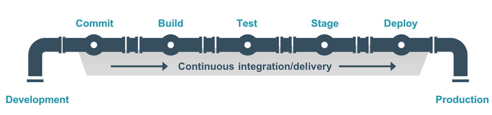

# JPaC Global Pipeline Library

See [JPaC Questions & Answers](./docs/JPAC_QUESTIONS.md)

This documentation is intended to provide a good starting point for application teams that want to better understand how the inner-source Global Pipeline Library (GPL) can be used to create a mature CI (Continuous Integration)/CD (Continuous Delivery) pipeline.  It is possible to differ greatly from the patterns shown within this documentation and still be mature in your CI/CD pipeline implementation.  Please consider this documentation as a guide of what you could do but not a law that dictates what you MUST do.  That being said, if you are not able to come up with a better pattern, you can use this guide to help you understand what is possible to achieve given the current JPaC GPL capabilities.

## Definition

The Global Pipeline Library is a shared Library of reusable Groovy classes and methods that are designed to help you rapidly automate the build, test execution, security scans, approval steps and deployments of your applications from your lowest environment all the way to production.

## The 'gl' methods

If you browse the [vars](./vars) folder you will see 
all of the <b>'gl'</b> methods that have been implemented as part of the JPaC Global Pipeline Library.  The 'gl' methods are an abstraction of the Groovy methods within the GPL.  By using the 'gl' methods, you do not have to instantiate the Groovy classes and then call the Groovy method in order to use them.  Once you configure your Jenkins instance to use this Global Pipeline Library and then refernce this library within your Jenkinsfile, Jenkins will automatically (implicitly) load everything under the 'vars' directory so that it is immediately available to you within your Jenkinsfile.

## The Jenkinsfile

### Referencing the GPL that is defined within your Jenkins instance

```groovy
@Library("com.optum.jenkins.pipeline.library@v0.1.25") _
```

The Jenkinsfile is where you define the behavior of your CI/CD Pipeline.  You will define stages in your Jenkinfile (e.g. 'build', 'sonar', 'run End-to-End tests', 'deploy to dev', 'deploy to prod', etc...) and then call the appropriate 'gl' methods within the stages.

### Example of stages within your Jenkinsfile

```groovy
  stages {
    stage ('Build') {
      steps {
        glMavenBuild isDebugMode:true
      }
    }
    stage('Sonar') {
      steps {
        glSonarMavenScan gitUserCredentialsId:"${env.GIT_CREDENTIALS_ID}"
      }
    }
  }

```

## Thinking in terms of a Pipeline (Left-to-Right)

You should have as a goal, to try to create a complete end-to-end pipeline all the way to production.  The ultimate goal is to commit to source control (e.g. GitHub) and then automatically deploy to production within about 45 minutes to an hour without any manual/human intervention.  This goal might even seem high risk to some; however, the idea is to mitigate all areas of risk using automation and various levels of testing. You can always create push-button approval steps before deploying into an environment if you aren't yet comfortable doing so without a manual approval.



## Capabilities, Work in Progress & Roadmap

### Capabilities

As developers contribute more and more capabilities into the Global Pipeline Library, the ability for application teams to use the GPL to achieve a mature CI/CD Pipeline will increase.  Below you will see a list of most of the capabilities available today.  If you want to see all that is available, please review the 'gl' methods in the vars directory.

1. Maven:  Build, Sonar, Fortify, Artifactory
1. NET Standard and NET Core:  Build, Sonar, Fortify, Publish, Test
1. Angular: Build, Test,
1. Other: ServiceNow, Approval, FlowDock Message Publish
1. Security: Sonar, Fortify, Contrast, Arachni
1. Docker: Build Image, Tag Image, Push Image to Docker Trusted Registry (DTR)
1. OpenShift: Deploy from DTR to OpenShift, Deploy to OpenShift using Templates (YML)
   1. Auto-Scale OpenShift POD Quota during Deployment to achieve Zero Downtime Rolling Deployments
   1. Create and Destroy OpenShift Projects to achieve ephemeral OpenShift Environments.
1. Deployments:  
   1. Terraform
	 1. OpenShift
 	 1. Azure
 	 1. Kubernetes
	 1. Amazon Image Build and Deploy
	 1. XLDeploy

### Work In Progress

1. Automated Compliance - Bringing the Automated Compliance capabilities that the A4Me team built for themselves into the mainstream for general use.
   1. [JPaC work](https://github.optum.com/jenkins-pipelines/global-pipeline-library/pull/408)
   1. DevOps ToolChain work
1. Security
   1. Container Scanning - This is a PoC
   1. OpenSource License Scanning and Dependency Vulnerability
1. Tech Stack Specific Pipeline abstractions that are very mature and extremely easy to use that will enable you to come close to a one line Jenkinsfile.
   1. [naftis](https://github.optum.com/jenkins-pipelines/naftis)

### High Level RoadMap

1. Almost all 'gl' methods will eventually have events associated with them
1. More tech stacks will develop complete end-to-end capabilities 'gl' methods enabling more and more teams to take advantage of the power behind JPaC and the Global Pipeline Library.  We create these capabilities in the [JPaC Workgroups](https://hubconnect.uhg.com/docs/DOC-129470)
1. We are moving in the direction of eventually being able to truley OpenSource the Global Pipeline Library.

### High Level RoadMap for [DevOps Events](https://github.optum.com/jenkins-pipelines/global-pipeline-library/blob/master/DEVOPS_EVENTS.md)

1. The Event Models for all event types will become more standardized and documented.
2. The Event capturing will move to better Enterprise Worthy architecture/infrastructure
3. Executive dashboards will begin relying upon this event data.

## [Maintainers, Contributors, Teams Using & Partners](docs/JPAC_STAKEHOLDERS.md)

## Workgroups for Various Tech Stacks

To implement JPaC capabilities across the various Tech Stacks, we have decided to create inner source Work Groups led by SMEs within those Technology Stacks.
The goal for each workgroup is to:

1. Define the stages (build, sonar, fortify, deploy to dev, etc...) for a mature CI/CD Jenkins Workflow for the relevant Tech Stack.  You should go all the way to production.
2. Determine what JPaC Global Pipeline methods already exist and which ones are missing
3. Begin implementing the missing stages
   1. Add the missing 'gl' method
   2. Write Unit Tests for the 'gl' method
   3. Write very good documentation
   4. Implement the capturing of the DevOps Event for each 'gl' method
   5. Update the documentation indicating what stages have been implemented for the Global Pipeline Library

## 'gl' methods Implemented for Each Tech Stack

## Relatively Mature CD Pipeline Implementations

* Maven + Docker + OpenShift
  * [GitHubFlow Pattern](docs/JPAC_CAPABILITIES_MAVEN-DOCKER-OSE.md)
  * GitFlow Pattern (TBD)
* .NET Standard
* .NET Core

## Others

* ETL - Ab Initio
* ETL - DataStage