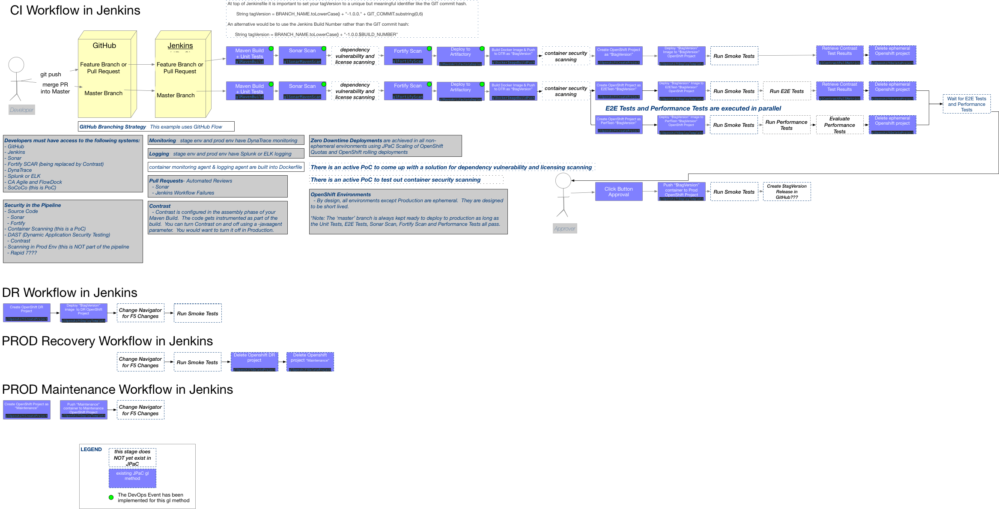

# JPaC Capabilities for Maven, Docker and OpenShift



## Maven Build and Deploy Artifact to Artifactory
| method name | description |
|:------------|:------|
|[glMavenBuild](https://github.optum.com/jenkins-pipelines/global-pipeline-library/blob/master/vars/glMavenBuild.groovy) | Maven Build, Unit Test, JaCoCo Code Coverage |
|[glMavenArtifactoryDeploy](https://github.optum.com/jenkins-pipelines/global-pipeline-library/blob/master/vars/glMavenArtifactoryDeploy.groovy) | Deploy Artifact to Artifactory|

## Static Application Security Testing (SAST)
| method name | description |
|:------------|:------|
| [glSonarMavenScan](https://github.optum.com/jenkins-pipelines/global-pipeline-library/blob/master/vars/glSonarMavenScan.groovy)           | Sonar Maven Scan - Sonar scans discover 1) Security Vulnerabilities, 2) Application Bugs and 3) Bad "Code Smells" by scanning source code as part of the Continuous Integration build.  Sonar will discover legacy issues as well as "new" issues and will fail the build workflow if the scan results do not pass the criteria that is defined in the Sonar Quality Gate that the application is set to within Sonar at <a href="http://sonar.optum.com">sonar.optum.com</a>.  In Addition a sonar scan will upload the Unit Test results and the Unit Test Code Coverage results that were produced in a previous build step.  It is important to know that Sonar will discover some security vulnerabilities that Fortify will also find but Sonar typically finds these earlier in the build process "Shift Left" than a Fortify Scan since Fortify Scans are typically executed less frequently due to the long execution times that are common with Fortify scans.  Fortify security scans are, however, more comprehensive that Sonar Security Scans.|
| [glFortifyScan](https://github.optum.com/jenkins-pipelines/global-pipeline-library/blob/master/vars/glFortifyScan.groovy)                 | Fortify Scan - Security Scans for source code.  Fortify Scans can also traverse the call stack to discover more complex security vulnerabilities that Sonar Scans cannot find. Fortify scans have 2 important steps.  The first step is when the source code gets "translated" into some proprietary syntax (tables) that a "fortify scan" can then run against to discover potential Security Vulnerabilities.  The second "Fortify Scan" step can occur locally on the build machine or it can occur in the cloud which is called a "cloud scan".  It is suggested that you scan locally rather than use Cloud Scanning because with cloud scans you lose a handle to the scan which means that you do not know if the fortify scan passed or failed before proceeding to the next Jenkins Pipeline stage following your Fortify scan.  After a local fortify scan completes, your results can then be uploaded to the SCAR server <a href="https://scar.uhc.com/ssc">https://scar.uhc.com/ssc</a>.

## Dynamic Application Security Testing (DAST)
| method name | description |
|:------------|:------|
| [glContrastPullMetrics](https://github.optum.com/jenkins-pipelines/global-pipeline-library/blob/master/vars/glContrastPullMetrics.groovy) | Contrast is Instrumented into the code at build time.  In a Maven build this occurs during the Maven assembly phase.  When the Smoke Tests or End-To-End tests are executed, vulnerabilities can be discovered in the running application.  Contrast can be disabled using an environment variable at runtime. |


## Docker and Openshift
### Deploying to a Lower OpenShift Environment that is short lived (Branch Specific Environments, Pull Request specific Environments)
```
The ephemeral Create and Delete Project methods allow you to spin up a temporary Openshift project and then tear 
it down as needed.  This allows you to create temporary Openshift projects for your feature branches and Pull 
Requests.  You can execute your automated regression tests to prove that the changes are ready to be merged into 
the <b>master</b> or mainline branch.  When the acceptance tests complete,you can delete the temporary OpenShift 
Project.  By Spinning up and Tearing down these Environments/Projects for each Pull Request you can isolate the 
Acceptance Testing against these changes.  Also, a side benefit is that you are not having to pay for these 
temporary projects since billing is only applied for long lived Openshift Projects.
```
| method name | description |
|:------------|:------|
| [glDockerImageBuild](https://github.optum.com/jenkins-pipelines/global-pipeline-library/blob/master/vars/glDockerImageBuild.groovy)             | Build Docker Image that Contains the Built Artifact.<br>The Dockerfile will contain the steps necessary to build the Docker container. |
| [glDockerImageBuildPush](https://github.optum.com/jenkins-pipelines/global-pipeline-library/blob/master/vars/glDockerImageBuildPush.groovy)     | Builds the Docker Image and then Pushes the Image to the DTR. |
| [glOpenshiftCreateProject](https://github.optum.com/jenkins-pipelines/global-pipeline-library/blob/master/vars/glOpenshiftCreateProject.groovy) | Spin up an ephemeral OpenShift Environment |
| [glOpenshiftDeployTemplate](https://github.optum.com/jenkins-pipelines/global-pipeline-library/blob/master/vars/glOpenshiftDeployTemplate.groovy) | Deploy to OpenShift using a Template YML file |
| [glOpenshiftDeleteProject](https://github.optum.com/jenkins-pipelines/global-pipeline-library/blob/master/vars/glOpenshiftDeleteProject.groovy) | Tear Down Ephemeral OpenShift Environment |

### Deploying to an OpenShift Environment that is Long Lived (Dev, Test, Stage, Prod)
```
This deployment strategy will involve a downtime for your application.  It is suggested that you use the 
'Achieving Zero Downtime Deployments' strategy defined below.  You can Delete all your resources that contain 
a label APP=$MYAPPNAME
```
| method name | description |
|:------------|:------|
| [glDockerImageBuild](https://github.optum.com/jenkins-pipelines/global-pipeline-library/blob/master/vars/glDockerImageBuild.groovy)             | Build Docker Imaage that Contains the Built Artifact.<br>The Dockerfile will contain the steps necessary to build the Docker container. |
| [glOpenshiftDeleteServiceResources](https://github.optum.com/jenkins-pipelines/global-pipeline-library/blob/master/vars/glOpenshiftDeleteServiceResources.groovy) | Delete OpenShift Resources with the APP label|
| [glOpenshiftDeployTemplate](https://github.optum.com/jenkins-pipelines/global-pipeline-library/blob/master/vars/glOpenshiftDeployTemplate.groovy) | Deploy to OpenShift using a Template YML file |

### Achieving Zero Downtime Deployments
```
This is a game changer.  Thank you RJ!
Previously, to achieve Zero Downtime Deployments, you had to set your OpenShift quota to a level so that you could 
have two instances of your application running at a time so that you could still serve traffic on the old instance 
while the new instance was being deployed. The problem is that with the way that our billing occurs, you would have 
to pay for more resources (possibly double) than you were using even at peak usage times.  This can get expensive.  
With this change, you can now avoid the cost of the extra large quota by only scaling your OpenShift quota up 
immediately before a deployment and then immediately scale it back down after a rolling deployment is complete.
```
| method name | description |
|:------------|:------|
| [glDockerImageBuild](https://github.optum.com/jenkins-pipelines/global-pipeline-library/blob/master/vars/glDockerImageBuild.groovy)         | Build Docker Imaage that Contains the Built Artifact. <br>The Dockerfile will contain the steps necessary to build the Docker container. |
| [glOpenshiftUpdateQuota](https://github.optum.com/jenkins-pipelines/global-pipeline-library/blob/master/vars/glOpenshiftUpdateQuota.groovy) | Scale the OpenShift Quota up for a Rolling Deployment |
| [glOpenshiftDeployTemplate](https://github.optum.com/jenkins-pipelines/global-pipeline-library/blob/master/vars/glOpenshiftDeployTemplate.groovy) | Deploy to OpenShift using a Template YML file |
| [glOpenshiftUpdateQuota](https://github.optum.com/jenkins-pipelines/global-pipeline-library/blob/master/vars/glOpenshiftUpdateQuota.groovy) | Scale the OpenShift Quota Down after a Rolling Deployment is complete |

