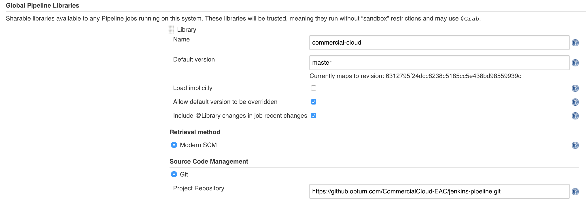
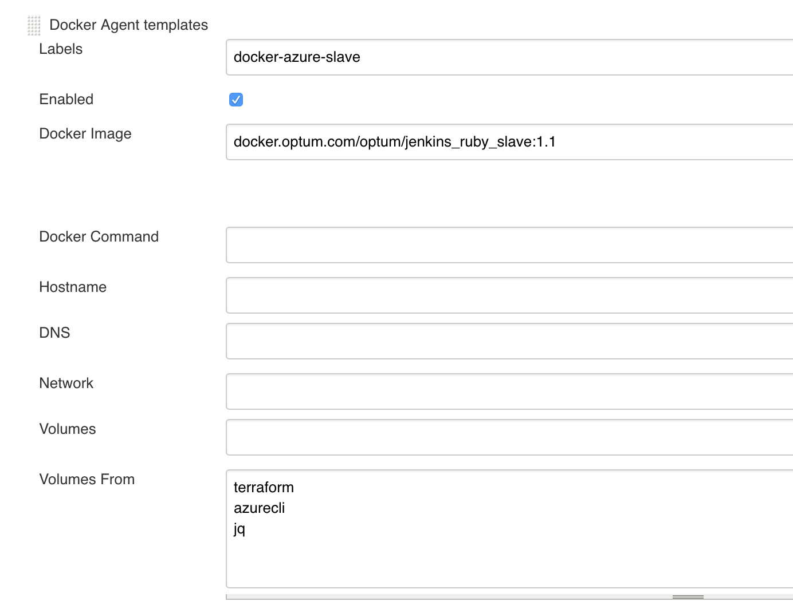

# Commercial Cloud Pipelines

## Deprecation Notice

**TerraformPipeline and AWSPipeline are being transitioned to JPaC Pipeline Templates, new [repo](https://github.optum.com/jenkins-pipelines/template-terraform) is in the [jenkins-pipelines](https://github.optum.com/jenkins-pipelines) organization**

---

The below pipelines are in alpha and ready for early adopters.

- Beta: at least one app team has fully adopted the pipeline.
- 1.0 GA: one or more app teams have successfuly conducted a production deployment to a live end-user environment.

## Table of Contents

- [Terraform Pipeline (Azure)](#terraform-pipeline-azure)
  - [Getting Started](#getting-started)
  - [Pipeline Configuration](#pipeline-configuration)
  - [Examples](#examples)
  - [Usage Conventions](#usage-conventions)
  - [Jenkins Plugin Dependencies](#jenkins-plugin-dependencies)
- [AWS Pipeline](#aws-pipeline)
  - [Getting Started](#aws-getting-started)
  - [Pipeline Configuration](#aws-pipeline-configuration)
  - [Examples](#aws-examples)

## Terraform Pipeline (Azure)

This is the commercial cloud supported pipeline for teams utilizing terraform to create their infrastucture.

> Currently only supports Azure

### Getting Started

We recommend using our "starters" to help jumpstart your terraform usage. These are small terraform projects that are pre-configured with Commercial Cloud modules and pipeline.

<<<<<<< Updated upstream

- # [Azure Starter](https://github.optum.com/CommercialCloud-EAC/azure_starter)

* [Azure Starter](https://github.optum.com/CommercialCloud-EAC/azure_starter)
  > > > > > > > Stashed changes

If you're looking to add the pipeline to your existing project you can use the below code for your `Jenkinsfile`

```groovy
#!/usr/bin/groovy
@Library(['commercial-cloud', 'global-library']) _

TerraformPipeline()
```

### Pipeline Configuration

The terraform pipeline uses an `Optumfile.yml` to configure the pipeline to your needs.

```yaml
pipeline:
  terraform:
    azure:
      subscriptions:
        nonprod:
          credentials:
            servicePrincipal: nonProdServicePrincipal
        prod:
          credentials:
            servicePrincipal: prodServicePrincipal
      environments:
        nonprod:
          subscription: nonprod # ties this environment to subscription defined above
          tfvars:
            file: ./env/nonprod.tfvars # adds -var-file flag, ie. -var-file="./env/nonprod.tfvars"
        prod:
          prompt: true
          subscription: prod
          tfvars:
            file: ./env/prod.tfvars
```

> The value you set for `azure.subscriptions.credentials.servicePrincipal` must match the id for the [Azure Credential](https://plugins.jenkins.io/azure-credentials) in jenkins.

#### Examples

##### Ability to define azure subscriptions to deploy to based on defined credentials within Jenkins (Service Principal)

```yaml
pipeline:
  terraform:
    azure:
      subscriptions:
        nonprod:
          credentials:
            servicePrincipal: nonProdServicePrincipal
```

##### Ability to define environments and associate correct subscription to environment

```yaml
pipeline:
  terraform:
    azure:
      environments:
        stage:
          subscription: nonprod
```

##### Ability to perform environment promotion

For example after merging changes to master, the below configuration configuration will first deploy to a `dev` environment (using `nonprod` subscription), then to a `stage` environment (using `nonprod` subscription), and then to a `prod` environment (using `prod` subscription)

```yaml
pipeline:
  terraform:
    azure:
      environments:
<<<<<<< Updated upstream
        dev:  # first deploys to a `dev` environment (using `nonprod` subscription)
=======
        dev: # first deploys to a `dev` environment (using `nonprod` subscription)
>>>>>>> Stashed changes
          subscription: nonprod
        stage: # then to a `stage` environment (using `nonprod` subscription)
          subscription: nonprod
        prod: # then to a `prod` environment (using `prod` subscription)
          subscription: prod
```

##### Ability to define var file by environment

Adds `-var-file` flag to the underlying terraform command based on configured value, ie. `-var-file="./env/nonprod.tfvars"`

```yaml
pipeline:
  terraform:
<<<<<<< Updated upstream
    azure:
...
      environments:
        stage:
          subscription: nonprod
          tfvars:
            file: ./env/stage.tfvars
        prod:
          subscription:
          tfvars:
            file: ./env/prod.tfvars
=======
    ? azure
---
environments:
  stage:
    subscription: nonprod
    tfvars:
      file: ./env/stage.tfvars
  prod:
    ? subscription
    tfvars:
      file: ./env/prod.tfvars
>>>>>>> Stashed changes
```

##### Ability to prompt before different environments

Adds a prompt to the pipeline to allow for manual intervention between environments. Will only occur when `prompt` is set to `true` in an environment block

```yaml
pipeline:
  terraform:
<<<<<<< Updated upstream
    azure:
...
      environments:
        dev:
          prompt: false # this line is not needed as it is the default. here for demo purposes only
        stage:
          prompt: true
        prod:
          prompt: true
```

### Usage Conventions

- # `TF_VAR_environment` variable is required in terraform project. Jenkins will inject this environment variable as defined in `Optumfile.yml` and will be used for remote state segregation and tagging.
      ? azure

---

environments:
dev:
prompt: false # this line is not needed as it is the default. here for demo purposes only
stage:
prompt: true
prod:
prompt: true

````
### Usage Conventions

- `TF_VAR_environment` variable is required in terraform project. Jenkins will inject this environment variable as defined in `Optumfile.yml` and will be used for remote state segregation and tagging.
>>>>>>> Stashed changes

### Jenkins Dependencies

#### Plugins

<<<<<<< Updated upstream
* [Azure Credentials](https://plugins.jenkins.io/azure-credentials)
=======
- [Azure Credentials](https://plugins.jenkins.io/azure-credentials)
>>>>>>> Stashed changes

> After installing [Azure Credentials](https://plugins.jenkins.io/azure-credentials), the credential type may not be enabled by default. To enable go to Manage Jenkins > Config Credential and check the box next to Microsoft Azure Service Principal

#### Libraries

Configure these libraries as defined in the jenkins [documentation](https://jenkins.io/doc/book/pipeline/shared-libraries/#global-shared-libraries)

##### Commercial Cloud Library

<<<<<<< Updated upstream

=======

>>>>>>> Stashed changes

##### Optum Global Pipeline Library

The Commercial Cloud pipelines make use of the Optum Global Pipeline library and pipeline-as-code. Learn more about the Jenkins pipeline-as-code (JPaC) initiatives [here](https://hubconnect.uhg.com/docs/DOC-129470).

<<<<<<< Updated upstream
To leverage the Azure Commercial Cloud pipeline successfully, please ensure you are using the ```docker-azure-slave ``` agent configured as shown below.


=======
To leverage the Azure Commercial Cloud pipeline successfully, please ensure you are using the `docker-azure-slave` agent configured as shown below.


>>>>>>> Stashed changes

## AWS Pipeline

This is the commercial cloud supported pipeline for teams utilizing terraform to create their infrastucture.

> Only supports AWS

### <a id="aws-getting-started"></a> Getting Started

We recommend using our "starters" to help jumpstart your terraform usage. These are small terraform projects that are pre-configured with Commercial Cloud modules and pipeline.

<<<<<<< Updated upstream
* [AWS Starter](https://github.optum.com/CommercialCloud-EAC/aws_starter)
=======
- [AWS Starter](https://github.optum.com/CommercialCloud-EAC/aws_starter)
>>>>>>> Stashed changes

If your looking to add the pipeline to your existing project you can use the below code for your `Jenkinsfile`

```groovy
#!/usr/bin/groovy
@Library(['commercial-cloud']) _

AWSPipeline()
````

### <a id="aws-pipeline-configuration"></a> Pipeline Configuration

The terraform pipeline uses an `Optumfile.yml` to configure the pipeline to your needs.

```yaml
pipeline:
  terraform:
    aws:
      accounts:
        nonprod:
          jenkins:
            credentials:
              usernamePassword: AWS_AUTOMATION_USER # these values map to the ids of credentials created within jenkins
          account: "123456789012" # Input the 12 digit AWS Account ID
          roleArn: arn:aws:iam::123456789012:role/Role_Name # Role to assume
          sandbox: false # (Optional - will default to false) Boolean to indicated if the account is a Sandbox/POC account, this determines how the acccount gets authenticated
        prod:
          jenkins:
            credentials:
              usernamePassword: AWS_AUTOMATION_USER
          account: "987654321098"
          roleArn: arn:aws:iam::987654321098:role/Role_Name
        sandbox:
          jenkins:
            credentials:
              usernamePassword: AWS_AUTOMATION_USER
          account: "543210987654"
          roleArn: arn:aws:iam::543210987654:role/Role_Name
          sandbox: true
      environments:
        nonprod:
          subscription: nonprod # ties this environment to subscription defined above
          bootstrapVars: # (Optional) variables used for aws_bootstrap, else uses default
            nameSpace: nonprod # (Optional) name_space for aws_bootstrap
            region: us-east-1 # (Optional) aws_region for aws_bootstrap
          tfvars: # (Optional) Currently assumes that the file is located relative to the directory of the yaml and jenkinsfile (WORKSPACE)
            file: env/nonprod.tfvars # (Optional) adds -var-file flag, ie. "-var-file=${WORKSPACE}/env/nonprod.tfvars", where ${WORKSPACE} will be substituted with the correct directory in AWSPipeline
        prod:
          subscription: prod
          bootstrapVars: # (Optional) variables used for aws_bootstrap, else uses default
            nameSpace: prod # (Optional)
            region: us-east-2 # (Optional)
          tfvars: # (Optional)
            file: env/prod.tfvars # (Optional)
        sandbox:
          subscription: sandbox
          bootstrapVars: # (Optional) variables used for aws_bootstrap, else uses default
            nameSpace: prod # (Optional)
            region: us-east-2 # (Optional)
          tfvars: # (Optional)
            file: env/sandbox.tfvars # (Optional)
```

#### <a id="aws-examples"></a> Examples

##### Ability to define aws accounts to deploy to based on defined credentials within Jenkins

```yaml
pipeline:
  terraform:
    aws:
      accounts:
        nonprod:
          jenkins:
            credentials:
              usernamePassword: AWS_AUTOMATION_USER
          account: 123456789012
          roleArn: arn:aws:iam::123456789012:role/Role_Name
```

##### Ability to prompt before different environments

Adds a prompt to the pipeline to allow for manual intervention between environments. Will only occur when `prompt` is set to `true` in an environment block

```yaml
pipeline:
  terraform:
<<<<<<< Updated upstream
    aws:
...
      environments:
        dev:
          prompt: false # this line is not needed as it is the default. here for demo purposes only
        stage:
          prompt: true
        prod:
          prompt: true
=======
    ? aws
---
environments:
  dev:
    prompt: false # this line is not needed as it is the default. here for demo purposes only
  stage:
    prompt: true
  prod:
    prompt: true
>>>>>>> Stashed changes
```
