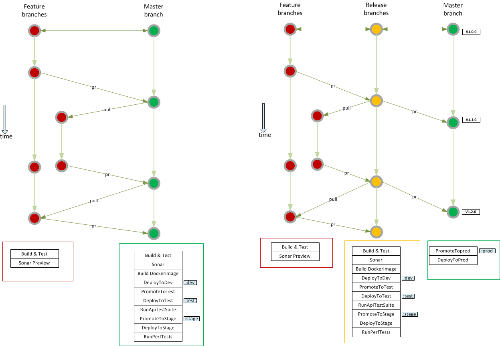

# Jenkins Shared Library

This repository contains "Shared Libraries" representing common patterns used across various stages in Jenkins Pipeline delivering enhanced CI/CD 

## Directory structure

```folder
src
|
|---com
|   |
|   |---optum
|       |
|       |---config
|       |
|       |---pipline
|       |
|       |---resiliency
|       |
|       |---utils
|   |   ...
```

## Setup

The setup needs the following components:

1. Jenkins setup
    - Tell Jenkins where the shared library repository is located.
    - Setup a GitHub Organization job.
1. Jenkinsfile - Root folder in application repository will have Jenkinsfile that makes a call to shared library.
1. Config.yaml - This file contains the specifications needed to build your environment.

These components are described in more detail in the following sections.

## How do I use it

First off, Jenkins needs to be setup to point to the repository containing the shared library. In Jenkins, this can be done on a global level or by project. To set it up globally,

1. Go to Manage Jenkins
1. Configure System
1. Scroll down to Global Pipeline Libraries and set this up. Point to the repository containing the shared pipeline code.

## Create a Jenkins job

Instead of a pipeline job, lets set up a GitHub Organization job. This is because we need a multi branch support as well as pull request support. Why? Because we need to follow the following architecture:

1. Developer checks code into git repository.
1. A jenkins build will be triggered automatically once there is code checked into the git repository. It runs build, archive, sonar preview, deploy to dev OSE, etc.
1. Once the result is satisfactory, an approver will run a pull request of the dev branch in git to a release branch.
1. This triggers a build off of the release branch. This will run a jenkins build, sonar scan, deploy to stage, etc.

The GitHub Organization job in Jenkins along with the Webhook plugin in GitHub accomplishes this smoothly within a single job.

## The multibranch model

Review this image to further understand the multibranch model which the shared library utilizes.  You can run whichever features you want on any branch as specified in your config.yml (see below).

+

## Deeper look at the Shared Library

The Jenkinsfile is a simple one liner that calls the init method in BasePipeline class. Here is the content in Jenkinsfile:

```groovy
@Library('JenkinsSharedLibrary') _
def pipelineInit = new com.optum.pipeline.BasePipeline().init()
```

The parameters needed to setup the job is controlled by a file called config.yml that resides in the same location as the Jenkinsfile.

## Deeper look at the config.yml

Here is a [sample config.yml](./docs/CONFIG.md)

## Some example config scenarios

- [Config With Master Branch Build and Deploy](./docs/MasterBranchDeploy.md)
- [Config With Short Lived Branch Scan enable](./docs/ShortLivedBranchScan.md)
- [Config With Skip Deploy enable](./docs/SkipDeploy.md)
- [Config With US Branch Sonar Scan](./docs/USBranchSonarScan.md)
- [Config With Docker Backup](./docs/DockerBackup.md)

## Resiliency Testing

There is a module available for setting up resiliency testing in an AWS environment. Resiliency testing is a way of testing the resiliency of a system by creating chaos or injecting failures into our environments. More details about our test plan can be found in our [Resiliency Testing wiki](https://github.optum.com/cloud-idp/everything-as-code/wiki/Resiliency%5BChaos%5D-Testing-Embrace-the-failure).

This works the same as the pipeline above. It is still configuration based model. All requirements are specified in the config.yml file. More details available in the [Resiliency ReadMe](src/com/optum/resiliency).
The Jenkins script looks slightly different:

```groovy
@Library('ResiliencyLibrary') _
def resiliencyInit = new com.optum.pipeline.ResiliencyTesting().init()
```
## AWS Patch Management
After AMI is upgraded, the EC2 instances need to be patched with the upgraded AMI. This module takes care of that by "draining" the nodes which involves:

   1. Not scheduling any new processes in the nodes.
   2. Complete the running processes in the nodes and shutting them down.

Once that is complete, the node is terminated. The AWS autoscaler will start up a new instance in its place which will have the updated AMI.

This works the same as the pipeline above. It is still configuration based model. All requirements are specified in the config.yml file. More details available in the [PatchManagement ReadMe](src/com/optum/patchmanagement).
The Jenkins script looks slightly different:

```groovy
@Library('PatchManagement') _
def patchInit = new com.optum.patchmanagement.PatchManagement().init()
```