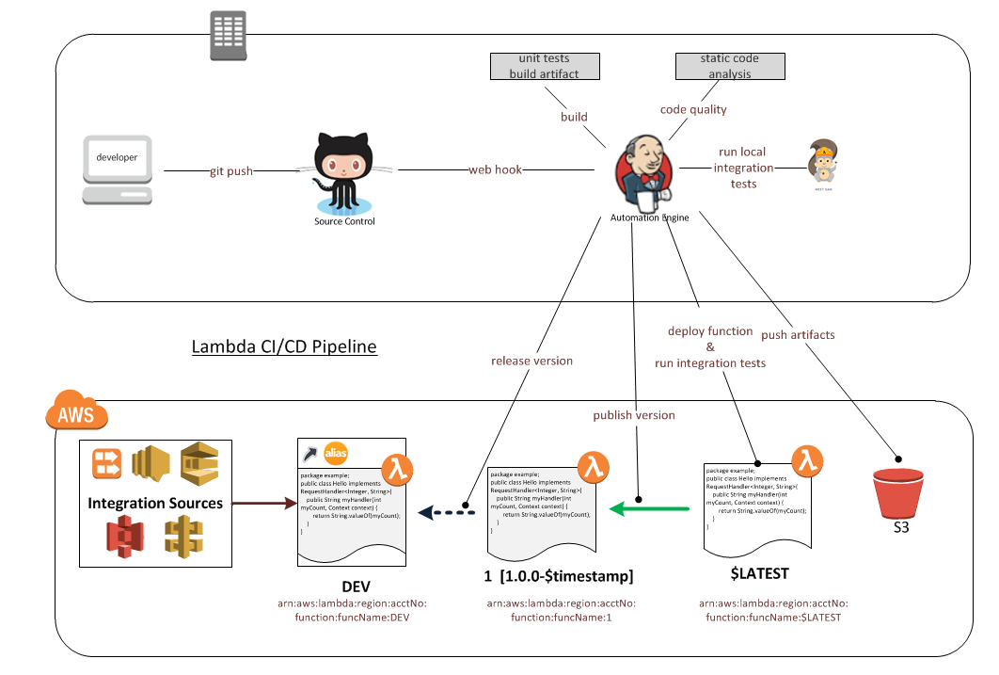
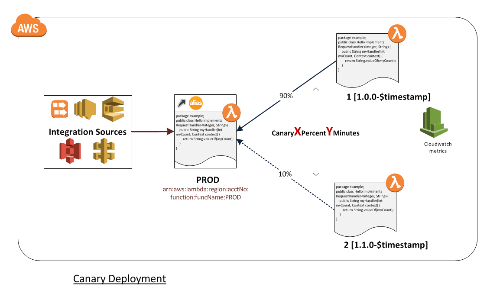

# AWS Lambda function deployment

This page contains the implementation details of the AWS Lambda function deployment that is part of the shared library.

## Lambda CI/CD

### Implementation details

#### Build and Test

The first step is to validate the essentials are provided in the configuration file that triggers a Lambda deploy. Some examples are:

- The runtime value specified has to be supported. Today, we only support java8 runtime.
- The S3 bucket that holds the function artifacts has to exist and we have proper access to it.
- The Lambda function has already been created since we are only doing an update. Additionally, checks whether the function is created with proper attributes like Role, Handler, MemorySize and Timeout values.
- The provided version follows the [Semantic Versioning Specification](https://semver.org/). The version should include `MAJOR.MINOR.PATCH`.

Based on the work-flow defined in the configuration, code quality and security scans are run against the code.

#### Publish artifact

The artifact is pushed to S3. Older artifacts are archived by appending date and time in the artifact name.

#### Deployment and Integration test

The Lambda function is first updated but not published just yet. Integration test is run using the supplied input file. If the test results in a successful run of the function, then the proper tag (dev, stage, prod) is applied to prepare it to publish in a specific environment.

#### Publish and Release

The Lambda function can now be published which is making it available for the actual run. This entails adding the specified version number into the function's description. Lambda alias can be used to release the function as "AllAtOnce" or "Canary" deployment. "AllAtOnce" means an instant switch over of the version to the newly published version. "Canary" is where only a percent of traffic is routed to the new version for a specified amount of time. If there are no issues at the end of that interval, then all the traffic is routed to the new version.

