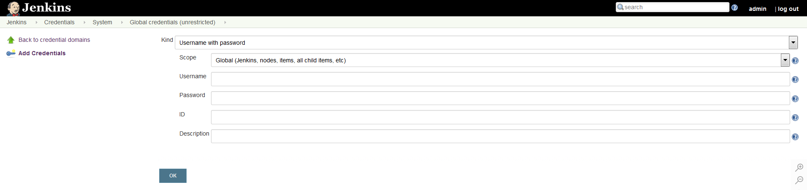
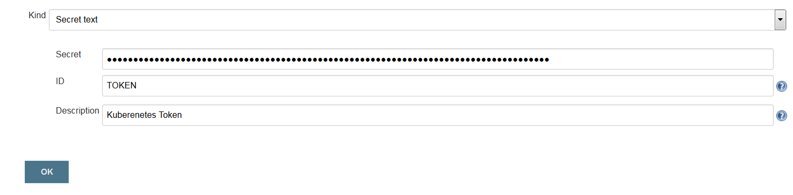
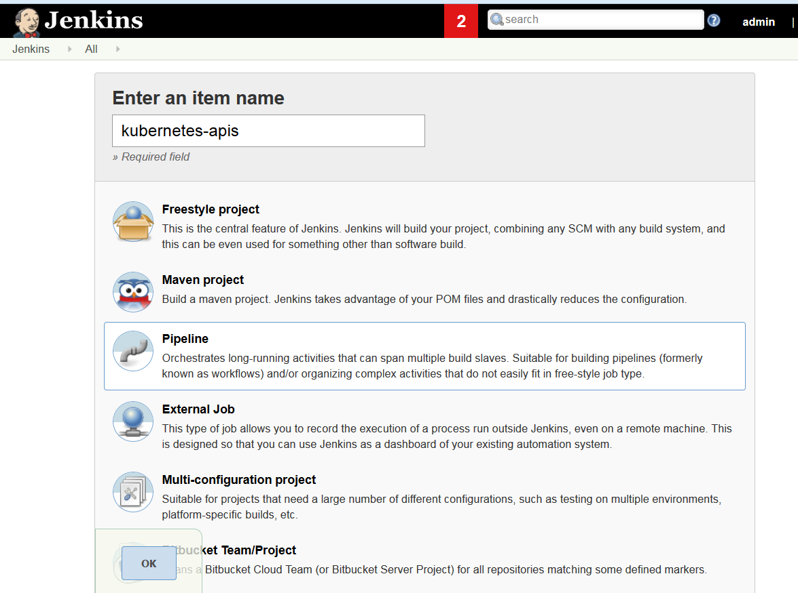
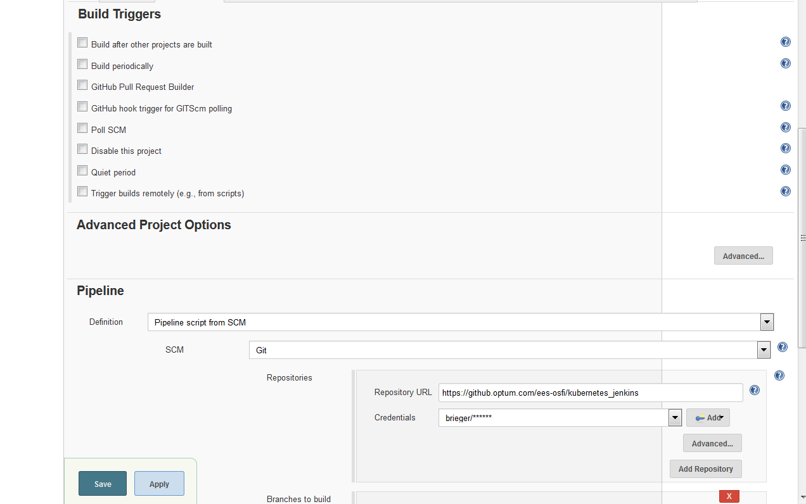
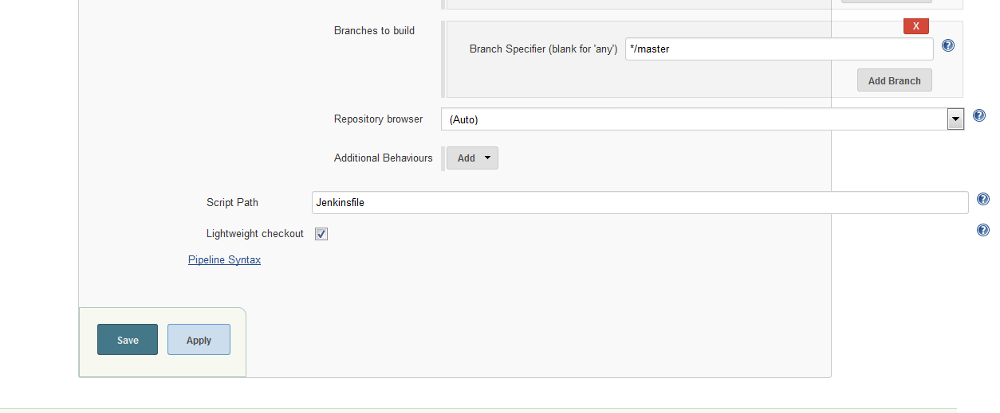
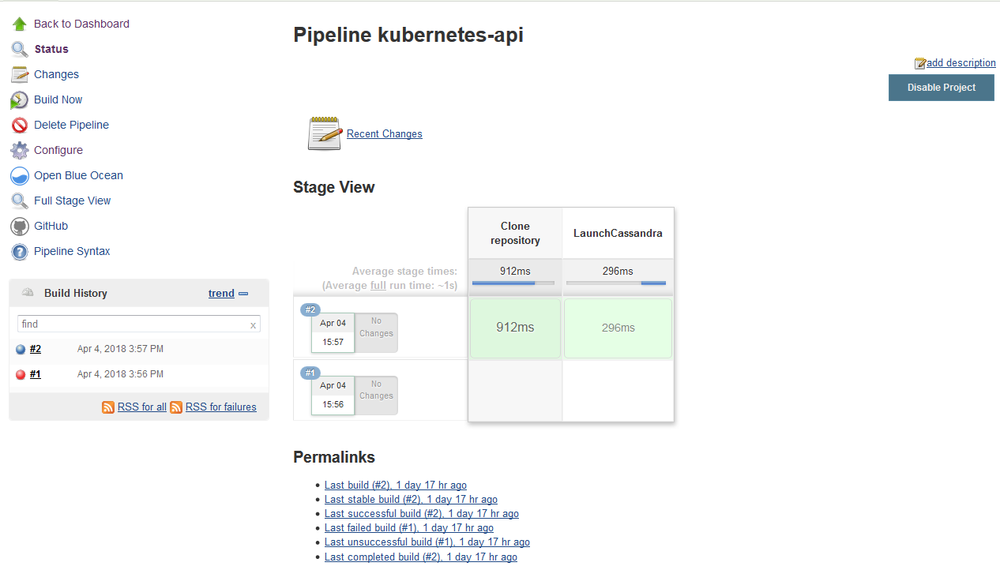
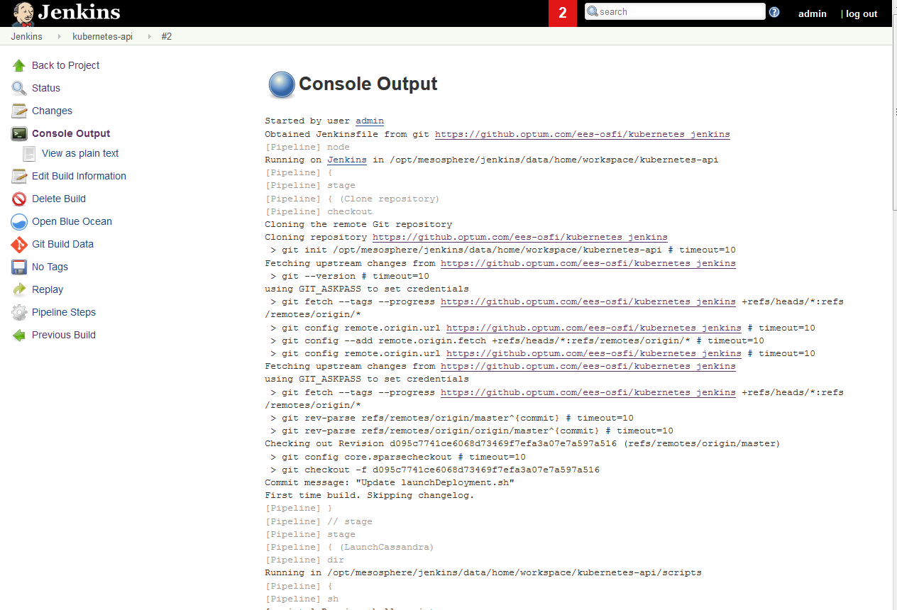
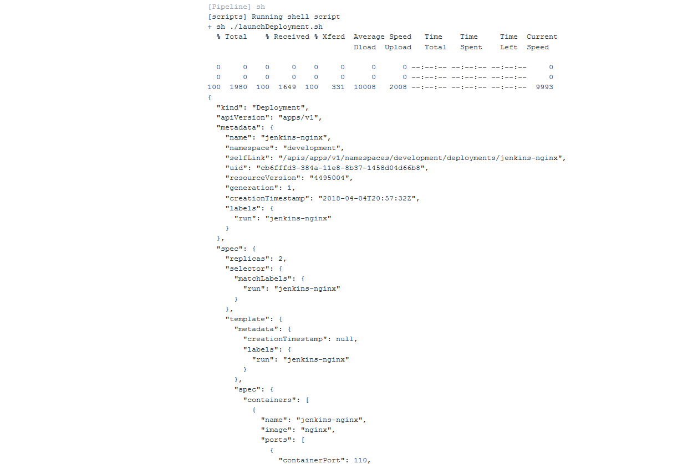
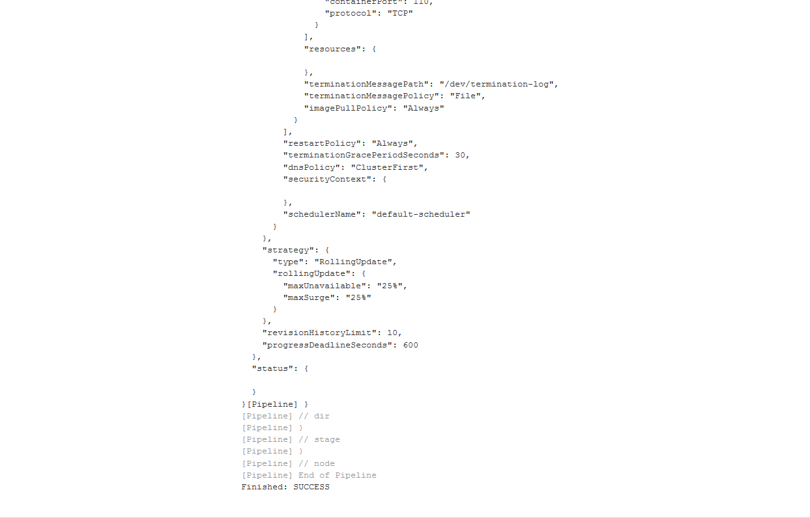

# kubernetes_jenkins
This git provides an example of how to launch a deployment into a kubernetes cluster via jenkins. In order to launch the deployment.conf will need to be edited to point to your cluster and namespace. 

## Running the Install pipeline
1. Login to [Jenkins](https://jenkins.optum.com/central)
2. Add your credentials for github to the jenkins global credentials store if you have not already done so:  Jenkins -> Credentials -> System -> Global credentials (unrestricted) -> add credentials 

  

 
3. Add your Kubernetes Token to Jenkins Credentials. Use the Type Secret Text and ID of TOKEN:

To retrive your token run the below:

`kubectl -n <NAMESPACE> describe secret $(kubectl -n <NAMESPACE> get secret | grep <Service Account Name> | awk '{print $1}')`

4. Go back to the Jenkins home screen by hitting the jenkins logo in the top corner, navigate to your folder and then hit new item:

 

5. Give your pipeline a name and select the pipeline option and then hit OK

  

6. Now configure your pipeline so that it looks the same as below while pointing to your forked repository:

  

  
 

 

  
 

 
7. Save your pipeline

8. Edit your deployment.conf file with your kubernetes master IP, port, and namespace.

9. Optionally supply your own deployment.yaml file as the one provided spins up nginx

10. If you changed the names of any of the files you will need to update scripts/launchDeployment.sh with the new file names.
11. Now navigate to your framework in Jenkins and run Build Now 

  
12. Click on the latest build in the build history which can be seen in the above screenshot  

13. Open up the console log  

  
 

  
14. Wait until you see Success  

  
 

  

  
  

 
15. Your deployment is now running! :tada: 
