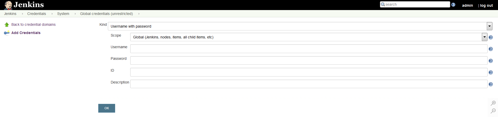
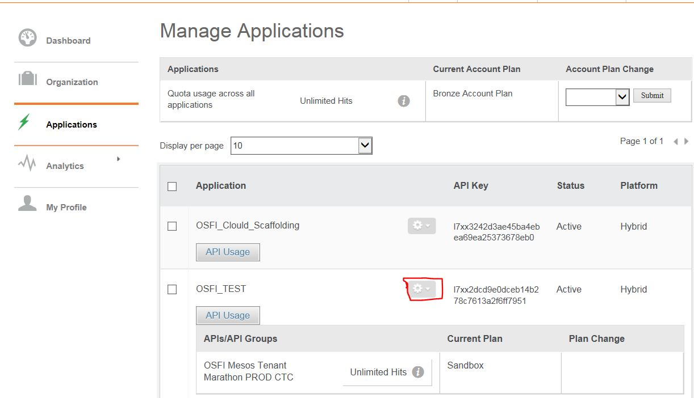
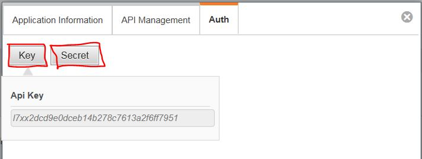
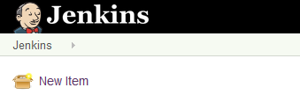
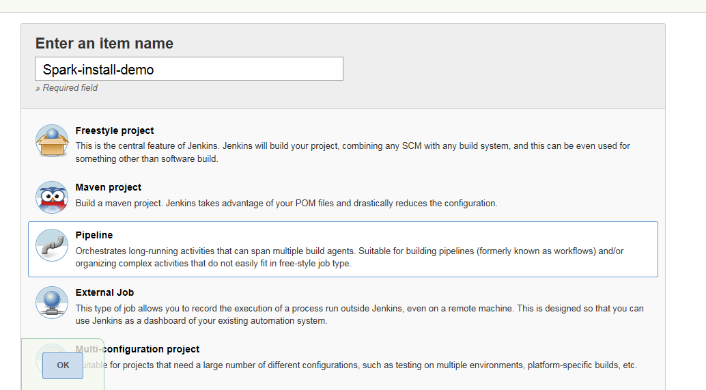
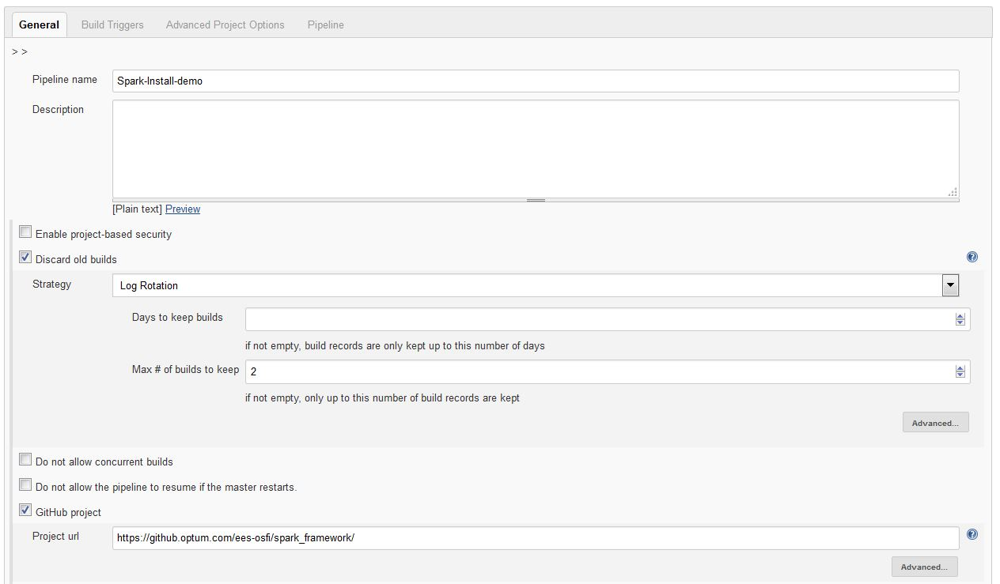
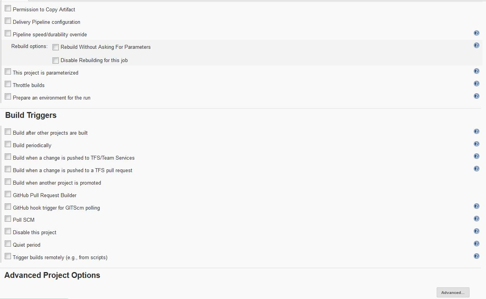
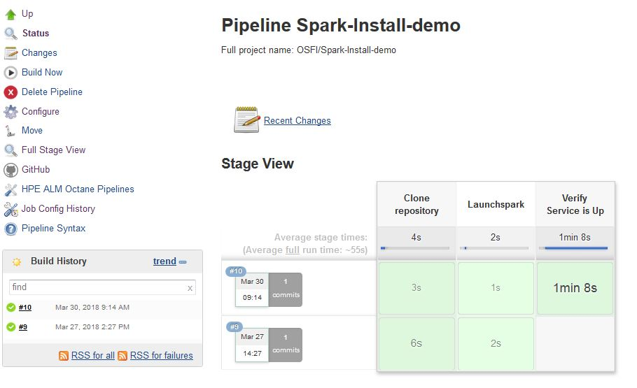
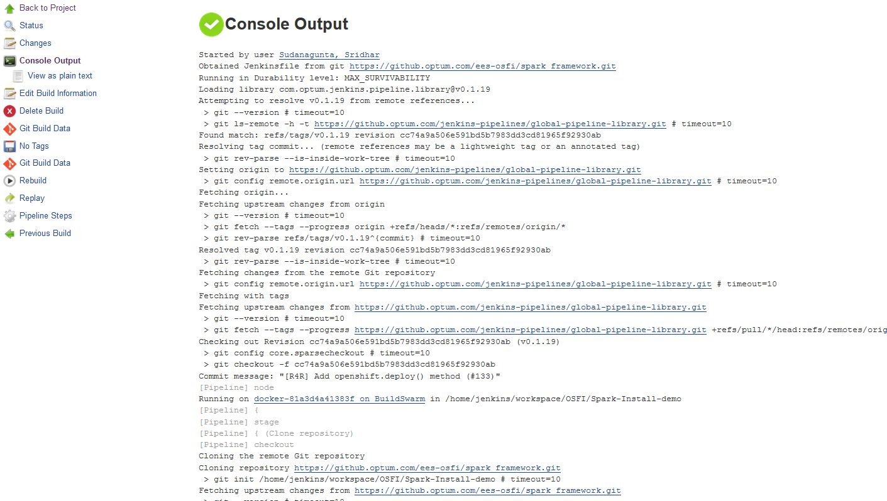
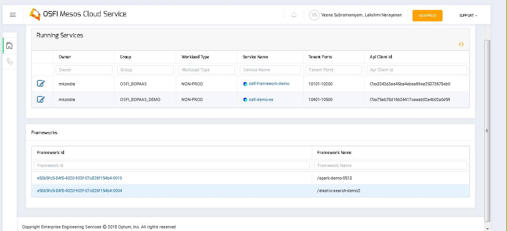

# Spark Framework Automation Scripts
This project contains scripts that deploys and Updates the framework using Layer 7 proxy. All the user needs to do is create a jenkins pipeline that uses the provided jenkins pipeline files and update all json/conf files for spinning up these easy to use Frameworks

## Obtaining Credentials to Consume APIs
Please follow [API Consumer: Getting Started](https://www.optumdeveloper.com/content/odv-optumdev/optum-developer/en/getting-started/apis/api-consumers.html) Optum Developer link to obtaining Credentials to Consume APIs.

## Running the Install pipeline

1. Login to [Jenkins](https://jenkins.optum.com/central)

2. Add a your credentials for github to the jenkins global credentials store if you have not already done so:
  Jenkins -> Credentials -> System -> Global credentials (unrestricted) -> add credentials
 

  

 

 3. Get API Key and Secret by:
   * Logging into API Manager
   * Navigate to Application on Left Pane
   * Hover Over Application Gear
   * Select Edit in Gear Drop-Down
   
 

  

   * Navigate to Auth Tab in Window
   * Copy Key and Secret for future reference

 

  

4. Add API Key and API Secret Credentials in Jenkins by navigating to 
Credentials -> System -> Global credentials (unrestricted) -> add credentials

**Kind: Secret Text**

**ID: ClientSecret & ClientKey**

 

  

5. Update the Client ID in OSFI Mesos Application
 

  

 

6. Go back to the Jenkins home screen by hitting the jenkins logo in the top corner, navigate to your folder and then hit new item:

  

7. Give your pipeline a name and select the pipeline option and then hit OK

  

8. Now configure your pipeline so that it looks the same as below while pointing to your forked repository:

  

  
 

 

  
 

 
9. Save your pipeline

10. Edit the options.json file located in the install folder of the master
  
  Important Configs to note
   - service.name - The service name must be unique
  
11. Now navigate to your framework in Jenkins and run Build Now
 

  
 

 
 12. Click on the latest build in the build history which can be seen in the above screenshot
 
 10. Open up the console log
  

  
 

 
 13. Wait until you see the dns, addresses, vip, and zookeeper
  

  
 

 
 14. Your service is now running! :tada:
 
## Accessing Spark from OSFI Mesos Application 
To see your Framework , log into the OSFI Mesos Application environment and you should see your Framework ID and Framewrok Name in the list of Frameworks deployed.

  
 

Congrats you can now access your Spark running in Mesos.

## Uninstall/delete Framework Instructions
Please contact BDPaaS Admin for uninstalling or deleting your framework application.
 
